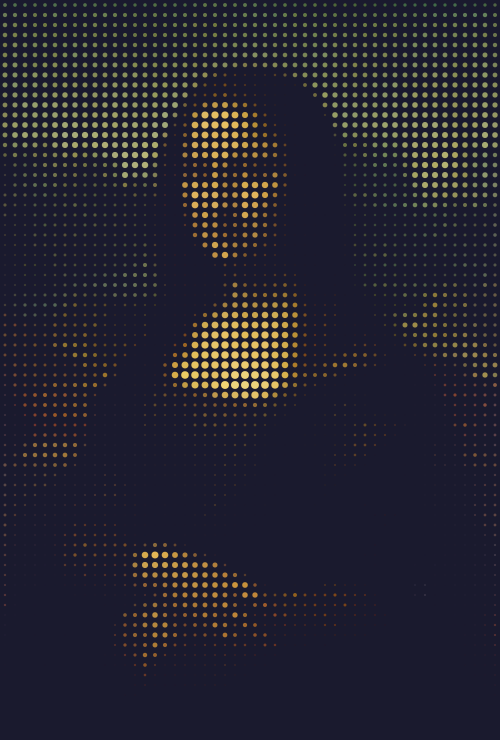
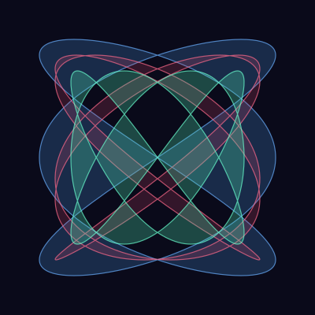
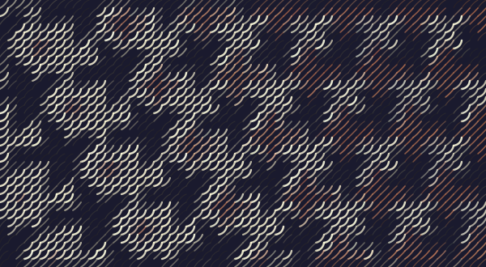
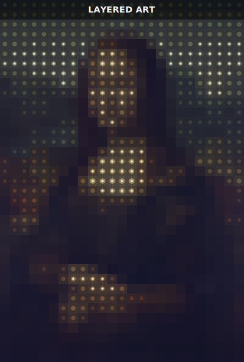

<p align="center">
  
</p>

<h1 align="center">PyFreeform</h1>

<p align="center">Turn images into art with Python.</p>

<p align="center">
  
</p>

## Install

```bash
pip install pyfreeform
```

Requires Python 3.10+.

## Quick Start

```python
from pyfreeform import Scene

scene = Scene.from_image("photo.jpg", grid_size=40)
for cell in scene.grid:
    cell.add_dot(radius=cell.brightness * 0.4, color=cell.color)
scene.save("artwork.svg")
```

That's it — four lines from photo to SVG.

## What Can You Make?

<table>
  <tr>
    <td align="center"><br><sub>Color dots</sub></td>
    <td align="center"><br><sub>Filled Lissajous curves</sub></td>
    <td align="center"><br><sub>Flowing curves</sub></td>
  </tr>
  <tr>
    <td align="center"><br><sub>ASCII art</sub></td>
    <td align="center"><br><sub>Connected networks</sub></td>
    <td align="center"><br><sub>Multi-layer compositions</sub></td>
  </tr>
</table>

Dots, lines, curves, polygons, text, ellipses, custom paths — all positioned relative to a grid of cells. Sizes are fractions of the cell, so your art scales to any resolution.

## Learn More

Everything you need is in the docs:

- [**Getting Started**](https://matheweb.github.io/pyfreeform/getting-started/) — install and create your first artwork
- [**Guide**](https://matheweb.github.io/pyfreeform/guide/) — every feature, explained visually
- [**Recipes**](https://matheweb.github.io/pyfreeform/recipes/) — portraits, patterns, typography, networks
- [**API Surface**](https://matheweb.github.io/pyfreeform/api-surface/) — complete reference

## License

GPL-3.0 — see [LICENSE](./LICENSE) for details.

## Acknowledgments

Built on [NumPy](https://numpy.org/) (BSD-3-Clause) and [Pillow](https://python-pillow.github.io) (MIT-CMU). See [LICENSES/third_party/](./LICENSES/third_party/) for full texts.
