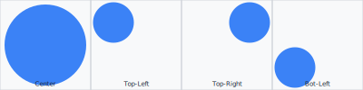
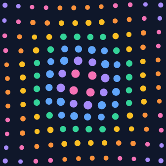

# Fit to Cell

Automatically constrain entities within cell boundaries.

## What is fit_to_cell()?

```python
entity.fit_to_cell(scale=1.0, recenter=True)
```


Automatically:
1. Calculates entity's bounding box
2. Accounts for rotation
3. Scales to fit within cell
4. Optionally centers in cell

## Usage


```python
# Create large ellipse
ellipse = cell.add_ellipse(rx=100, ry=60, rotation=45)

# Auto-fit to 85% of cell
ellipse.fit_to_cell(0.85)
```


## Parameters

- `scale` (0-1): Target size relative to cell (1.0 = full cell)
- `recenter` (bool): Whether to center in cell (default: True)


## Examples

### Dynamic Sizing
```python
for cell in scene.grid:
    # Size based on brightness
    target_scale = 0.3 + cell.brightness * 0.7
    
    ellipse = cell.add_ellipse(rx=100, ry=60, rotation=45)
    ellipse.fit_to_cell(target_scale)
```


### Rotation-Aware
```python
# Rotated ellipses still fit perfectly!
for cell in scene.grid:
    rotation = (cell.row + cell.col) * 15
    ellipse = cell.add_ellipse(rx=20, ry=10, rotation=rotation)
    ellipse.fit_to_cell(0.8)  # Handles rotation automatically
```


## Works For All Entities

```python
dot.fit_to_cell(0.9)
ellipse.fit_to_cell(0.85)
polygon.fit_to_cell(0.75)
text.fit_to_cell(0.8)
```


## Position-Aware Fitting

Place entities at specific positions within a cell **and** guarantee they never overflow:

```python
entity.fit_to_cell(scale, at=(rx, ry))
```

The `at` parameter accepts a cell-relative position. Available space is automatically constrained by the nearest cell edge — so a shape at `(0.25, 0.25)` only gets the top-left quadrant, while `(0.5, 0.5)` gets the full cell.



```python
# Place a huge dot in the top-left quadrant — it shrinks to fit
dot = cell.add_dot(radius=9999, color="blue")
dot.fit_to_cell(0.9, at=(0.25, 0.25))

# Same call at center uses the full cell
dot = cell.add_dot(radius=9999, color="blue")
dot.fit_to_cell(0.9, at=(0.5, 0.5))
```

### Orbiting Dots

Combine `at=` with a bit of math for a fun orbital effect:

```python
import math
for cell in scene.grid:
    angle = math.atan2(dy, dx)
    rx = 0.5 + math.cos(angle) * 0.18
    ry = 0.5 + math.sin(angle) * 0.18
    dot = cell.add_dot(radius=100, color=color)
    dot.fit_to_cell(scale, at=(rx, ry))
```



## See Also
- [Ellipses Example](../examples/advanced/ellipses.md)
- [Transforms](04-transforms.md)
