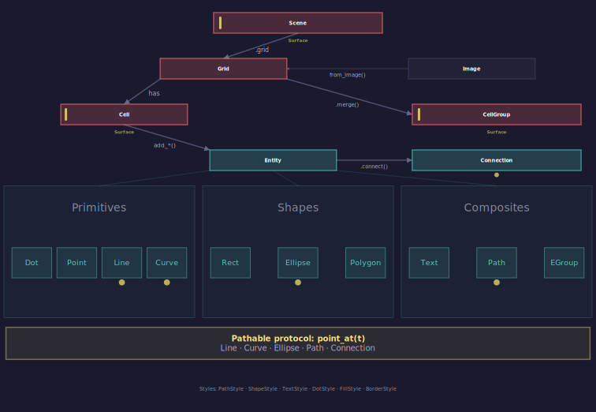

---
hide:
  - toc
---

# API Reference

Comprehensive lookup reference for PyFreeform's public API. Organized to follow the natural flow -- from creating a canvas to building complex generative art.

!!! tip "How to use this reference"
    This section is designed as a **lookup reference**. For learning-oriented walkthroughs with visual examples, see the [Guide](../guide/index.md). For copy-paste starting points, see [Recipes](../recipes/index.md).

---

| Page | Covers |
|---|---|
| [Scene](scene.md) | Creating your canvas -- constructors, properties, rendering, saving |
| [Grid & Cells](grid-and-cells.md) | Dividing the canvas -- grid structure, cell access, image data, neighbors |
| [Drawing](drawing.md) | Putting things on the canvas -- the 12 builder methods, positioning, `along`/`t`/`align` |
| [Entities](entities.md) | What you draw -- Dot, Line, Curve, Ellipse, Polygon, Rect, Text, Path, EntityGroup, Point |
| [Connections & Paths](connections.md) | Linking things together -- Connection class, Pathable protocol, built-in path shapes |
| [Transforms](transforms.md) | Rotating, scaling, fitting -- `rotate()`, `scale()`, `fit_to_surface()`, `fit_within()` |
| [Styling & Caps](styling.md) | Making it beautiful -- colors, opacity, style classes, palettes, cap system |
| [Types & Utilities](types.md) | Building blocks -- Coord, RelCoord, AnchorSpec, Image, utility functions |

---

## Relationship Map

<figure markdown>
{ width="580" }
<figcaption>PyFreeform's class relationships -- this diagram was generated by PyFreeform itself.</figcaption>
</figure>

### Key Design Principles

1. **Surface protocol**: Cell, Scene, CellGroup all share identical `add_*` methods
2. **Pathable protocol**: Position anything along anything with `along`/`t`
3. **`fill=` vs `color=`**: Shapes use `fill`, everything else uses `color`
4. **Immutable styles**: Style classes with `.with_*()` builder methods
5. **z_index layering**: Higher values render on top, same values preserve add-order
6. **Everything returns self**: Transform methods chain: `entity.rotate(45).scale(0.5)`
