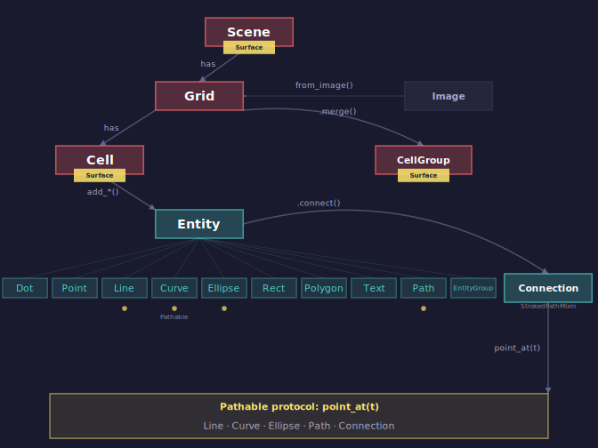

# API Reference

This is the comprehensive API reference for PyFreeform v0.3.0. Every class, method, property, and concept is documented here on a single page, organized to follow the natural discovery flow -- from creating your first Scene to building complex generative art.

!!! tip "How to use this reference"
    This page is designed as a **lookup reference**. For learning-oriented walkthroughs with visual examples, see the [Guide](../guide/index.md) section. For copy-paste starting points, see [Recipes](../recipes/index.md).

---

## 1. The Entry Point: Scene

Everything starts with a `Scene`. It is the canvas -- it holds your artwork and renders it to SVG.

!!! info "See also"
    For a hands-on walkthrough of creating scenes, see [Scenes and Grids](../guide/01-scenes-and-grids.md).

### Three Ways to Create a Scene

| Constructor | Use Case | Returns |
|---|---|---|
| `Scene(width, height, background=None)` | Manual canvas, no grid | Scene |
| `Scene.from_image(source, *, grid_size=40, cell_size=10, ...)` | Image-based art | Scene with grid |
| `Scene.with_grid(*, cols=30, rows=None, cell_size=10, ...)` | Grid-based art, no image | Scene with grid |

**`Scene.from_image()`** is the flagship -- load a photo, get a grid where every cell knows the color and brightness of the pixel it overlays.

**`Scene.with_grid()`** gives you the same grid structure but with no image data (cells default to brightness 0.5, color "#808080").

**`Scene(w, h)`** is for freeform art -- you place entities at absolute positions, no grid involved.

### Scene Properties

| Property | Type | Description |
|---|---|---|
| `scene.width` | `int` | Canvas width in pixels |
| `scene.height` | `int` | Canvas height in pixels |
| `scene.background` | `str \| None` | Background color (default: `"#1a1a2e"` midnight blue) |
| `scene.grid` | `Grid` | The primary grid (raises `ValueError` if none) |
| `scene.grids` | `list[Grid]` | All grids in the scene |
| `scene.entities` | `list[Entity]` | All entities (including those inside grid cells) |
| `scene.connections` | `list[Connection]` | All connections |

### Scene Methods

| Method | Description |
|---|---|
| `scene.add(*objects)` | Add entities, connections, or grids. Returns last added. |
| `scene.remove(obj)` | Remove an object. Returns `True` if found. |
| `scene.clear()` | Remove everything. |
| `scene.to_svg()` | Render to SVG string. |
| `scene.save(path)` | Save to `.svg` file (adds extension if missing). |

### `from_image()` Full Signature

??? note "Expand full signature"

    ```python
    Scene.from_image(
        source: str | Path | Image,   # File path or Image object
        *,
        grid_size: int | None = 40,   # Columns (rows auto from aspect ratio)
        cell_size: int = 10,          # Base cell size in pixels
        cell_ratio: float = 1.0,      # Width-to-height ratio (2.0 = domino)
        cell_width: float | None,     # Explicit cell width (overrides cell_size)
        cell_height: float | None,    # Explicit cell height (overrides cell_size)
        background: str | None,       # Background color (default "#1a1a2e")
    ) -> Scene
    ```

Two modes:

- **`grid_size=N`** (default): N columns, rows calculated from image aspect ratio. Scene dimensions = grid * cell_size.
- **`grid_size=None`**: Grid fits the image dimensions. Columns/rows derived from `image.width / cell_size`.

### `with_grid()` Full Signature

??? note "Expand full signature"

    ```python
    Scene.with_grid(
        *,
        cols: int = 30,               # Columns
        rows: int | None = None,      # Rows (defaults to cols for square)
        cell_size: int = 10,          # Base cell size in pixels
        cell_width: float | None,     # Explicit cell width
        cell_height: float | None,    # Explicit cell height
        background: str | None,       # Background color (default "#1a1a2e")
    ) -> Scene
    ```

---

## 2. The Grid: Structure and Selection

A `Grid` divides the scene into rows and columns of `Cell` objects. It provides powerful selection methods for targeting specific cells.

!!! info "See also"
    For grid creation patterns and cell access techniques, see [Scenes and Grids](../guide/01-scenes-and-grids.md).

### Grid Construction

| Constructor | Description |
|---|---|
| `Grid(cols, rows, cell_size=None, cell_width=None, cell_height=None)` | Manual grid |
| `Grid.from_image(image, cols=None, rows=None, cell_size=10, ...)` | Grid sized to image |

### Grid Properties

| Property | Type | Description |
|---|---|---|
| `grid.cols` | `int` | Number of columns |
| `grid.rows` | `int` | Number of rows |
| `grid.cell_width` | `float` | Cell width in pixels |
| `grid.cell_height` | `float` | Cell height in pixels |
| `grid.cell_size` | `(float, float)` | `(cell_width, cell_height)` tuple |
| `grid.pixel_width` | `float` | Total width = cols * cell_width |
| `grid.pixel_height` | `float` | Total height = rows * cell_height |
| `grid.origin` | `Coord` | Top-left corner position |
| `grid.source_image` | `Image \| None` | Original source image (if from_image) |

### Cell Access

| Operation | Description |
|---|---|
| `grid[row, col]` | Access by (row, col) index |
| `for cell in grid:` | Iterate row-by-row, left-to-right |
| `len(grid)` | Total number of cells |
| `grid.cell_at(x, y)` | Get cell at pixel position (or None) |

### Row & Column Access

| Method | Returns | Description |
|---|---|---|
| `grid.row(i)` | `list[Cell]` | All cells in row i |
| `grid.column(i)` | `list[Cell]` | All cells in column i |
| `grid.all_rows` | `Iterator[list[Cell]]` | Iterate over all rows |
| `grid.all_columns` | `Iterator[list[Cell]]` | Iterate over all columns |

### Region Selection

| Method | Returns | Description |
|---|---|---|
| `grid.region(row_start, row_end, col_start, col_end)` | `Iterator[Cell]` | Rectangular region |
| `grid.border(thickness=1)` | `Iterator[Cell]` | Cells on the grid border |

### Cell Merging (CellGroup)

| Method | Returns | Description |
|---|---|---|
| `grid.merge(start, end)` | `CellGroup` | Merge region into single surface. Both args are `(row, col)` tuples, both inclusive. Default: `start=(0, 0)`, `end=(rows-1, cols-1)`. Example: `merge((0, 0), (2, 2))` selects a 3x3 block. |
| `grid.merge_row(i)` | `CellGroup` | Merge full row |
| `grid.merge_col(i)` | `CellGroup` | Merge full column |

A `CellGroup` is a virtual surface -- it has all the same `add_*` builder methods as a Cell, and averaged data properties from its constituent cells.

### Pattern Selection

| Method | Description |
|---|---|
| `grid.every(n, offset=0)` | Every Nth cell (linear count) |
| `grid.checkerboard("black" \| "white")` | Checkerboard pattern |
| `grid.where(predicate)` | Filter by lambda: `grid.where(lambda c: c.brightness > 0.5)` |
| `grid.diagonal(direction="down", offset=0)` | Main or offset diagonals |

### Data Loading

```python
grid.load_layer(name, source, mode="value")
```

Modes: `"value"` (raw), `"normalized"` (0-1), `"hex"` (color string). Normally handled automatically by `Scene.from_image()`.

---

## 3. The Cell: Your Creative Unit

`Cell` extends `Surface` -- it inherits all 12+ builder methods plus has image data, position helpers, and neighbor access.

!!! info "See also"
    For practical cell usage patterns, see [Working with Cells](../guide/02-working-with-cells.md).

### Typed Data Properties (from loaded image)

| Property | Type | Default | Description |
|---|---|---|---|
| `cell.brightness` | `float` | `0.5` | 0.0 (black) to 1.0 (white) |
| `cell.color` | `str` | `"#808080"` | Hex color string |
| `cell.rgb` | `(int, int, int)` | `(128, 128, 128)` | RGB tuple (0-255 each) |
| `cell.alpha` | `float` | `1.0` | 0.0 (transparent) to 1.0 (opaque) |
| `cell.data` | `dict` | `{}` | Raw data dict for custom layers |

### Position Properties (inherited from Surface)

| Property | Type | Description |
|---|---|---|
| `cell.x`, `cell.y` | `float` | Top-left corner |
| `cell.width`, `cell.height` | `float` | Cell dimensions |
| `cell.bounds` | `(x, y, w, h)` | Bounding tuple |
| `cell.center` | `Coord` | Center position |
| `cell.top_left` | `Coord` | Top-left corner |
| `cell.top_right` | `Coord` | Top-right corner |
| `cell.bottom_left` | `Coord` | Bottom-left corner |
| `cell.bottom_right` | `Coord` | Bottom-right corner |

### Grid Position

| Property | Type | Description |
|---|---|---|
| `cell.row` | `int` | Row index (0-based) |
| `cell.col` | `int` | Column index (0-based) |
| `cell.grid` | `Grid` | Parent grid |
| `cell.normalized_position` | `(float, float)` | (nx, ny) normalized to 0.0-1.0 within grid |

### Neighbors

| Property | Returns | Direction |
|---|---|---|
| `cell.above` | `Cell \| None` | North |
| `cell.below` | `Cell \| None` | South |
| `cell.left` | `Cell \| None` | West |
| `cell.right` | `Cell \| None` | East |
| `cell.above_left` | `Cell \| None` | Northwest |
| `cell.above_right` | `Cell \| None` | Northeast |
| `cell.below_left` | `Cell \| None` | Southwest |
| `cell.below_right` | `Cell \| None` | Southeast |
| `cell.neighbors` | `dict[str, Cell \| None]` | 4 cardinal directions |
| `cell.neighbors_all` | `dict[str, Cell \| None]` | All 8 directions |

!!! warning "Neighbor properties return Cells, not positions"
    `cell.left`, `cell.right`, `cell.above`, `cell.below` return `Cell | None`, **not** position coordinates. Use `cell.center`, `cell.top_left`, etc. for positions.

### Sub-Cell Image Sampling

For finer-grained access to the original source image within a cell's area:

| Method | Returns | Description |
|---|---|---|
| `cell.sample_image(rx, ry)` | `(int, int, int)` | RGB at relative position within cell |
| `cell.sample_brightness(rx, ry)` | `float` | Brightness at relative position |
| `cell.sample_hex(rx, ry)` | `str` | Hex color at relative position |

Where `rx` and `ry` are 0.0-1.0 within the cell (0.5, 0.5 = center).

### Utility

| Method | Returns | Description |
|---|---|---|
| `cell.distance_to(other)` | `float` | Pixel distance to Cell, Coord, or tuple |

---

## 4. The Surface Protocol: Builder Methods

`Surface` is the base class for `Cell`, `Scene`, and `CellGroup`. It provides **12 builder methods** that all work identically across these three surfaces.

!!! info "See also"
    For creative examples of all builder methods, see [Drawing with Entities](../guide/03-drawing-with-entities.md).

### Named Positions

All `at` parameters accept named positions or `(rx, ry)` relative coordinates:

| Name | Relative | Description |
|---|---|---|
| `"center"` | `(0.5, 0.5)` | Center of surface |
| `"top_left"` | `(0.0, 0.0)` | Top-left corner |
| `"top_right"` | `(1.0, 0.0)` | Top-right corner |
| `"bottom_left"` | `(0.0, 1.0)` | Bottom-left corner |
| `"bottom_right"` | `(1.0, 1.0)` | Bottom-right corner |
| `"top"` | `(0.5, 0.0)` | Top center |
| `"bottom"` | `(0.5, 1.0)` | Bottom center |
| `"left"` | `(0.0, 0.5)` | Left center |
| `"right"` | `(1.0, 0.5)` | Right center |

### Parametric Positioning: `along` / `t` / `align`

All builder methods (except `add_fill`, `add_border`) support parametric positioning:

- **`along`**: Any `Pathable` object (Line, Curve, Ellipse, Path, Connection, or custom)
- **`t`**: Parameter 0.0 (start) to 1.0 (end) along the path
- **`align`**: If `True`, rotate the entity to follow the path's tangent direction

!!! tip "Killer feature"
    This is PyFreeform's most powerful concept -- position any element along any path:
    ```python
    line = cell.add_diagonal()
    cell.add_dot(along=line, t=cell.brightness)  # Dot slides along diagonal
    ```
    See [Paths and Parametric Positioning](../guide/05-paths-and-parametric.md) for in-depth examples.

### Entity-Relative Positioning: `within`

All builder methods (except `add_fill`, `add_border`, `add_path`) support `within=`:

```python
rect = cell.add_rect(fill="blue", width=0.5, height=0.5)
dot = cell.add_dot(within=rect, at="center", color="red")
```

When `within=` is set, all relative coordinates (`at`, `start`/`end`, `radius`, `rx`/`ry`, `width`/`height`) are resolved against the referenced entity's bounding box instead of the cell. This is reactive -- if the reference entity moves, dependent entities follow automatically.

### The `.at` Property

Every entity has a read/write `.at` property:

```python
dot = cell.add_dot(at=(0.25, 0.75), color="red")
print(dot.at)       # (0.25, 0.75)
dot.at = (0.5, 0.5) # Reposition to center
```

Returns `None` if the entity was created with pixel coordinates (via `place()` or direct constructor).

### Complete Builder Reference

#### `add_dot`

```python
add_dot(*, at, within, along, t, radius=0.05, color="black", z_index=0, opacity=1.0, style=DotStyle)
```

Creates a filled circle. `radius` is a fraction of the cell's smaller dimension (0.05 = 5%). Default position: center.

#### `add_line`

```python
add_line(*, start, end, within, along, t, align, width=1, color="black", z_index=0,
         cap="round", start_cap, end_cap, opacity=1.0, style=LineStyle)
```

Creates a line segment. Default: center to center (zero-length).

#### `add_diagonal`

```python
add_diagonal(*, start="bottom_left", end="top_right", within, along, t, align, width=1,
             color="black", z_index=0, cap="round", start_cap, end_cap,
             opacity=1.0, style=LineStyle)
```

Convenience for corner-to-corner lines. Delegates to `add_line()`.

#### `add_curve`

```python
add_curve(*, start="bottom_left", end="top_right", curvature=0.5, within, along, t, align,
          width=1, color="black", z_index=0, cap="round", start_cap, end_cap,
          opacity=1.0, style=LineStyle)
```

Creates a quadratic Bezier curve. `curvature`: 0 = straight, positive = bows left, negative = bows right.

#### `add_path`

??? note "Expand full signature"

    ```python
    add_path(pathable, *, segments=64, closed=False, start_t=0.0, end_t=1.0,
             width=1, color="black", fill=None, z_index=0, cap="round",
             start_cap, end_cap, opacity=1.0, fill_opacity, stroke_opacity,
             style=LineStyle)
    ```

Renders any Pathable as a smooth SVG `<path>` using cubic Bezier approximation. Supports arcs via `start_t`/`end_t`, closed paths with fill, and dual opacity.

#### `add_ellipse`

??? note "Expand full signature"

    ```python
    add_ellipse(*, at, within, along, t, align, rx, ry, rotation=0, fill="black",
                stroke=None, stroke_width=1, z_index=0, opacity=1.0,
                fill_opacity, stroke_opacity, style=ShapeStyle)
    ```

Creates an ellipse. Default radii: 40% of surface dimensions. The ellipse itself is a Pathable -- you can position other elements along it.

#### `add_polygon`

??? note "Expand full signature"

    ```python
    add_polygon(vertices, *, within, along, t, align, fill="black", stroke=None,
                stroke_width=1, z_index=0, opacity=1.0, fill_opacity,
                stroke_opacity, rotation=0, style=ShapeStyle)
    ```

Creates a polygon from relative-coordinate vertices (0-1). Use `Polygon.hexagon()`, `Polygon.star()`, etc. for common shapes. See [Shapes and Polygons](../guide/06-shapes-and-polygons.md) for shape classmethods.

#### `add_rect`

??? note "Expand full signature"

    ```python
    add_rect(*, at, within, along, t, align, width, height, rotation=0, fill="black",
             stroke=None, stroke_width=1, opacity=1.0, fill_opacity,
             stroke_opacity, z_index=0, style=ShapeStyle)
    ```

Creates a rectangle. `at` specifies the **center** position. Default size: 60% of surface.

#### `add_text`

??? note "Expand full signature"

    ```python
    add_text(content, *, at, within, along, t, align, font_size, color="black",
             font_family="sans-serif", bold=False, italic=False, text_anchor,
             baseline="middle", rotation=0, z_index=0, opacity=1.0,
             start_offset=0.0, end_offset=1.0, style=TextStyle)
    ```

Creates text. `font_size` is a fraction of the surface height (0.25 = 25% of cell height). Default: 0.25.

Two modes with `along`:

- **`along` + `t`**: Position text at a point on the path, optionally align to tangent.
- **`along` without `t`**: Warp text along the path using SVG `<textPath>` (auto-sizes font to fill path).

See [Text and Typography](../guide/07-text-and-typography.md) for text layout techniques.

#### `add_fill`

```python
add_fill(*, color="black", opacity=1.0, z_index=0, style=FillStyle)
```

Fill the entire surface with a solid color.

#### `add_border`

```python
add_border(*, color="#cccccc", width=0.5, z_index=0, opacity=1.0, style=BorderStyle)
```

Add a stroke-only border around the surface.

#### `add`

```python
add(entity, at="center")
```

Add an existing entity to this surface with relative positioning. The entity is moved to the resolved `at` position. Works for any entity type including `EntityGroup`.

#### `place`

```python
place(entity)
```

Place an entity at its current absolute pixel position (escape hatch). Unlike `add()`, this does NOT reposition the entity -- it is registered exactly where it already is.

---

## 5. Entities: The Drawing Primitives

All entities inherit from `Entity` and share these common capabilities.

!!! info "See also"
    For creative examples of each entity type, see [Drawing with Entities](../guide/03-drawing-with-entities.md).

### Entity Base Class

| Property/Method | Description |
|---|---|
| `entity.position` | Current position (`Coord`) -- computed from relative coords if set |
| `entity.x`, `entity.y` | Position coordinates (lazily resolved) |
| `entity.at` | Read/write relative position as `(rx, ry)` tuple, or `None` if pixel-mode |
| `entity.z_index` | Layer ordering (higher = on top) |
| `entity.cell` | Containing Surface (if placed) |
| `entity.connections` | Set of connections involving this entity |
| `entity.data` | Custom data dictionary |

### Movement

| Method | Description |
|---|---|
| `entity.move_to(x, y)` | Move to absolute position |
| `entity.move_by(dx, dy)` | Move by relative offset |
| `entity.translate(dx, dy)` | Alias for `move_by()` |
| `entity.move_to_cell(cell, at="center")` | Move to position within a cell |

### Transforms

| Method | Description |
|---|---|
| `entity.rotate(angle, origin=None)` | Rotate in degrees (counterclockwise) |
| `entity.scale(factor, origin=None)` | Scale (2.0 = double size) |
| `entity.fit_to_cell(scale=1.0, recenter=True, *, at=None)` | Auto-scale to fit within containing cell |
| `entity.fit_within(target, scale=1.0, recenter=True, *, at=None)` | Auto-scale to fit within another entity's inner bounds |

See [Transforms and Layout](../guide/08-transforms-and-layout.md) for detailed transform examples.

### Relationships

| Method | Description |
|---|---|
| `entity.connect(other, style, start_anchor, end_anchor)` | Create a Connection to another entity |
| `entity.anchor(name)` | Get named anchor point |
| `entity.anchor_names` | List of available anchor names |
| `entity.offset_from(anchor_name, dx, dy)` | Point offset from an anchor |
| `entity.place_beside(other, side="right", gap=0)` | Position beside another entity using bounding boxes |

### Abstract Methods (implemented by each entity type)

| Method | Description |
|---|---|
| `entity.to_svg()` | Render to SVG element string |
| `entity.bounds()` | Bounding box: `(min_x, min_y, max_x, max_y)` |
| `entity.inner_bounds()` | Inscribed rectangle (default: same as bounds) |

---

### 5a. Dot

**A filled circle.** The simplest entity.

```python
Dot(x=0, y=0, radius=5, color="black", z_index=0, opacity=1.0)
```

- **Anchors**: `"center"`
- **`color=`** parameter (not `fill=`)
- `inner_bounds()` returns inscribed square

---

### 5b. Line

**A line segment between two points.** Implements the Pathable protocol.

```python
Line(x1, y1, x2, y2, width=1, color="black", z_index=0, cap="round",
     start_cap=None, end_cap=None, opacity=1.0)
Line.from_points(start, end, ...)
```

- **Anchors**: `"start"`, `"center"`, `"end"`
- **Pathable**: `line.point_at(t)` returns a point along the line
- **Properties**: `line.start`, `line.end`, `line.length`
- **Methods**: `line.set_endpoints(start, end)`, `line.arc_length()`, `line.angle_at(t)`, `line.to_svg_path_d()`
- Cap values: `"round"`, `"square"`, `"butt"`, `"arrow"`, `"arrow_in"`

---

### 5c. Curve

**A quadratic Bezier curve.** Implements the Pathable protocol.

```python
Curve(x1, y1, x2, y2, curvature=0.5, width=1, color="black", z_index=0,
      cap="round", start_cap=None, end_cap=None, opacity=1.0)
Curve.from_points(start, end, curvature=0.5, ...)
```

- **Anchors**: `"start"`, `"center"`, `"end"`, `"control"`
- **Pathable**: `curve.point_at(t)` returns a point along the Bezier curve
- **Curvature**: 0 = straight, positive = bows left, negative = bows right, typical range -1 to 1
- **Properties**: `curve.start`, `curve.end`, `curve.curvature`, `curve.control`
- **Methods**: `curve.arc_length()`, `curve.angle_at(t)`, `curve.to_svg_path_d()`

See [Paths and Parametric Positioning](../guide/05-paths-and-parametric.md) for Bezier curve techniques.

---

### 5d. Ellipse

**An ellipse (oval).** Implements the Pathable protocol.

```python
Ellipse(x, y, rx=10, ry=10, rotation=0, fill="black", stroke=None,
        stroke_width=1, z_index=0, opacity=1.0, fill_opacity=None, stroke_opacity=None)
Ellipse.at_center(center, rx, ry, ...)
```

- **Anchors**: `"center"`, `"right"`, `"top"`, `"left"`, `"bottom"`
- **Pathable**: `ellipse.point_at(t)` -- t=0 rightmost, t=0.25 top, t=0.5 left, t=0.75 bottom
- **`fill=`** parameter (not `color=`)
- **Dual opacity**: `fill_opacity` and `stroke_opacity` override `opacity`
- **Methods**: `point_at_angle(degrees)`, `arc_length()`, `angle_at(t)`, `to_svg_path_d()`, `inner_bounds()`

---

### 5e. Polygon

**A closed polygon from vertices.** Includes shape classmethods for common shapes.

```python
Polygon(vertices, fill="black", stroke=None, stroke_width=1, z_index=0,
        opacity=1.0, fill_opacity=None, stroke_opacity=None)
```

- **Anchors**: `"center"` + `"v0"`, `"v1"`, `"v2"`, ...
- **`fill=`** parameter (not `color=`)
- **Dual opacity**: `fill_opacity` and `stroke_opacity`
- Position is centroid of vertices

#### Entity-Reference Vertices

Vertices can be static coordinates **or** entity references:

| Vertex type | Example | Behavior |
|---|---|---|
| `(x, y)` tuple or `Coord` | `(50, 100)` | Static — moves with polygon transforms |
| `Entity` | `Point(50, 100)` | Reactive — tracks entity's `.position` |
| `(Entity, "anchor")` | `(rect, "top_right")` | Reactive — tracks entity's named anchor |

Entity-reference vertices are resolved at render time. When the referenced entity moves, the polygon deforms automatically.

!!! warning "Transforms and entity vertices"
    `polygon.move_by()`, `polygon.rotate()`, and `polygon.scale()` only affect static (Coord) vertices. Entity-reference vertices follow their entity, not polygon transforms.

!!! info "See also"
    For all shape classmethods and polygon techniques, see [Shapes and Polygons](../guide/06-shapes-and-polygons.md).

#### Shape Classmethods

All return `list[tuple[float, float]]` in relative coordinates (0-1), ready for `add_polygon()`:

| Method | Description |
|---|---|
| `Polygon.triangle(size=1.0, center=(0.5, 0.5))` | Equilateral triangle (pointing up) |
| `Polygon.square(size=0.8, center=(0.5, 0.5))` | Axis-aligned square |
| `Polygon.diamond(size=0.8, center=(0.5, 0.5))` | Rotated square (45 degrees) |
| `Polygon.hexagon(size=0.8, center=(0.5, 0.5))` | Regular hexagon |
| `Polygon.star(points=5, size=0.8, inner_ratio=0.4, center=(0.5, 0.5))` | Star with N points |
| `Polygon.regular_polygon(sides, size=0.8, center=(0.5, 0.5))` | Regular N-gon |
| `Polygon.squircle(size=0.8, center=(0.5, 0.5), n=4, points=32)` | Superellipse (n=2 circle, n=4 squircle) |
| `Polygon.rounded_rect(size=0.8, center=(0.5, 0.5), corner_radius=0.2, points_per_corner=8)` | Rectangle with rounded corners |

---

### 5f. Rect

**A rectangle with optional rotation.**

```python
Rect(x, y, width, height, fill="black", stroke=None, stroke_width=1,
     rotation=0, z_index=0, opacity=1.0, fill_opacity=None, stroke_opacity=None)
Rect.at_center(center, width, height, rotation=0, ...)
```

- **Anchors**: `"center"`, `"top_left"`, `"top_right"`, `"bottom_left"`, `"bottom_right"`, `"top"`, `"bottom"`, `"left"`, `"right"`
- **`fill=`** parameter (not `color=`)
- **Dual opacity**: `fill_opacity` and `stroke_opacity`
- `x, y` is top-left corner; `Rect.at_center()` positions by center
- Rotation: stored as `rotation` attribute, emits SVG `transform="rotate()"`
- Rotation-aware anchors (anchors account for rotation angle)

---

### 5g. Text

**A text label with rich formatting.**

??? note "Expand full constructor"

    ```python
    Text(x=0, y=0, content="", font_size=16, color="black",
         font_family="sans-serif", font_style="normal", font_weight="normal",
         bold=False, italic=False, text_anchor="middle", baseline="middle",
         rotation=0, z_index=0, opacity=1.0)
    ```

- **`font_size`** in the constructor is **pixels** (16 = 16px). In `add_text()`, it's a **fraction** of surface height (0.25 = 25%).
- **Anchors**: `"center"`
- **`color=`** parameter
- **Sugar**: `bold=True` sets `font_weight="bold"`, `italic=True` sets `font_style="italic"`
- **Text alignment**: `text_anchor` = `"start"` / `"middle"` / `"end"`, `baseline` = `"auto"` / `"middle"` / `"hanging"` / etc.
- **Rotation**: `rotation` attribute, SVG `transform="rotate()"`
- **Bounds**: Uses Pillow for accurate font measurement; heuristic fallback
- **TextPath**: `text.set_textpath(path_id, path_d, start_offset, text_length)` for warping along paths

See [Text and Typography](../guide/07-text-and-typography.md) for text layout and textpath examples.

---

### 5h. Path

**Renders any Pathable as a smooth SVG path.** Implements the Pathable protocol itself.

??? note "Expand full constructor"

    ```python
    Path(
        pathable,           # Any object with point_at(t)
        *,
        segments=64,        # Number of cubic Bezier segments
        closed=False,       # Close path smoothly (enables fill)
        start_t=0.0,        # Start parameter (for arcs/sub-paths)
        end_t=1.0,          # End parameter (for arcs/sub-paths)
        width=1,            # Stroke width
        color="black",      # Stroke color
        fill=None,          # Fill color (only if closed)
        z_index=0,
        cap="round",
        start_cap=None,
        end_cap=None,
        opacity=1.0,
        fill_opacity=None,
        stroke_opacity=None,
    )
    ```

- **Anchors**: `"start"`, `"center"`, `"end"`
- **Pathable**: `path.point_at(t)` evaluates the stored Bezier segments
- **Algorithm**: Hermite interpolation to cubic Bezier fitting with C1 continuity
- **Sub-paths**: Use `start_t`/`end_t` to render a portion of any path (e.g., quarter of an ellipse)
- **Methods**: `arc_length()`, `angle_at(t)`, `to_svg_path_d()`

See [Paths and Parametric Positioning](../guide/05-paths-and-parametric.md) for path rendering techniques.

---

### 5i. EntityGroup

**A reusable composite entity.** Children positioned relative to (0,0), rendered as SVG `<g>`.

```python
EntityGroup(x=0, y=0, z_index=0, opacity=1.0)
```

- **`group.add(entity)`**: Add child (positioned relative to local origin)
- **`group.children`**: List of children (copy)
- **`group.rotate(angle, origin=None)`**: Accumulate rotation (degrees). With `origin`, also orbits position.
- **`group.scale(factor, origin=None)`**: Accumulate scale factor.
- **`group.opacity`**: Group-level opacity (applies to entire `<g>` element)
- **Placement**: `cell.add(group)` -- centers in cell
- **Fitting**: `group.fit_to_cell(fraction)` -- auto-scales to fit cell bounds
- **SVG**: `<g transform="translate(x,y) rotate(r) scale(s)" opacity="o">` -- children never mutated
- **Reuse**: Wrap creation in a factory function; each call returns new instance

!!! tip "EntityGroup vs CellGroup"
    `EntityGroup` inherits `Entity` and is used for reusable composite shapes. `CellGroup` inherits `Surface` and represents merged multi-cell regions. They serve different purposes.

See [Transforms and Layout](../guide/08-transforms-and-layout.md) for EntityGroup composition patterns.

---

### 5j. Point

**An invisible positional entity.** Renders no SVG — used as a movable anchor for reactive polygon vertices or connection endpoints.

```python
Point(x=0, y=0, z_index=0)
```

- **Anchors**: `"center"`
- **SVG output**: None (empty string)
- **Bounds**: Zero-size at position
- **Key use**: Pass to `Polygon()` as a vertex — the polygon tracks the Point's position at render time

```python
a, b, c = Point(0, 0), Point(100, 0), Point(50, 80)
tri = Polygon([a, b, c], fill="coral")
b.move_to(120, 30)  # triangle vertex 1 moves with it
```

See [Reactive Polygons](../guide/06-shapes-and-polygons.md#reactive-polygons) for shared vertices and anchor tracking examples.

---

## 6. The Pathable Protocol

The `Pathable` protocol defines a single method:

```python
class Pathable:
    def point_at(self, t: float) -> Coord
```

Where `t` ranges from 0.0 (start) to 1.0 (end). This enables the `along`/`t` parametric positioning system.

!!! info "See also"
    For a deep dive into parametric positioning, see [Paths and Parametric Positioning](../guide/05-paths-and-parametric.md).

### Built-in Pathables

| Entity | Description |
|---|---|
| `Line` | Linear interpolation start to end |
| `Curve` | Quadratic Bezier |
| `Ellipse` | Parametric ellipse (t=0 right, t=0.25 top, t=0.5 left, t=0.75 bottom) |
| `Path` | Evaluates stored cubic Bezier segments |
| `Connection` | Dynamic path between entities |

### Optional Pathable Methods

These methods enable additional features when present:

| Method | Used By | Description |
|---|---|---|
| `arc_length()` | `add_text(along=)` | Total path length for text sizing |
| `angle_at(t)` | `get_angle_at()` | Tangent angle for alignment |
| `to_svg_path_d()` | `add_text(along=)` | SVG path for `<textPath>` warping |

### Custom Pathables

Any object with `point_at(t: float) -> Coord` works:

```python
class Wave:
    def point_at(self, t):
        x = self.start.x + t * (self.end.x - self.start.x)
        y = self.center_y + self.amplitude * math.sin(t * self.frequency * 2 * math.pi)
        return Coord(x, y)
```

---

## 7. Connections

**Links between entities** that auto-update when entities move. By default, connections are **invisible** — they encode a relationship without rendering anything. Pass a `shape` to give them visual form.

```python
Connection(start, end, start_anchor="center", end_anchor="center",
           style=None, shape=None, segments=32)
```

Or via the entity method:
```python
connection = entity1.connect(
    entity2,
    style=ConnectionStyle(...),
    start_anchor="center",
    end_anchor="center",
    shape=Line(),       # or Curve(), Path(pathable), or None
    segments=32,
)
```

### Shape Options

| Shape | SVG Output | Notes |
|---|---|---|
| `None` (default) | Nothing (`to_svg()` returns `""`) | Pure relationship — supports `point_at(t)` |
| `Line()` | `<line>` element | Straight connection |
| `Curve(curvature=0.3)` | Single cubic Bezier `<path>` | Arc; curvature controls bow direction and amount |
| `Path(pathable)` | Fitted Bezier `<path>` | Any Pathable — wave, spiral, custom shape |

!!! info "Shape coordinates are auto-mapped"
    Shape objects define a template curve in their own coordinate space (e.g. `Line()` defaults to `(0,0)→(1,0)`). An affine transform maps the shape's start→end chord onto the actual anchor positions at render time.

- **`style`** accepts `ConnectionStyle` or `dict` with `width`, `color`, `z_index`, `cap` keys
- **`shape=None`** (default) = invisible — `point_at(t)` still works (linear interpolation)
- **`segments`** controls Bezier fitting resolution for `Path` shapes (default 32; ignored for Line/Curve)
- Added to scene via `scene.add(connection)` (`entity.connect()` does not auto-add)
- Supports cap system (arrow, arrow_in, custom) on all visible shapes
- Closed paths (`Path(pathable, closed=True)`) cannot be used as shapes — raises `ValueError`

!!! warning "Connections must be added to the scene"
    Calling `entity.connect(other)` creates a `Connection` object but does **not** add it to the scene. You must call `scene.add(connection)` separately.

---

## 8. Transforms and Fitting

!!! info "See also"
    For hands-on transform examples including `fit_to_cell` and `fit_within`, see [Transforms and Layout](../guide/08-transforms-and-layout.md).

### Entity Transforms

All entities support:

- **`rotate(angle, origin)`** -- Degrees counterclockwise. Default origin varies by entity type.
- **`scale(factor, origin)`** -- 2.0 = double size. Scales both geometry and position.

Each entity type handles transforms appropriately:

- **Dot**: Scales radius
- **Line/Curve**: Rotates/scales both endpoints
- **Ellipse**: Scales radii, updates intrinsic rotation
- **Polygon**: Transforms all vertices
- **Text**: Scales font_size
- **Path**: Transforms all Bezier control points
- **EntityGroup**: Accumulates internal `_scale` factor

### `fit_to_cell(scale=1.0, recenter=True, *, at=None)`

Auto-scales and positions any entity to fit within its containing cell.

- **`scale`**: Fraction of cell to fill (0.0-1.0). Default 1.0 fills entire cell.
- **`recenter`**: If True, centers in cell after scaling.
- **`at=(rx, ry)`**: Position-aware mode. Entity is placed at relative position within cell, with available space constrained by nearest edges.

### `fit_within(target, scale=1.0, recenter=True, *, at=None)`

Same concept, but fits within another entity's `inner_bounds()` instead of the cell.

---

## 9. Color and Styling

!!! info "See also"
    For creative styling techniques and palette usage, see [Colors, Styles, and Palettes](../guide/04-colors-styles-palettes.md).

### The Color Parameter Split

!!! danger "Critical API distinction: `fill=` vs `color=`"
    This is the most common source of errors. Using the wrong parameter will raise a `TypeError`.

| Parameter | Used by | Entity property |
|---|---|---|
| **`color=`** | Dot, Line, Curve, Text, add_dot, add_line, add_curve, add_text, add_fill, add_border, all style classes | `.color` |
| **`fill=`** | Rect, Ellipse, Polygon, add_rect, add_ellipse, add_polygon, Path (for closed paths) | `.fill` |

`ShapeStyle.color` maps to `fill=` when applied to shapes.

### Color Formats

The `Color` utility accepts:

- **Named colors**: `"red"`, `"coral"`, `"navy"`, etc.
- **Hex**: `"#ff0000"`, `"#f00"`, `"#FF0000"`
- **RGB tuple**: `(255, 0, 0)`

### Opacity System

- **`opacity`** on every entity and style: 0.0 (transparent) to 1.0 (opaque). Default 1.0 emits no SVG attribute.
- **`fill_opacity` / `stroke_opacity`** on shapes (Rect, Ellipse, Polygon, Path, ShapeStyle): optional overrides for independent control.
- Simple entities (Dot, Line, Curve, Text, Connection): SVG `opacity` attribute.
- Shapes: SVG `fill-opacity` + `stroke-opacity` attributes.

### Style Classes

7 immutable dataclasses with `.with_*()` builder methods:

| Class | For | Key Fields |
|---|---|---|
| `DotStyle` | `add_dot()` | `color`, `z_index`, `opacity` |
| `LineStyle` | `add_line()`, `add_diagonal()`, `add_curve()`, `add_path()` | `width`, `color`, `z_index`, `cap`, `start_cap`, `end_cap`, `opacity` |
| `FillStyle` | `add_fill()` | `color`, `opacity`, `z_index` |
| `BorderStyle` | `add_border()` | `width`, `color`, `z_index`, `opacity` |
| `ShapeStyle` | `add_ellipse()`, `add_polygon()`, `add_rect()` | `color`, `stroke`, `stroke_width`, `z_index`, `opacity`, `fill_opacity`, `stroke_opacity` |
| `TextStyle` | `add_text()` | `color`, `font_family`, `bold`, `italic`, `text_anchor`, `baseline`, `rotation`, `z_index`, `opacity` |
| `ConnectionStyle` | `Connection`, `entity.connect()` | `width`, `color`, `z_index`, `cap`, `start_cap`, `end_cap`, `opacity` |

Example builder pattern:
```python
base_style = LineStyle(width=2, color="coral")
thick_style = base_style.with_width(4)
arrow_style = base_style.with_end_cap("arrow")
```

### Palettes

8 pre-built color palettes with 6 named colors each:

| Palette | Background | Vibe |
|---|---|---|
| `Palette.midnight()` | `#1a1a2e` | Dark blue with coral accent |
| `Palette.sunset()` | `#2d1b4e` | Warm oranges and purples |
| `Palette.ocean()` | `#0a1628` | Cool blues and teals |
| `Palette.forest()` | `#1a2e1a` | Natural greens and earth |
| `Palette.monochrome()` | `#0a0a0a` | Black, white, grays |
| `Palette.paper()` | `#fafafa` | Light, clean, minimalist |
| `Palette.neon()` | `#0d0d0d` | Vibrant neon electric |
| `Palette.pastel()` | `#fef6e4` | Soft, gentle pastels |

Named colors: `background`, `primary`, `secondary`, `accent`, `line`, `grid`.

Methods: `with_background(color)`, `inverted()`, `all_colors()`, iteration.

---

## 10. Cap System

Line/Curve/Connection endpoints support custom caps:

| Built-in Cap | Description |
|---|---|
| `"round"` | Standard SVG round cap |
| `"square"` | SVG square cap |
| `"butt"` | SVG butt cap (flat) |
| `"arrow"` | Arrowhead marker at endpoint |
| `"arrow_in"` | Inward-pointing arrowhead |

Per-end caps: `start_cap` and `end_cap` override the base `cap`:
```python
cell.add_line(start="left", end="right", cap="round", end_cap="arrow")
```

Custom caps via registry:
```python
from pyfreeform import register_cap
register_cap("diamond", my_diamond_generator)
```

---

## 11. The Coord Type

```python
from pyfreeform import Coord
```

`Coord` is a `NamedTuple` with `x` and `y` fields. Subscriptable: `point[0]`, `point[1]`.

| Method | Description |
|---|---|
| `Coord(x, y)` | Create a point |
| `point.x`, `point.y` | Access coordinates |
| `point[0]`, `point[1]` | Subscript access |
| `point.distance_to(other)` | Euclidean distance |
| `point.midpoint(other)` | Midpoint between two points |
| `point.lerp(other, t)` | Linear interpolation |
| `point + Coord(dx, dy)` | Addition |
| `point - Coord(dx, dy)` | Subtraction |

---

## 12. Image Processing

### Image Class

```python
from pyfreeform import Image
image = Image.load("photo.jpg")
```

| Method/Property | Description |
|---|---|
| `Image.load(path)` | Load from file |
| `Image.from_pil(pil_image)` | Create from PIL Image |
| `image.width`, `image.height` | Dimensions |
| `image.has_alpha` | Whether image has alpha channel |
| `image["brightness"]` | Get brightness Layer |
| `image["red"]`, `["green"]`, `["blue"]`, `["alpha"]` | Channel layers |
| `image.rgb_at(x, y)` | RGB at pixel position |
| `image.hex_at(x, y)` | Hex color at pixel position |
| `image.resize(width, height)` | Resize image |
| `image.fit(max_dim)` | Fit within max dimension |
| `image.quantize(levels)` | Reduce to N levels |
| `image.downscale(factor)` | Downscale by factor |

!!! info "See also"
    For image-to-art workflows, see [Image to Art](../recipes/01-image-to-art.md).

### Layer Class

A single-channel grayscale array (used for brightness, individual color channels, etc.):

| Property/Method | Description |
|---|---|
| `layer.width`, `layer.height` | Dimensions |
| `layer[x, y]` | Value at position (0-255) |

---

## 13. Utility Functions

### `map_range(value, in_min=0, in_max=1, out_min=0, out_max=1, clamp=False)`

Map a value from one range to another. Convenience for creative coding.

```python
from pyfreeform import map_range

rotation = map_range(cell.brightness, 0, 1, 0, 360)
radius = map_range(cell.brightness, 0, 1, 2, 10)
```

### `get_angle_at(pathable, t)`

Compute the tangent angle at parameter `t` on a Pathable. Used internally by the `align` system.

```python
from pyfreeform import get_angle_at
angle = get_angle_at(curve, 0.5)  # Angle in degrees at midpoint
```

### `display(scene_or_svg)`

Display an SVG in the current environment (Jupyter notebook, etc.).

---

## 14. Relationship Map

<figure markdown>
{ width="580" }
<figcaption>PyFreeform's class relationships — this diagram was generated by PyFreeform itself.</figcaption>
</figure>

### Key Design Principles

1. **Surface protocol**: Cell, Scene, CellGroup all share identical `add_*` methods
2. **Pathable protocol**: Position anything along anything with `along`/`t`
3. **`fill=` vs `color=`**: Shapes use `fill`, everything else uses `color`
4. **Immutable styles**: Style classes with `.with_*()` builder methods
5. **z_index layering**: Higher values render on top, same values preserve add-order
6. **Everything returns self**: Transform methods chain: `entity.rotate(45).scale(0.5).move_by(10, 0)`
