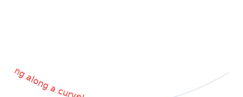

# Text

Add typography and labels to your artwork with the Text entity. Full control over fonts, sizes, alignment, and rotation.

---

## What is Text?

A **Text** entity displays typography with:
- **Content** - The text string
- **Position** - Anchor point (x, y)
- **Font size** - Size in pixels
- **Font family** - Typeface
- **Color** - Text color
- **Alignment** - Horizontal and vertical positioning
- **Rotation** - Angle in degrees

Perfect for titles, labels, annotations, and text-based art.


---

## Creating Text

### Via Cell Method

```python
# Simple text at center
cell.add_text("Hello", font_size=16)

# Custom positioning
cell.add_text(
    content="Label",
    at="top_left",
    font_size=12,
    color="white"
)

# Full control
cell.add_text(
    content="Title",
    at="center",
    font_size=24,
    color="coral",
    font_family="serif",
    text_anchor="middle",
    baseline="middle"
)
```

### Direct Construction

```python
from pyfreeform import Text

text = Text(
    x=100,
    y=200,
    content="My Label",
    font_size=18,
    color="black",
    font_family="sans-serif"
)

scene.add(text)
```

---

## Properties

```python
text.content        # Text string
text.position       # Anchor point
text.x, text.y      # Coordinates
text.font_size      # Size in pixels
text.color          # Text color
text.font_family    # Typeface
text.text_anchor    # Horizontal alignment
text.baseline       # Vertical alignment
text.rotation       # Degrees
text.z_index        # Layer order
```

---

## Font Families

```python
# Web-safe fonts
cell.add_text("Sans Serif", font_family="sans-serif")  # Default, clean
cell.add_text("Serif", font_family="serif")            # Traditional
cell.add_text("Monospace", font_family="monospace")    # Fixed-width

# Specific fonts (may not be available on all systems)
cell.add_text("Arial", font_family="Arial")
cell.add_text("Georgia", font_family="Georgia")
cell.add_text("Courier", font_family="Courier New")
```


**Recommended:** Stick with generic families for maximum compatibility.

---

## Alignment

### Text Anchor (Horizontal)

Controls which part of the text sits at the position:

```python
text_anchor="start"   # Left-aligned (position at start)
text_anchor="middle"  # Center-aligned (position at middle) - DEFAULT
text_anchor="end"     # Right-aligned (position at end)
```

### Baseline (Vertical)

Controls vertical positioning:

```python
baseline="auto"       # Browser default
baseline="middle"     # Vertically centered - RECOMMENDED
baseline="hanging"    # Top of text at position
baseline="alphabetic" # Baseline at position
baseline="ideographic"  # For CJK text
```

**For centered text:**
```python
cell.add_text(
    "Centered",
    text_anchor="middle",  # Horizontal center
    baseline="middle"      # Vertical center
)
```

---

## Rotation

Rotate text around its anchor point:

```python
# Rotate 45 degrees
cell.add_text("Rotated", rotation=45)

# Vertical text (90 degrees)
cell.add_text("Vertical", rotation=90)

# Upside down
cell.add_text("Flipped", rotation=180)
```

---

## Text Along Paths

Text can be positioned along paths or **warped** to follow them:

### Position at a Point (with t=)

```python
curve = cell.add_curve(curvature=0.5, color="gray")

# Position text at t=0.5, rotated to follow tangent
cell.add_text("Label", along=curve, t=0.5, align=True, font_size=10, color="white")
```

### Warp Along Path (without t=)

Omit `t=` to flow text along the entire path using SVG `<textPath>`:

```python
curve = cell.add_curve(start="left", end="right", curvature=0.3)

# Text warps along the curve shape
cell.add_text("Hello World!", along=curve, font_size=12, color="coral")
```



This works with any entity that has `to_svg_path_d()` — lines, curves, and ellipses.

See [Positioning Along Paths](../parametric-art/02-positioning-along-paths.md#text-along-paths-textpath) for more details and examples.

---

## Common Patterns

### Pattern 1: Grid Labels

```python
scene = Scene.with_grid(cols=8, rows=8, cell_size=30)

# Column headers (A-H)
for col in range(scene.grid.cols):
    cell = scene.grid[0, col]
    label = chr(65 + col)  # A, B, C, ...
    cell.add_text(
        label,
        font_size=14,
        color="white"
    )

# Row numbers (1-8)
for row in range(scene.grid.rows):
    cell = scene.grid[row, 0]
    cell.add_text(
        str(row + 1),
        font_size=14,
        color="white"
    )
```


### Pattern 2: Title Overlay

```python
scene = Scene.from_image("photo.jpg", grid_size=40)

# Add artwork
for cell in scene.grid:
    cell.add_dot(color=cell.color)

# Title on top
from pyfreeform import Text
title = Text(
    x=scene.width // 2,
    y=30,
    content="My Artwork",
    font_size=32,
    color="white",
    font_family="serif",
    text_anchor="middle",
    z_index=100  # On top
)
scene.add(title)
```


### Pattern 3: Data Labels

```python
for cell in scene.grid:
    # Show brightness value
    value = f"{cell.brightness:.2f}"

    cell.add_text(
        value,
        font_size=8,
        color="white" if cell.brightness < 0.5 else "black",
        font_family="monospace"
    )
```


### Pattern 4: Rotating Text

```python
for cell in scene.grid:
    # Rotation based on position
    angle = (cell.row + cell.col) * 15

    cell.add_text(
        "TEXT",
        font_size=10,
        rotation=angle,
        color=cell.color
    )
```


---

## Font Sizing

Font size is in pixels:

```python
cell.add_text("Small", font_size=10)
cell.add_text("Medium", font_size=16)  # Default
cell.add_text("Large", font_size=24)
cell.add_text("Huge", font_size=36)
```

**Tip:** Use relative to cell size:
```python
size = cell.height * 0.6  # 60% of cell height
cell.add_text("Auto-sized", font_size=size)
```

### Automatic Sizing with fit_within

When placing text inside another entity (like a dot or ellipse), use `fit_within` to auto-scale the font size:

```python
dot = cell.add_dot(radius=15, color="navy", z_index=0)

# Start with a large font_size — fit_within scales it down to fit
label = cell.add_text(
    content=str(radius),
    font_size=50,
    color="white",
    font_family="monospace",
    z_index=10
)
label.fit_within(dot)
```

For circles and ellipses, `fit_within` uses the **inscribed rectangle** (`inner_bounds()`) so text stays inside the curved boundary — not the bounding box.


See [Fit to Cell](../advanced-concepts/05-fit-to-cell.md) for the related `fit_to_cell()` method.

---

## Layering

Text often needs to be on top:

```python
# Background
cell.add_fill(color="navy", z_index=0)

# Text on top
cell.add_text(
    "LABEL",
    color="white",
    z_index=10
)
```

---

## Complete Example

```python
from pyfreeform import Scene, Palette, Text

scene = Scene.with_grid(cols=4, rows=4, cell_size=100)
colors = Palette.midnight()
scene.background = colors.background

# Font families demo
families = ["sans-serif", "serif", "monospace", "sans-serif"]
for row in range(4):
    for col in range(4):
        cell = scene.grid[row, col]

        if row == 0:
            # Font family examples
            cell.add_text(
                families[col],
                font_family=families[col],
                font_size=14,
                color=colors.primary
            )
        elif row == 1:
            # Size variations
            size = 10 + col * 4
            cell.add_text(
                f"{size}px",
                font_size=size,
                color=colors.secondary
            )
        elif row == 2:
            # Alignment
            anchors = ["start", "middle", "end", "middle"]
            cell.add_text(
                anchors[col],
                text_anchor=anchors[col],
                font_size=12,
                color=colors.accent
            )
        else:
            # Rotation
            angle = col * 30
            cell.add_text(
                f"{angle}°",
                rotation=angle,
                font_size=14,
                color=colors.line
            )

# Title
title = Text(
    x=scene.width // 2,
    y=scene.height + 30,
    content="Text Features",
    font_size=20,
    color="white",
    text_anchor="middle"
)
scene.add(title)

scene.save("text_demo.svg")
```


---

## Tips

### Center Text in Cells

Use both alignments:
```python
cell.add_text(
    "Centered",
    text_anchor="middle",
    baseline="middle"
)
```

### Contrast for Readability

Choose color based on background:
```python
text_color = "white" if cell.brightness < 0.5 else "black"
cell.add_text("Label", color=text_color)
```

### Monospace for Data

Use monospace for numbers and code:
```python
cell.add_text(
    f"{cell.brightness:.3f}",
    font_family="monospace",
    font_size=10
)
```

### Layer Text on Top

Always use high z-index for text:
```python
cell.add_text("Label", z_index=100)
```

---

## See Also

- 📖 [Rectangles](07-rectangles.md) - Backgrounds for text
- 📖 [Layering](../fundamentals/05-layering.md) - Z-index control
- 🎯 [Text Example](../examples/intermediate/text.md)
- 🎯 [Text Showcase](../examples/intermediate/text.md)

