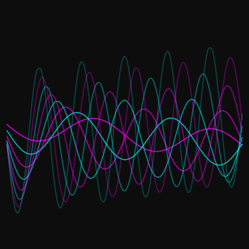
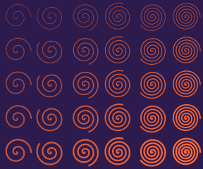
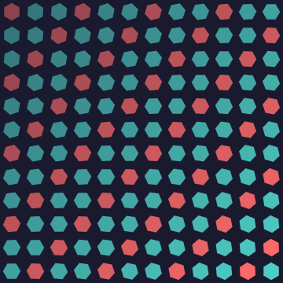
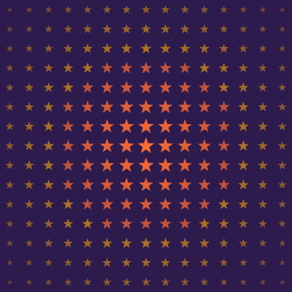

---
hide:
  - toc
---

# Gallery

A showcase of the best artwork generated across the wiki. Click any image to zoom in. Each links to the page where it's explained.

---

## Image-to-Art

<figure markdown>

<figcaption markdown>[Classic Dot Art](../recipes/01-image-to-art.md)</figcaption>
</figure>

<figure markdown>

<figcaption markdown>[Halftone Effect](../recipes/01-image-to-art.md)</figcaption>
</figure>

<figure markdown>

<figcaption markdown>[Shape Art](../recipes/01-image-to-art.md)</figcaption>
</figure>

---

## Geometric Patterns

<figure markdown>

<figcaption markdown>[Rotating Hexagonal Tiling](../recipes/02-geometric-patterns.md)</figcaption>
</figure>

<figure markdown>

<figcaption markdown>[Sine Wave Pattern](../recipes/02-geometric-patterns.md)</figcaption>
</figure>

<figure markdown>

<figcaption markdown>[Concentric Rings](../recipes/02-geometric-patterns.md)</figcaption>
</figure>

---

## Flowing Art

<figure markdown>

<figcaption markdown>[Wave Visualization](../recipes/03-flowing-curves.md)</figcaption>
</figure>

<figure markdown>

<figcaption markdown>[Spiral Paths](../recipes/03-flowing-curves.md)</figcaption>
</figure>

<figure markdown>

<figcaption markdown>[Image Curves](../recipes/03-flowing-curves.md)</figcaption>
</figure>

---

## Networks & Typography

<figure markdown>

<figcaption markdown>[Brightness Network](../recipes/04-connected-networks.md)</figcaption>
</figure>

<figure markdown>

<figcaption markdown>[ASCII Art](../recipes/05-typographic-art.md)</figcaption>
</figure>

<figure markdown>

<figcaption markdown>[Full Stack Composition](../recipes/06-advanced-compositions.md)</figcaption>
</figure>

---

## Parametric Paths

<figure markdown>

<figcaption markdown>[Filled Lissajous Curves](../guide/05-paths-and-parametric.md#filled-closed-paths)</figcaption>
</figure>

<figure markdown>

<figcaption markdown>[Wave Paths](../guide/05-paths-and-parametric.md#built-in-path-shapes)</figcaption>
</figure>

<figure markdown>

<figcaption markdown>[Ellipse Arcs](../guide/05-paths-and-parametric.md#sub-paths-and-arcs)</figcaption>
</figure>

---

## Guide Highlights

<figure markdown>

<figcaption markdown>[MONSTER Letter Mosaic](../recipes/05-typographic-art.md#letter-mosaic)</figcaption>
</figure>

<figure markdown>

<figcaption markdown>[Star Constellation](../guide/09-connections-and-anchors.md#creative-pattern-constellation)</figcaption>
</figure>

<figure markdown>

<figcaption markdown>[Edge Detection](../guide/02-working-with-cells.md)</figcaption>
</figure>

---

## Home Page Art

<figure markdown>

<figcaption markdown>[Hero Artwork](../index.md)</figcaption>
</figure>

<figure markdown>

<figcaption markdown>[Hexagons](../index.md)</figcaption>
</figure>

<figure markdown>

<figcaption markdown>[Star Field](../index.md)</figcaption>
</figure>

