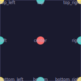
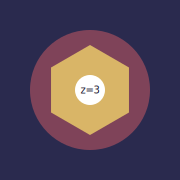

# How PyFreeform Works

Understanding four concepts unlocks everything PyFreeform can do.

## The Mental Model

```
Scene  →  Grid  →  Cells  →  Entities
```

A **Scene** is your canvas. It contains a **Grid** of **Cells**. You add **Entities** (dots, lines, shapes, text) to each cell.

<figure markdown>
{ width="280" }
<figcaption>A 6x6 grid with dots, lines, shapes, and fills placed in different cells.</figcaption>
</figure>

Every cell inherits data from the image (if you used `from_image()`) — brightness, color, RGB values. Without an image, cells have neutral defaults. Either way, the pattern is always the same:

```python
scene = Scene.from_image("photo.jpg")  # or Scene.with_grid(...)

for cell in scene.grid:
    # Read data from the cell
    # Add entities based on that data
    cell.add_dot(radius=cell.brightness * 5, color=cell.color)

scene.save("output.svg")
```

## Named Positions

Every surface (cell, scene, merged region) has **9 named positions**. Use them anywhere you'd specify a location:

<figure markdown>
{ width="200" }
<figcaption>The 9 named positions: center, corners, and edge midpoints.</figcaption>
</figure>

```python
cell.add_dot(at="center")           # Default
cell.add_dot(at="top_left")         # Corner
cell.add_line(start="left", end="right")  # Edge to edge
```

You can also use relative coordinates — `(0.0, 0.0)` is top-left, `(1.0, 1.0)` is bottom-right:

```python
cell.add_dot(at=(0.25, 0.75))  # Quarter from left, three-quarters down
```

## The Surface Protocol

`Cell`, `Scene`, and `CellGroup` all share the same builder methods. This means you learn one set of methods and use them everywhere:

| Method | Creates |
|---|---|
| `add_dot()` | Filled circle |
| `add_line()` | Line segment |
| `add_curve()` | Bezier curve |
| `add_ellipse()` | Ellipse (also a path!) |
| `add_polygon()` | Any polygon shape |
| `add_rect()` | Rectangle |
| `add_text()` | Text label |
| `add_path()` | Smooth path from any parametric equation |
| `add_fill()` | Solid background fill |
| `add_border()` | Stroke-only border |

<figure markdown>
{ width="280" }
<figcaption>Entities added at the cell level (dots) and scene level (large dot, line) coexist.</figcaption>
</figure>

## Layering with z_index

When entities overlap, `z_index` controls which appears on top. Higher values render later (on top):

```python
cell.add_fill(color="navy", z_index=0)      # Background
cell.add_ellipse(fill="coral", z_index=1)    # Middle layer
cell.add_dot(color="white", z_index=2)       # Foreground
```

<figure markdown>
{ width="200" }
<figcaption>Four layers stacked: fill → ellipse → hexagon → dot.</figcaption>
</figure>

!!! tip "Same z_index?"
    Entities with the same `z_index` render in the order they were added.

---

## What's Next?

You now understand the core architecture. The **Guide** takes you through every feature in depth:

[Scenes & Grids &rarr;](../guide/01-scenes-and-grids.md){ .md-button }
