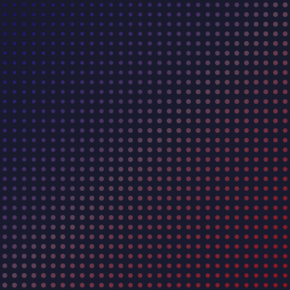
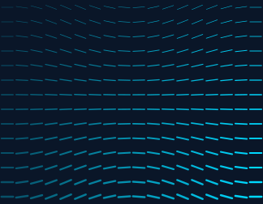
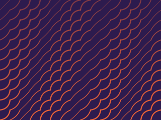
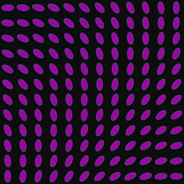
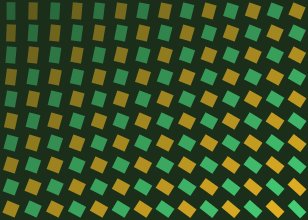
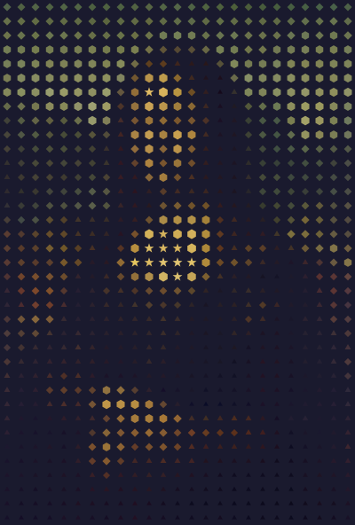
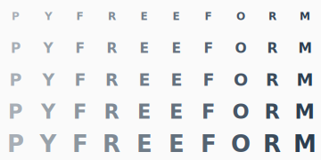
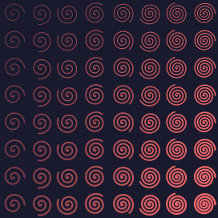

# Drawing with Entities

PyFreeform has **9 entity types**, each with a unique creative personality. This page showcases what makes each one special.

## Dots

The fundamental mark. A filled circle defined by radius and color.

```python
cell.add_dot(radius=cell.brightness * 0.42, color=cell.color, opacity=0.6)
```

<figure markdown>
{ width="380" }
<figcaption>Dots sized and colored by a gradient image — larger and brighter toward the warm corner.</figcaption>
</figure>

!!! info "Key parameter"
    Dots use **`color=`** (not `fill=`). Default radius is 0.05.

---

## Lines

Structure and direction. Line segments connect two points within a cell.

```python
angle = math.sin(nx * math.pi * 2) * 0.4
dx, dy = math.cos(angle) * 0.4, math.sin(angle) * 0.4
cell.add_line(start=(0.5 - dx, 0.5 - dy), end=(0.5 + dx, 0.5 + dy), width=1.5, color=colors.primary)
```

<figure markdown>
{ width="380" }
<figcaption>Line angles driven by sine waves create a flowing direction field.</figcaption>
</figure>

Lines also implement the **Pathable protocol** — you can position other entities along them with `along=line, t=0.5`.

---

## Curves

Organic flow. Quadratic Bezier curves with controllable curvature.

```python
curvature = math.sin(nx * math.pi * 3 + ny * 2) * 0.8
cell.add_curve(start="bottom_left", end="top_right", curvature=curvature, width=1.5, color=colors.primary)
```

<figure markdown>
{ width="380" }
<figcaption>Varying curvature across the grid creates a rippling wave texture.</figcaption>
</figure>

!!! tip "Curvature values"
    `0` = straight line. Positive = bows left. Negative = bows right. Typical range: -1 to 1.

---

## Ellipses

The pathable shape. Ellipses can serve as both visual elements and paths for positioning.

```python
cell.add_ellipse(at="center", rx=0.4, ry=0.2, rotation=(nx + ny) * 90, fill=colors.primary, opacity=0.6)
```

<figure markdown>
{ width="340" }
<figcaption>Ellipses rotated by position create a moiré interference pattern.</figcaption>
</figure>

Ellipses use **`fill=`** (not `color=`) and support `stroke`, `fill_opacity`, and `stroke_opacity`.

---

## Rectangles

Filled regions with optional rotation. `at=` specifies the **center** position.

```python
cell.add_rect(at="center", width=w, height=h, rotation=t * 45, fill=colors.primary, opacity=0.5)
```

<figure markdown>
{ width="380" }
<figcaption>Rectangles with varying proportions and rotation form an evolving mosaic.</figcaption>
</figure>

---

## Polygons

Shape variety. Use the **shape classmethods** for common shapes, or pass custom vertices.

```python
if brightness < 0.25:
    verts = Polygon.triangle(size=size)
elif brightness < 0.5:
    verts = Polygon.diamond(size=size)
elif brightness < 0.75:
    verts = Polygon.hexagon(size=size)
else:
    verts = Polygon.star(points=5, size=size)

cell.add_polygon(verts, fill=cell.color, opacity=0.8)
```

<figure markdown>
{ width="420" }
<figcaption>Different shapes for different brightness ranges — triangles, diamonds, hexagons, and stars.</figcaption>
</figure>

??? info "All shape classmethods"
    | Method | Shape |
    |---|---|
    | `Polygon.triangle()` | Equilateral triangle |
    | `Polygon.square()` | Square |
    | `Polygon.diamond()` | Rotated square |
    | `Polygon.hexagon()` | Regular hexagon |
    | `Polygon.star(points=5)` | N-pointed star |
    | `Polygon.regular_polygon(sides)` | Regular N-gon |
    | `Polygon.squircle()` | Superellipse |
    | `Polygon.rounded_rect()` | Rounded rectangle |

---

## Text

Labels, characters, and typography. Supports font families, bold, italic, rotation, and `fit=True` to prevent overflow.

```python
cell.add_text("A", at="center", font_size=0.25, color=colors.primary, bold=True, opacity=0.7)
cell.add_text("Long label", at="center", font_size=0.25, color=colors.primary, fit=True)
```

<figure markdown>
{ width="380" }
<figcaption>Characters from "PYFREEFORM" repeated across the grid, growing in size.</figcaption>
</figure>

---

## Paths

Render **any parametric equation** as a smooth SVG path. Define a class with `point_at(t)` and pass it to `add_path()`:

```python
class Spiral:
    def __init__(self, cx, cy, max_r, turns=2):
        self.cx, self.cy, self.max_r, self.turns = cx, cy, max_r, turns

    def point_at(self, t):
        angle = t * self.turns * 2 * math.pi
        r = t * self.max_r
        return Coord(self.cx + r * math.cos(angle), self.cy + r * math.sin(angle))

spiral = Spiral(cx, cy, max_r=12, turns=3)
cell.add_path(spiral, segments=48, width=1.2, color=colors.primary)
```

<figure markdown>
{ width="320" }
<figcaption>A custom spiral pathable rendered in each cell — the path system handles any shape.</figcaption>
</figure>

---

## Points

Invisible anchors. Points render nothing but serve as movable position references — useful as reactive vertices in polygons or as connection endpoints.

```python
# Builder method (relative coordinates — preferred in cells)
a = cell.add_point(at=(0.5, 0.1))
b = cell.add_point(at=(0.9, 0.9))
c = cell.add_point(at=(0.1, 0.9))
tri = Polygon([a, b, c], fill="coral")
b.at = (0.8, 0.3)  # polygon deforms automatically
```

The direct constructor `Point(x, y)` is also available for pixel-based positioning outside of cells.

!!! info "Zero visual footprint"
    Points produce no SVG output. They exist purely as positional anchors for other entities to reference. See [Reactive Polygons](06-shapes-and-polygons.md#reactive-polygons) for full examples.

---

## What's Next?

Now that you know all the entity types, learn how to color and style them consistently:

[Colors, Styles & Palettes &rarr;](04-colors-styles-palettes.md){ .md-button }
