# Colors, Styles & Palettes

PyFreeform provides a coherent color and styling system. Master three concepts: the **color parameter split**, **style objects**, and **palettes**.

## The Color Parameter Split

This is the most important API distinction to remember:

| Parameter | Used by | Description |
|---|---|---|
| **`color=`** | Dot, Line, Curve, Text, `add_fill`, `add_border` | Stroke-like entities |
| **`fill=`** | Rect, Ellipse, Polygon | Filled shapes |

<figure markdown>
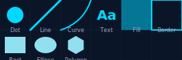{ width="400" }
<figcaption>Top row: entities using <code>color=</code>. Bottom row: entities using <code>fill=</code>.</figcaption>
</figure>

!!! warning "Common mistake"
    Writing `cell.add_polygon(verts, color="red")` will raise an error. Use `fill="red"` for shapes.

## Color Formats

All color parameters accept any `ColorLike` value:

- **Named colors**: `"red"`, `"coral"`, `"navy"`, `"salmon"`
- **Hex strings**: `"#ff6b6b"`, `"#f00"`, `"#FF6B6B"`
- **RGB tuples**: `(255, 107, 107)`, `cell.rgb`

---

## Opacity

Every entity supports `opacity` (0.0 transparent → 1.0 opaque, default 1.0):

```python
cell.add_dot(radius=0.1, color="coral", opacity=0.5)
cell.add_fill(color="navy", opacity=0.3)
```

### Shape-Specific: fill_opacity & stroke_opacity

Shapes (Rect, Ellipse, Polygon) support independent opacity for fill and stroke:

```python
cell.add_ellipse(
    rx=0.45, ry=0.45,
    fill=colors.primary,
    stroke=colors.accent,
    stroke_width=3,
    fill_opacity=0.4,     # Semi-transparent fill
    stroke_opacity=1.0,   # Fully opaque stroke
)
```

<figure markdown>
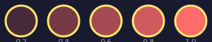{ width="380" }
<figcaption>Fill opacity from 0.2 to 1.0 with constant stroke opacity.</figcaption>
</figure>

### Layered Opacity

Stack semi-transparent shapes for color mixing effects:

<figure markdown>
{ width="220" }
<figcaption>Three overlapping circles at 50% opacity — colors blend where they overlap.</figcaption>
</figure>

---

## Brightness

Scale any color toward black with a brightness multiplier (0.0 = black, 1.0 = unchanged).

### color_brightness

For `color=` entities (Dot, Line, Curve, Text, Fill, Border, Connection):

```python
# Map image brightness directly to color intensity
for cell in scene.grid:
    cell.add_dot(color="white", color_brightness=cell.brightness)
```

<figure markdown>
{ width="420" }
<figcaption>White dots dimmed by brightness — dark cells produce darker dots.</figcaption>
</figure>

### fill_brightness & stroke_brightness

For `fill=`/`stroke=` shapes (Rect, Ellipse, Polygon), mirroring `fill_opacity`/`stroke_opacity`:

```python
cell.add_ellipse(
    fill="coral", stroke="navy",
    fill_brightness=cell.brightness,   # Dim the fill
    stroke_brightness=1.0,             # Keep stroke at full intensity
)
```

<figure markdown>
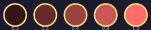{ width="380" }
<figcaption>Fill brightness from 0.2 to 1.0 with constant stroke brightness.</figcaption>
</figure>

### Utility Functions

Two standalone functions for working with brightness outside builders:

```python
from pyfreeform.color import apply_brightness, gray

apply_brightness("coral", 0.5)  # Half-bright coral → "#7f3f28"
apply_brightness("white", 0.0)  # Pure black → "#000000"
gray(0.5)                       # Mid-gray → "#808080"
gray(1.0)                       # White → "#ffffff"
```

`gray(b)` is shorthand for `apply_brightness("white", b)`.

---

## Style Objects

Instead of repeating parameters, define a **style object** once and reuse it:

```python
from pyfreeform import FillStyle, PathStyle, ShapeStyle

dot_small = FillStyle(color="coral", opacity=0.6)
dot_large = FillStyle(color="gold", opacity=0.9)
line_thin = PathStyle(width=1, color="#666688", opacity=0.4)
shape_hex = ShapeStyle(color="teal", opacity=0.5)

for cell in scene.grid:
    cell.add_dot(radius=0.15, style=dot_small)  # Apply directly
    cell.add_line(start="top", end="bottom", style=line_thin)
```

<figure markdown>
{ width="320" }
<figcaption>Three zones using different pre-defined styles — consistent look with no parameter repetition.</figcaption>
</figure>

### All Style Classes

| Class | For Methods | Key Fields |
|---|---|---|
| `FillStyle` | `add_dot()`, `add_fill()` | `color`, `opacity`, `color_brightness` |
| `PathStyle` | `add_line()`, `add_diagonal()`, `add_curve()`, `add_path()`, `Connection` | `width`, `color`, `cap`, `start_cap`, `end_cap`, `color_brightness` |
| `BorderStyle` | `add_border()` | `width`, `color`, `opacity`, `color_brightness` |
| `ShapeStyle` | `add_ellipse()`, `add_polygon()`, `add_rect()` | `color` (→ fill), `stroke`, `stroke_width`, `fill_brightness`, `stroke_brightness` |
| `TextStyle` | `add_text()` | `color`, `font_family`, `bold`, `italic`, `color_brightness` |

Styles are dataclasses. Use `dataclasses.replace()` to create modified copies:

```python
from dataclasses import replace

base = PathStyle(width=2, color="coral")
thick = replace(base, width=4)                # New style, width=4
arrow = replace(base, end_cap="arrow")        # New style, with arrow cap
```

---

## Palettes

8 pre-built color palettes with 6 named colors each:

<div class="compare-grid" markdown>

<figure markdown>
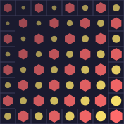
<figcaption>Midnight</figcaption>
</figure>

<figure markdown>
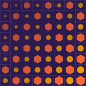
<figcaption>Sunset</figcaption>
</figure>

<figure markdown>
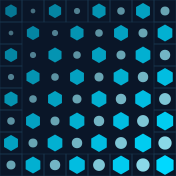
<figcaption>Ocean</figcaption>
</figure>

<figure markdown>
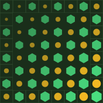
<figcaption>Forest</figcaption>
</figure>

<figure markdown>
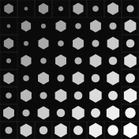
<figcaption>Monochrome</figcaption>
</figure>

<figure markdown>
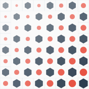
<figcaption>Paper</figcaption>
</figure>

<figure markdown>
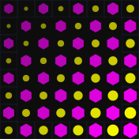
<figcaption>Neon</figcaption>
</figure>

<figure markdown>
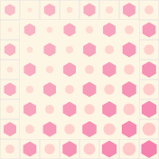
<figcaption>Pastel</figcaption>
</figure>

</div>

### Using Palettes

```python
from pyfreeform import Palette

colors = Palette.midnight()
scene = Scene.with_grid(cols=10, rows=10, cell_size=20, background=colors.background)

for cell in scene.grid:
    cell.add_dot(color=colors.primary)
    cell.add_border(color=colors.grid, width=0.3)
```

### Named Colors

| Name | Purpose |
|---|---|
| `colors.background` | Scene background |
| `colors.primary` | Main element color |
| `colors.secondary` | Supporting element color |
| `colors.accent` | Highlight/emphasis color |
| `colors.line` | Lines and connections |
| `colors.grid` | Grid borders |

### Custom Palettes

```python
my_palette = Palette(
    background="#1a1a2e",
    primary="#ff6b6b",
    secondary="#4ecdc4",
    accent="#ffe66d",
    line="#666688",
    grid="#3d3d5c",
)
```

Modify palettes with `dataclasses.replace()`: `replace(colors, background="#000")`.

---

## What's Next?

Learn the "killer feature" — positioning entities along any path:

[Paths & Parametric Positioning &rarr;](05-paths-and-parametric.md){ .md-button }
