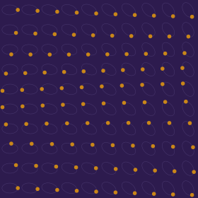
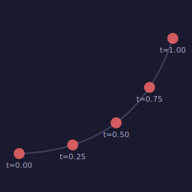
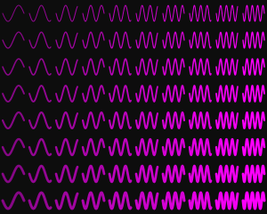
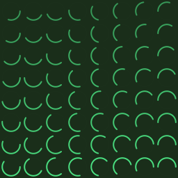
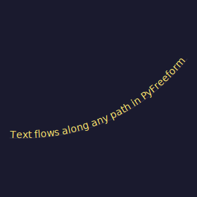
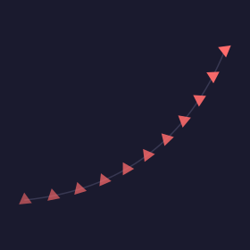

# Paths & Parametric Positioning

This is PyFreeform's "killer feature" — position any entity at any point along any path using the `along` / `t` system.

## The Core Idea

Every Line, Curve, and Ellipse is a **Pathable** — it has a `point_at(t)` method where `t` goes from 0.0 (start) to 1.0 (end). You can place entities along these paths:

```python
line = cell.add_diagonal()
cell.add_dot(along=line, t=cell.brightness)  # (1)!
```

1. The dot's position slides along the diagonal based on brightness.

<figure markdown>
{ width="420" }
<figcaption>Each dot slides along its cell's diagonal — bright areas push dots toward the top-right.</figcaption>
</figure>

## Along Curves

Curves make the positioning non-linear and organic:

```python
curve = cell.add_curve(start="bottom_left", end="top_right", curvature=0.6, ...)
for t_val in [0.25, 0.5, 0.75]:
    cell.add_dot(along=curve, t=t_val, radius=0.10, color=colors.primary)
```

<figure markdown>
{ width="360" }
<figcaption>Three dots per cell positioned along curves — the Bezier shape creates smooth distribution.</figcaption>
</figure>

## Along Ellipses

Ellipses are closed paths — `t=0` is the rightmost point, going counterclockwise:

| t value | Position |
|---|---|
| 0.0 | Right |
| 0.25 | Top |
| 0.5 | Left |
| 0.75 | Bottom |

```python
ellipse = cell.add_ellipse(at="center", rx=0.4, ry=0.25, fill="none", stroke=colors.line)
cell.add_dot(along=ellipse, t=ny, radius=0.10, color=colors.accent)
```

<figure markdown>
{ width="320" }
<figcaption>Each dot orbits its cell's ellipse at a position driven by the row.</figcaption>
</figure>

## Understanding t Values

On a single path, `t` selects the position:

<figure markdown>
{ width="360" }
<figcaption>Five dots at t=0.00, 0.25, 0.50, 0.75, and 1.00 along a curve.</figcaption>
</figure>

---

## Custom Pathables

Any object with `point_at(t) → Coord` works as a path. Create your own:

```python
from pyfreeform import Coord

class Wave:
    def __init__(self, x1, y1, x2, y2, amplitude, frequency):
        self.x1, self.y1, self.x2, self.y2 = x1, y1, x2, y2
        self.amp, self.freq = amplitude, frequency

    def point_at(self, t):
        x = self.x1 + t * (self.x2 - self.x1)
        cy = self.y1 + t * (self.y2 - self.y1)
        y = cy + self.amp * math.sin(t * self.freq * 2 * math.pi)
        return Coord(x, y)
```

Render it with `add_path()`:

```python
wave = Wave(cx - 10, cy, cx + 10, cy, amplitude=8, frequency=3)
cell.add_path(wave, segments=32, width=1.5, color=colors.primary)
```

<figure markdown>
{ width="340" }
<figcaption>Wave paths with increasing frequency across the grid.</figcaption>
</figure>

---

## Sub-Paths and Arcs

Use `start_t` and `end_t` to render only a portion of a path:

```python
cell.add_path(
    ellipse,
    start_t=0.1,      # Start at 10% around
    end_t=0.6,         # End at 60% around
    segments=24,
    width=2,
    color=colors.primary,
)
```

<figure markdown>
{ width="300" }
<figcaption>Partial arcs of ellipses — the start and length vary by position.</figcaption>
</figure>

---

## Text Along Paths

Pass a path to `add_text(along=)` **without** `t` to warp text along the full path:

```python
curve = cell.add_curve(start=(0.05, 0.7), end=(0.95, 0.3), curvature=0.5, ...)
cell.add_text("Text flows along any path", along=curve, font_size=0.05, color=colors.accent)
```

<figure markdown>
{ width="380" }
<figcaption>Text automatically warped along a Bezier curve using SVG <code>&lt;textPath&gt;</code>.</figcaption>
</figure>

<figure markdown>
{ width="320" }
</figure>

---

## Alignment

Set `align=True` to rotate entities to follow the path's tangent direction:

```python
cell.add_polygon(
    Polygon.triangle(size=0.06),
    along=curve, t=0.5, align=True,  # (1)!
    fill=colors.primary,
)
```

1. The triangle points in the direction the curve is heading at `t=0.5`.

<figure markdown>
{ width="380" }
<figcaption>Triangles aligned to the curve's tangent — they point the way the path flows.</figcaption>
</figure>

---

## What's Next?

Explore the shape system and learn to compose reusable groups:

[Shapes & Polygons &rarr;](06-shapes-and-polygons.md){ .md-button }
