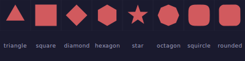
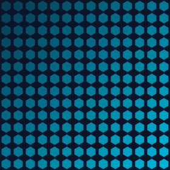
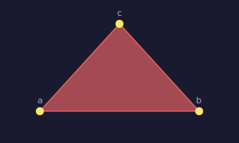
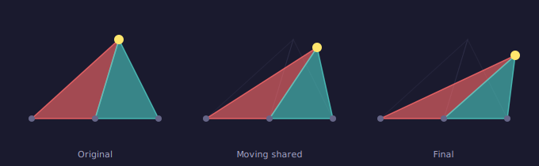
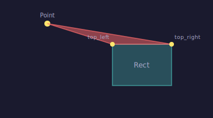
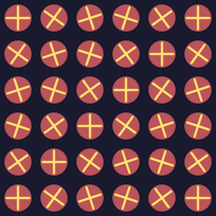

# Shapes & Polygons

PyFreeform includes 8 built-in shape classmethods and a powerful **EntityGroup** system for composing your own.

## Shape Gallery

All shapes are created as vertex lists and passed to `add_polygon()`:

```python
from pyfreeform import Polygon

cell.add_polygon(Polygon.hexagon(size=0.7), fill="coral")
cell.add_polygon(Polygon.star(points=5, size=0.7), fill="gold")
```

<figure markdown>
{ width="440" }
<figcaption>All 8 shape classmethods: triangle, square, diamond, hexagon, star, octagon, squircle, rounded rect.</figcaption>
</figure>

### Available Shapes

| Method | Description |
|---|---|
| `Polygon.triangle(size=0.8)` | Equilateral triangle |
| `Polygon.square(size=0.8)` | Axis-aligned square |
| `Polygon.diamond(size=0.8)` | 45-degree rotated square |
| `Polygon.hexagon(size=0.8)` | Regular hexagon |
| `Polygon.star(points=5, inner_ratio=0.4)` | N-pointed star |
| `Polygon.regular_polygon(sides, size=0.8)` | Any regular N-gon |
| `Polygon.squircle(size=0.8, n=4)` | Superellipse (n=2: circle, n=4: squircle) |
| `Polygon.rounded_rect(corner_radius=0.2)` | Rectangle with rounded corners |

All return `list[tuple[float, float]]` in relative coordinates (0-1), ready for any cell size.

---

## Creative Applications

### Hexagonal Tiling

```python
for cell in scene.grid:
    cell.add_polygon(
        Polygon.hexagon(size=0.85),
        fill=colors.primary,
        stroke=colors.secondary,
        stroke_width=0.5,
        opacity=0.3 + t * 0.5,
    )
```

<figure markdown>
{ width="320" }
<figcaption>Hexagons with growing opacity create a dense tiling pattern.</figcaption>
</figure>

### Shape by Brightness

Choose shapes based on image data:

```python
for cell in scene.grid:
    b = cell.brightness
    if b < 0.5:
        verts = Polygon.star(points=5, size=0.4 + b)
    else:
        verts = Polygon.hexagon(size=0.4 + b * 0.4)
    cell.add_polygon(verts, fill=cell.color)
```

<figure markdown>
{ width="420" }
<figcaption>Star size and inner ratio both driven by the source image's brightness.</figcaption>
</figure>

---

## EntityGroup

An **EntityGroup** is a composite entity — build it from simpler entities, then place it in any cell:

```python
from pyfreeform import EntityGroup, Dot, Ellipse

def make_flower(petal_color, center_color):
    group = EntityGroup()
    for i in range(6):
        angle = i * 60 * math.pi / 180
        px, py = 12 * math.cos(angle), 12 * math.sin(angle)
        group.add(Ellipse(px, py, rx=8, ry=4, rotation=i * 60, fill=petal_color, opacity=0.7))
    group.add(Dot(0, 0, radius=5, color=center_color))
    return group
```

Use it across cells:

```python
for cell in scene.grid:
    flower = make_flower(colors.primary, colors.accent)
    cell.add(flower)
    flower.fit_to_cell(0.85)
```

<figure markdown>
{ width="340" }
<figcaption>A flower EntityGroup placed in every cell — define once, use everywhere.</figcaption>
</figure>

!!! warning "New instance per cell"
    Always create a new EntityGroup for each cell. Groups placed in cells should not be reused directly — wrap creation in a factory function.

---

## Reactive Polygons

Polygon vertices don't have to be static coordinates — they can reference **live entities**. When a referenced entity moves, the polygon deforms automatically.

### The Point Entity

A **Point** is an invisible entity that renders nothing. Think of it as a thumbtack on a board — other shapes can reference it, and when the Point moves, everything attached follows.

```python
from pyfreeform import Point, Polygon

a = Point(0, 0)
b = Point(100, 0)
c = Point(50, 80)
tri = Polygon([a, b, c], fill="coral")
```

<figure markdown>
{ width="300" }
<figcaption>Three Point entities forming a triangle — the dots are decorative markers; Points themselves are invisible.</figcaption>
</figure>

### Shared Vertices

The real power: **multiple polygons can share the same Point vertex**. Moving the shared point deforms every polygon that references it:

```python
shared = Point(150, 40)
tri1 = Polygon([Point(50, 150), Point(130, 150), shared], fill="coral", opacity=0.7)
tri2 = Polygon([Point(170, 150), Point(250, 150), shared], fill="teal", opacity=0.7)

# Move the shared vertex — both triangles deform
shared.position = (200, 30)
```

<figure markdown>
{ width="680" }
<figcaption>Two triangles share a top vertex (gold). As it moves right, the coral triangle stretches while the teal triangle contracts.</figcaption>
</figure>

### Anchor Tracking

Vertices can also track a specific **anchor** on any entity. Use the `(entity, "anchor_name")` syntax:

```python
from pyfreeform import Point, Polygon, Rect, Coord

rect = Rect.at_center(Coord(200, 100), 100, 70, fill="teal")
tip = Point(50, 30)

# Polygon with one Point vertex and two Rect anchor vertices
tri = Polygon([tip, (rect, "top_left"), (rect, "top_right")], fill="coral", opacity=0.6)
```

<figure markdown>
{ width="360" }
<figcaption>A triangle whose base corners track a Rect's top_left and top_right anchors.</figcaption>
</figure>

!!! info "Connections vs reactive vertices"
    **Connections** are live _lines_ between entities — visual links that redraw when endpoints move.

    **Entity-reference vertices** are live _shape corners_ — polygon vertices that track entity positions. The polygon itself is the visual element; the vertices just follow.

    Use connections when you want **visible links**. Use entity-ref vertices when you want **shapes that deform**.

!!! warning "Transforms and entity vertices"
    `polygon.rotate()` and `polygon.scale()` only affect static (Coord) vertices. Entity-reference vertices follow their entity, not polygon transforms.

---

## fit_to_cell

Auto-scale any entity or group to fit within its cell:

```python
group = make_flower(...)
cell.add(group)
group.fit_to_cell(0.7)  # (1)!
```

1. `0.7` means fill 70% of the cell's area.

<figure markdown>
{ width="360" }
<figcaption>The same group at 30%, 50%, 70%, 90%, and 100% of cell size.</figcaption>
</figure>

### With Rotation

`fit_to_cell` works correctly with rotated groups:

<figure markdown>
{ width="280" }
<figcaption>Groups scaled to 75% and rotated by position — fitting accounts for rotation.</figcaption>
</figure>

---

## What's Next?

Learn text placement, typography, and text-along-path effects:

[Text & Typography &rarr;](07-text-and-typography.md){ .md-button }
