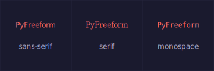
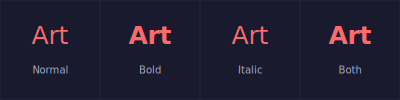
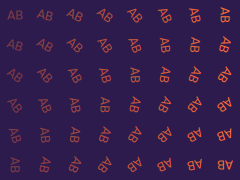
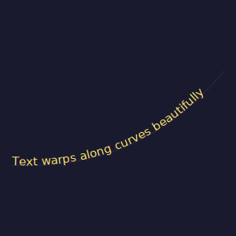
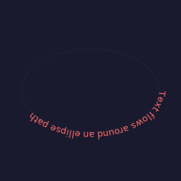

# Text & Typography

Text in PyFreeform supports font families, bold/italic, rotation, and text-along-path warping.

## Basic Text

```python
cell.add_text("Hello", at="center", font_size=16, color="white")
```

### Font Families

<figure markdown>
{ width="400" }
<figcaption>sans-serif, serif, and monospace — the three standard SVG font families.</figcaption>
</figure>

### Bold & Italic

```python
cell.add_text("Art", font_size=24, color=colors.primary, bold=True)
cell.add_text("Art", font_size=24, color=colors.primary, italic=True)
cell.add_text("Art", font_size=24, color=colors.primary, bold=True, italic=True)
```

<figure markdown>
{ width="440" }
<figcaption>Normal, Bold, Italic, and Bold+Italic variants.</figcaption>
</figure>

---

## ASCII Art from Images

Map brightness to characters for a classic ASCII art effect:

```python
chars = " .:-=+*#%@"

scene = Scene.from_image("MonaLisa.jpg", grid_size=40, cell_size=10)
for cell in scene.grid:
    idx = int(cell.brightness * (len(chars) - 1))
    char = chars[idx]
    if char != " ":
        cell.add_text(char, at="center", font_size=9, color=cell.color, font_family="monospace")
```

<figure markdown>
{ width="420" }
<figcaption>The Mona Lisa rendered in ASCII characters, colored by the source image.</figcaption>
</figure>

---

## Rotating Text

```python
for cell in scene.grid:
    nx, ny = cell.normalized_position
    rotation = (nx + ny) * 90
    cell.add_text("AB", at="center", font_size=12, color=colors.primary, rotation=rotation)
```

<figure markdown>
{ width="300" }
<figcaption>Text rotation varies smoothly across the grid.</figcaption>
</figure>

---

## Text Along Paths

Use `along=` with a path to warp text along its shape:

### Along a Curve

```python
curve = cell.add_curve(start=(0.05, 0.7), end=(0.95, 0.3), curvature=0.5, ...)
cell.add_text("Text warps along curves beautifully", along=curve, font_size=14, color=colors.accent)
```

<figure markdown>
{ width="380" }
<figcaption>Text automatically sized and warped to follow a Bezier curve.</figcaption>
</figure>

### Along an Ellipse

```python
ellipse = cell.add_ellipse(at="center", rx=0.4, ry=0.25, fill="none", stroke=colors.line)
cell.add_text("Text flows around an ellipse path", along=ellipse, font_size=13, color=colors.primary)
```

<figure markdown>
{ width="320" }
<figcaption>Text wrapping around an elliptical path.</figcaption>
</figure>

!!! tip "How it works"
    When you pass `along=` without `t`, PyFreeform uses SVG `<textPath>` to warp text. The font size auto-adjusts to fill the path length.

---

## Title Overlays

Merge cells and overlay text on an artwork:

```python
scene = Scene.from_image("FrankMonster.png", grid_size=30, cell_size=12)
for cell in scene.grid:
    cell.add_dot(radius=cell.brightness * 5, color=cell.color, opacity=0.7)

# Merge bottom rows for a title bar
title = scene.grid.merge((scene.grid.rows - 3, 0), (scene.grid.rows - 1, scene.grid.cols - 1))
title.add_fill(color="#000000", opacity=0.5)
title.add_text("FRANK", at="center", font_size=20, color="#ffffff", bold=True)
```

<figure markdown>
{ width="400" }
<figcaption>A semi-transparent title bar overlaid on dot art using a merged CellGroup.</figcaption>
</figure>

---

## What's Next?

Master transforms, fitting, connections, and layout:

[Transforms & Layout &rarr;](08-transforms-and-layout.md){ .md-button }
