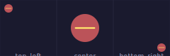
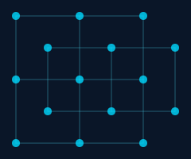
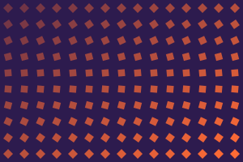

# Transforms & Layout

Rotate, scale, fit, connect, and layer entities for precise control over your compositions.

## Rotation

Every entity supports `rotation` as a parameter or `.rotate()` method:

```python
cell.add_polygon(
    Polygon.square(size=0.6),
    fill=colors.primary,
    rotation=(nx + ny) * 180,
)
```

<figure markdown>
{ width="300" }
<figcaption>Squares rotate smoothly from 0 to 360 degrees across the grid.</figcaption>
</figure>

---

## Scaling with fit_to_cell

`entity.fit_to_cell(scale)` auto-sizes any entity to fit within its cell. `scale` is the fraction of cell area to fill (0.0 to 1.0). Works with both `EntityGroup` and `Text` entities:

<figure markdown>
{ width="360" }
<figcaption>The same group at 20%, 40%, 60%, 80%, 90%, and 100% of cell size.</figcaption>
</figure>

### Position-Aware Fitting

Pass `at=(rx, ry)` to fit at a specific position within the cell:

```python
group.fit_to_cell(0.5, at=(0.15, 0.15))   # Near top-left, constrained by edges
group.fit_to_cell(0.5, at=(0.5, 0.5))     # Centered
group.fit_to_cell(0.5, at=(0.85, 0.85))   # Near bottom-right
```

<figure markdown>
{ width="320" }
<figcaption>Same size, different positions — the entity respects cell boundaries.</figcaption>
</figure>

---

## Connections

Link entities with **Connection** objects that auto-update when entities move. Connections are covered in depth on their own page:

<figure markdown>
{ width="300" }
<figcaption>Dots connected in a grid network — connections link alternate cells.</figcaption>
</figure>

[Connections & Anchors &rarr;](09-connections-and-anchors.md){ .md-button }

---

## z_index Layering

Control draw order with `z_index` — higher values render on top:

```python
cell.add_fill(color="navy", z_index=0)           # Background
cell.add_ellipse(fill="coral", opacity=0.2, z_index=1)  # Behind
cell.add_polygon(Polygon.hexagon(), fill="gold", z_index=2)  # Middle
cell.add_dot(color="white", z_index=3)            # On top
```

<figure markdown>
{ width="220" }
<figcaption>Four distinct layers: grid lines → ellipse → hexagon → dot.</figcaption>
</figure>

---

## map_range Utility

`map_range()` converts a value from one range to another — like converting between units. If a cell's horizontal position (`nx`) goes from 0 to 1 but you want a radius between 2 and 9:

```python
from pyfreeform import map_range

radius = map_range(nx, 0, 1, 2, 9)
# nx=0.0 → radius 2    (left edge: small)
# nx=0.5 → radius 5.5  (middle: medium)
# nx=1.0 → radius 9    (right edge: large)

rotation = map_range(ny, 0, 1, 0, 90)          # vertical position → rotation
opacity = map_range(nx + ny, 0, 2, 0.3, 1.0)   # diagonal position → opacity
```

<figure markdown>
{ width="340" }
<figcaption>Diamonds where size, rotation, and opacity are all driven by mapped position values.</figcaption>
</figure>

Swap the output range to reverse the direction — `map_range(nx, 0, 1, 9, 2)` makes the left edge large and the right edge small.

---

## What's Next?

Learn how connections link entities with live references and explore the anchor system:

[Connections & Anchors &rarr;](09-connections-and-anchors.md){ .md-button }
