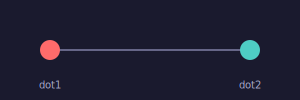
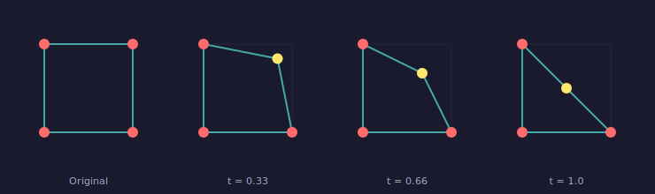
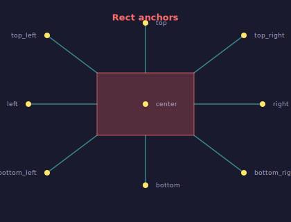
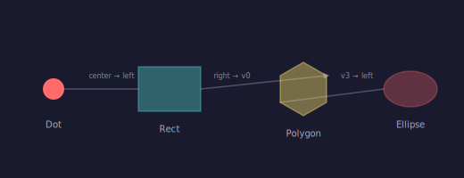
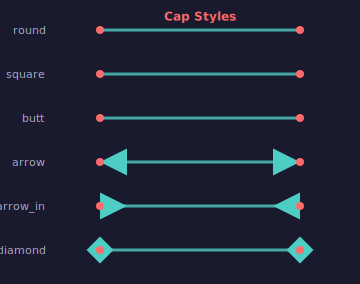
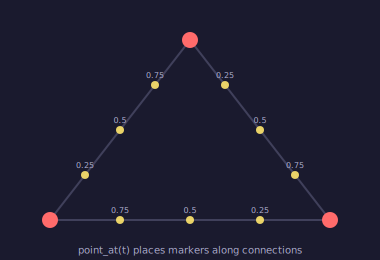
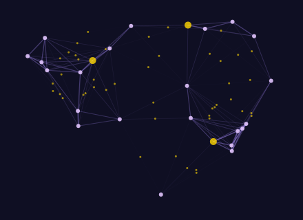

# Connections & Anchors

Connections are live links between entities. Unlike static lines that store coordinates, connections store **entity references** — when an entity moves, its connections follow automatically.

## Your First Connection

Create two entities, connect them, and add the connection to the scene:

```python
from pyfreeform import Scene, Dot, ConnectionStyle

scene = Scene(300, 100, background="#1a1a2e")
dot1 = Dot(50, 50, radius=10, color="#ff6b6b")
dot2 = Dot(250, 50, radius=10, color="#4ecdc4")
scene.add(dot1, dot2)

conn = dot1.connect(dot2, style=ConnectionStyle(width=2, color="#666688"))
scene.add(conn)  # (1)!
```

1. Connections must be added to the scene explicitly — they're not auto-added when created.

<figure markdown>
{ width="300" }
<figcaption>Two dots linked by a connection.</figcaption>
</figure>

---

## Live Updates — The Morphing Square

This is where connections shine. Build a square from 4 corner dots and 4 edge connections, then move one corner — the shape deforms automatically:

```python
# Create 4 corner dots
corners = [
    Dot(50, 50),    # top-left
    Dot(150, 50),   # top-right  ← this one will move
    Dot(150, 150),  # bottom-right
    Dot(50, 150),   # bottom-left
]
for d in corners:
    scene.add(d)

# Connect into a square (4 edges)
for i in range(4):
    conn = corners[i].connect(corners[(i + 1) % 4], style=conn_style)
    scene.add(conn)

# Move the top-right corner toward center
corners[1].move_to(100, 100)  # (1)!
```

1. The two connections attached to `corners[1]` update their endpoints instantly. No reconnection needed.

<figure markdown>
{ width="680" }
<figcaption>As the top-right corner (gold) moves toward the center, the shape morphs from a square into a triangle. Ghost lines show the original position.</figcaption>
</figure>

!!! tip "Connections store references, not coordinates"
    A connection holds a reference to each entity and queries its position at render time. This means:

    - **Move an entity** → all its connections follow
    - **No re-wiring needed** — the connection always knows where its endpoints are
    - Think of connections as rubber bands between thumbtacks

---

## The Anchor System

Different entity types expose different **anchor points** — named positions that connections can target:

| Entity | Anchors |
|---|---|
| **Dot** | `center` |
| **Point** | `center` |
| **Text** | `center` |
| **Rect** | `center`, `top_left`, `top_right`, `bottom_left`, `bottom_right`, `top`, `bottom`, `left`, `right` |
| **Polygon** | `center`, `v0`, `v1`, `v2`, ... (one per vertex) |
| **Ellipse** | `center`, `right`, `top`, `left`, `bottom` |
| **Line** | `start`, `center`, `end` |
| **Curve** | `start`, `center`, `end`, `control` |

!!! tip "Invisible anchors"
    `Point` entities render nothing — they're ideal when you need a connection endpoint without a visible dot. Think of them as thumbtacks that only connections can see.

Use `start_anchor` and `end_anchor` to control where the connection attaches:

```python
rect = Rect.at_center(Coord(200, 150), width=140, height=90, fill="navy")
label = Dot(350, 50, radius=5, color="coral")
scene.add(rect, label)

conn = rect.connect(label, start_anchor="top_right", style=style)  # (1)!
scene.add(conn)
```

1. The connection originates from the rectangle's top-right corner, not its center.

<figure markdown>
{ width="400" }
<figcaption>All 9 anchor points on a Rect — each connection starts from a different named anchor.</figcaption>
</figure>

!!! info "Rotation-aware anchors"
    Rect anchors account for rotation. If you rotate a rectangle 45°, its `top_right` anchor moves to the actual rotated corner position.

---

## Connecting Different Entity Types

Connections work between **any** entity types. Use specific anchors for precise control:

```python
dot = Dot(60, 100, radius=12, color="coral")
rect = Rect.at_center(Coord(190, 100), 70, 50, fill="teal")
poly = Polygon(hex_vertices, fill="gold")
ell = Ellipse(460, 100, rx=30, ry=20, fill="coral")

scene.add(dot, rect, poly, ell)

# Chain different entity types with specific anchors
scene.add(dot.connect(rect, end_anchor="left", style=style))
scene.add(rect.connect(poly, start_anchor="right", end_anchor="v0", style=arrow_style))
scene.add(poly.connect(ell, start_anchor="v3", end_anchor="left", style=style))
```

<figure markdown>
{ width="480" }
<figcaption>Dot → Rect → Polygon → Ellipse, each connection using specific anchors.</figcaption>
</figure>

---

## Cap Styles

Control line endings with cap styles. Use `cap` for both ends, or `start_cap`/`end_cap` for independent control:

```python
# Arrow on the end only
arrow_style = ConnectionStyle(width=2, color="coral", end_cap="arrow")

# Arrows on both ends
bidirectional = ConnectionStyle(width=2, color="coral", start_cap="arrow", end_cap="arrow")
```

<figure markdown>
{ width="340" }
<figcaption>All five cap styles: round, square, butt, arrow, and arrow_in.</figcaption>
</figure>

| Cap | Effect |
|---|---|
| `round` | Rounded ends (default) |
| `square` | Square ends extending past the endpoint |
| `butt` | Flat ends flush at the endpoint |
| `arrow` | Forward-pointing arrowhead |
| `arrow_in` | Backward-pointing arrowhead |

---

## Connections as Pathables

Connections implement `point_at(t)` and `angle_at(t)`, so you can position entities along them:

```python
conn = dot1.connect(dot2, style=conn_style)
scene.add(conn)

# Place markers along the connection
for t in [0.25, 0.5, 0.75]:
    pt = conn.point_at(t)  # (1)!
    scene.add(Dot(pt.x, pt.y, radius=4, color="gold"))
```

1. `point_at(0.0)` = start, `point_at(1.0)` = end, `point_at(0.5)` = midpoint.

<figure markdown>
{ width="360" }
<figcaption>Gold markers placed at t=0.25, 0.5, and 0.75 along each edge of a triangle.</figcaption>
</figure>

---

## Creative Pattern: Constellation

Combine distance-based connections, opacity fading, and midpoint markers for a constellation effect:

```python
import math, random

random.seed(42)
scene = Scene(440, 320, background="#0f0f23")

# Random star positions
dots = [Dot(random.uniform(30, 410), random.uniform(30, 290),
            radius=3, color="#e0c3fc") for _ in range(25)]
for d in dots:
    scene.add(d)

# Connect nearby stars
for i, d1 in enumerate(dots):
    for d2 in dots[i + 1:]:
        dist = math.hypot(d1.position.x - d2.position.x,
                          d1.position.y - d2.position.y)
        if dist < 130:
            opacity = 0.5 * (1 - dist / 130)
            conn = d1.connect(d2, style=ConnectionStyle(
                width=0.4 + (1 - dist / 130) * 1.2,
                color="#a78bfa", opacity=opacity,
            ))
            scene.add(conn)

            # Midpoint glow on long connections
            if dist > 90:
                mid = conn.point_at(0.5)
                scene.add(Dot(mid.x, mid.y, radius=1.5, color="#ffd700", opacity=0.6))
```

<figure markdown>
{ width="420" }
<figcaption>A constellation network — connections fade with distance, midpoint markers glow on the longest links.</figcaption>
</figure>

---

## What's Next?

You've completed the Guide! Put your skills to work with self-contained projects:

[Browse Recipes &rarr;](../recipes/01-image-to-art.md){ .md-button }

Or explore the complete API reference:

[API Surface &rarr;](../api-surface/index.md){ .md-button }
