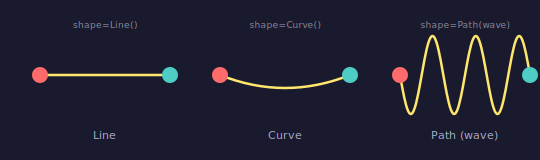
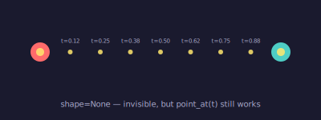
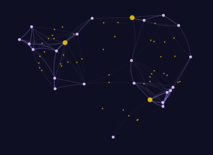
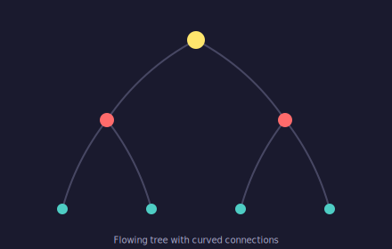

# Connections & Anchors

Connections are live links between connectable objects — entities and surfaces (cells, cell groups, scenes). Unlike static lines that store coordinates, connections store **entity references** — when an entity moves, its connections follow automatically.

## Your First Connection

Create two entities and connect them:

```python
from pyfreeform import Scene, Dot, PathStyle

scene = Scene(300, 100, background="#1a1a2e")
dot1 = Dot(50, 50, radius=10, color="#ff6b6b")
dot2 = Dot(250, 50, radius=10, color="#4ecdc4")
scene.place(dot1)
scene.place(dot2)

dot1.connect(dot2, style=PathStyle(width=2, color="#666688"))
```

!!! note "Auto-collection"
    Connections are automatically discovered by the scene at render time. There is no need to add them explicitly.

!!! info "Connections are visible by default"
    `dot1.connect(dot2)` draws a straight line using the default style (width=1, color="black"). Use `curvature=` for arcs, `path=` for custom shapes, or `visible=False` for invisible relationships. See [Connection Shapes](#connection-shapes) below.

<figure markdown>
{ width="300" }
<figcaption>Two dots linked by a connection.</figcaption>
</figure>

---

## Connection Shapes

Connections support three geometry modes:

| Mode | Renders As | Use Case |
|---|---|---|
| *(default)* | Straight `<line>` | Classic connections |
| `curvature=0.3` | Cubic Bézier arc | Organic, flowing links |
| `path=Path(pathable)` | Fitted Bézier path | Wave, spiral, any custom shape |
| `visible=False` | Nothing — invisible | Pure relationships, `point_at()` queries |

```python
from pyfreeform import Path

# Straight line (default)
d1.connect(d2)

# Arc — curvature controls how much the connection bows
d1.connect(d2, curvature=0.4)

# Custom path — any Pathable works
d1.connect(d2, path=Path(my_wave, segments=32))

# Invisible relationship
d1.connect(d2, visible=False)
```

<figure markdown>
{ width="520" }
<figcaption>The same two dots connected three ways: Line (straight), Curve (arc), and Path (wave).</figcaption>
</figure>

!!! tip "Curvature and path coordinates are auto-mapped"
    For `curvature=`, the arc is computed in a normalized unit-chord space and automatically stretched and rotated to match the entity positions at render time. For `path=`, the same affine transform maps the path geometry to the actual anchor positions. You never position them manually.

---

## Invisible Connections

Pass `visible=False` to create a connection that renders nothing — `to_svg()` returns an empty string. But the connection still:

- Tracks the relationship via each entity's connection set
- Supports `point_at(t)` for positioning (linear interpolation between anchors)
- Can be queried for `start_point`, `end_point`, and `angle_at(t)`

This is useful for layout, graph traversal, or placing entities along an invisible path:

```python
# Invisible — no rendering
conn = d1.connect(d2, visible=False)

# But point_at(t) still works
for t in [0.25, 0.5, 0.75]:
    pt = conn.point_at(t)
    scene.place(Dot(pt.x, pt.y, radius=3, color="gold"))
```

<figure markdown>
{ width="400" }
<figcaption>An invisible connection between two dots — markers placed via `point_at(t)` reveal the hidden relationship. The faint line is drawn separately for illustration; the connection itself renders nothing.</figcaption>
</figure>

---

## Live Updates — The Morphing Square

This is where connections shine. Build a square from 4 corner dots and 4 edge connections, then move one corner — the shape deforms automatically:

```python
# Create 4 corner dots
corners = [
    Dot(50, 50),    # top-left
    Dot(150, 50),   # top-right  ← this one will move
    Dot(150, 150),  # bottom-right
    Dot(50, 150),   # bottom-left
]
for d in corners:
    scene.place(d)

# Connect into a square (4 edges)
for i in range(4):
    corners[i].connect(corners[(i + 1) % 4], style=conn_style)

# Move the top-right corner toward center
corners[1].position = (100, 100)  # (1)!
```

1. The two connections attached to `corners[1]` update their endpoints instantly. No reconnection needed.

<figure markdown>
{ width="680" }
<figcaption>As the top-right corner (gold) moves toward the center, the shape morphs from a square into a triangle. Ghost lines show the original position.</figcaption>
</figure>

!!! tip "Connections store references, not coordinates"
    A connection holds a reference to each entity and queries its position at render time. This means:

    - **Move an entity** → all its connections follow
    - **No re-wiring needed** — the connection always knows where its endpoints are
    - Think of connections as rubber bands between thumbtacks

---

## The Anchor System

Different entity types expose different **anchor points** — named positions that connections can target:

| Entity | Anchors |
|---|---|
| **Dot** | `center` |
| **Point** | `center` |
| **Text** | `center` |
| **Rect** | `center`, `top_left`, `top_right`, `bottom_left`, `bottom_right`, `top`, `bottom`, `left`, `right` |
| **Polygon** | `center`, `v0`, `v1`, `v2`, ... (one per vertex) |
| **Ellipse** | `center`, `right`, `top`, `left`, `bottom` |
| **Line** | `start`, `center`, `end` |
| **Curve** | `start`, `center`, `end`, `control` |
| **Surface** (Cell, CellGroup, Scene) | `center`, `top_left`, `top_right`, `bottom_left`, `bottom_right`, `top`, `bottom`, `left`, `right` |

!!! tip "Invisible anchors"
    `Point` entities render nothing — they're ideal when you need a connection endpoint without a visible dot. Think of them as thumbtacks that only connections can see.

Use `start_anchor` and `end_anchor` to control where the connection attaches:

```python
rect = Rect.at_center(Coord(200, 150), width=140, height=90, fill="navy")
label = Dot(350, 50, radius=5, color="coral")
scene.place(rect)
scene.place(label)

rect.connect(label, start_anchor="top_right", style=style)  # (1)!
```

1. The connection originates from the rectangle's top-right corner, not its center.

<figure markdown>
{ width="400" }
<figcaption>All 9 anchor points on a Rect — each connection starts from a different named anchor.</figcaption>
</figure>

!!! info "Rotation-aware anchors"
    Rect anchors account for rotation. If you rotate a rectangle 45°, its `top_right` anchor moves to the actual rotated corner position.

### Arbitrary Anchor Points

Anchors aren't limited to named strings. Anywhere an anchor is accepted — `entity.anchor()`, `start_anchor`, `end_anchor` — you can pass a **relative coordinate** as a tuple or `RelCoord`:

```python
from pyfreeform import RelCoord

# Tuple syntax — 70% across, 30% down within the entity's bounding box
point = rect.anchor((0.7, 0.3))

# RelCoord syntax — equivalent
point = rect.anchor(RelCoord(0.7, 0.3))

# Works in connections too
dot.connect(rect, end_anchor=(0.0, 0.5))  # Connect to rect's left edge midpoint
cell_a.connect(cell_b, start_anchor=(1.0, 0.5), end_anchor=(0.0, 0.5))
```

The type that captures all valid anchor values is `AnchorSpec`:

```python
from pyfreeform import AnchorSpec  # str | RelCoord | tuple[float, float]
```

For entities, the relative coordinate is resolved against the entity's axis-aligned bounding box (`bounds()`). Rect overrides this to use its local coordinate space, so `(0, 0)` maps to the actual rotated top-left corner rather than the AABB corner.

---

## Connecting Different Entity Types

Connections work between **any** entity types. Use specific anchors for precise control:

```python
dot = Dot(60, 100, radius=12, color="coral")
rect = Rect.at_center(Coord(190, 100), 70, 50, fill="teal")
poly = Polygon(hex_vertices, fill="gold")
ell = Ellipse(460, 100, rx=30, ry=20, fill="coral")

scene.place(dot)
scene.place(rect)
scene.place(poly)
scene.place(ell)

# Chain different entity types with specific anchors
dot.connect(rect, end_anchor="left", style=style)
rect.connect(poly, start_anchor="right", end_anchor="v0", style=arrow_style)
poly.connect(ell, start_anchor="v3", end_anchor="left", style=style)
```

<figure markdown>
{ width="480" }
<figcaption>Dot → Rect → Polygon → Ellipse, each connection using specific anchors.</figcaption>
</figure>

---

## Cap Styles

Control line endings with cap styles. Use `cap` for both ends, or `start_cap`/`end_cap` for independent control:

```python
# Arrow on the end only
arrow_style = PathStyle(width=2, color="coral", end_cap="arrow")

# Arrows on both ends
bidirectional = PathStyle(width=2, color="coral", start_cap="arrow", end_cap="arrow")
```

<figure markdown>
{ width="340" }
<figcaption>All six cap styles: round, square, butt, arrow, arrow_in, and diamond.</figcaption>

</figure>

| Cap | Effect |
|---|---|
| `round` | Rounded ends (default) |
| `square` | Square ends extending past the endpoint |
| `butt` | Flat ends flush at the endpoint |
| `arrow` | Forward-pointing arrowhead |
| `arrow_in` | Backward-pointing arrowhead |
| `diamond` | Diamond shape centered on the endpoint |

---

## Connections as Pathables

Connections implement `point_at(t)` and `angle_at(t)`, so you can position entities along them:

```python
conn = dot1.connect(dot2, style=conn_style)

# Place markers along the connection
for t in [0.25, 0.5, 0.75]:
    pt = conn.point_at(t)  # (1)!
    scene.place(Dot(pt.x, pt.y, radius=4, color="gold"))
```

1. `point_at(0.0)` = start, `point_at(1.0)` = end, `point_at(0.5)` = midpoint.

<figure markdown>
{ width="360" }
<figcaption>Gold markers placed at t=0.25, 0.5, and 0.75 along each edge of a triangle.</figcaption>
</figure>

---

## Connecting Surfaces

Connections aren't limited to entities — any **surface** (Cell, CellGroup, Scene) is also connectable. This eliminates the need for invisible anchor dots:

```python
scene = Scene.with_grid(cols=5, rows=1, cell_size=40)

# Cell-to-cell connection — no phantom dots needed
cell_a = scene.grid[0][0]
cell_b = scene.grid[0][4]
cell_a.connect(cell_b, color="coral", width=2)

# Entity-to-cell connection
dot = scene.grid[0][2].add_dot(color="teal")
dot.connect(cell_b, end_anchor="left", color="navy")

# Cell-to-entity connection
cell_a.connect(dot, start_anchor="right", color="gold")
```

Surfaces expose the same 9 anchor points as `Rect`:

| Anchor | Position |
|---|---|
| `center` | Center (default) |
| `top`, `bottom`, `left`, `right` | Edge midpoints |
| `top_left`, `top_right`, `bottom_left`, `bottom_right` | Corners |

!!! tip "Cross-grid connections"
    Cells from different grids can be connected. The scene auto-collects connections from all grids at render time.

---

## Connection Data

Every connectable object — entities, cells, and connections themselves — carries a `data` dictionary for custom metadata:

```python
conn = cell_a.connect(cell_b)
conn.data["weight"] = 0.75
conn.data["label"] = "edge"

# Entities and cells also have data
cell_a.data["type"] = "source"
dot.data["visited"] = True
```

This is useful for graph algorithms, filtering, or storing application-specific state alongside the visual representation.

---

## Creative Pattern: Constellation

Combine distance-based connections, opacity fading, and midpoint markers for a constellation effect:

```python
import math, random

random.seed(42)
scene = Scene(440, 320, background="#0f0f23")

# Random star positions
dots = [Dot(random.uniform(30, 410), random.uniform(30, 290),
            radius=3, color="#e0c3fc") for _ in range(25)]
for d in dots:
    scene.place(d)

# Connect nearby stars
for i, d1 in enumerate(dots):
    for d2 in dots[i + 1:]:
        dist = math.hypot(d1.position.x - d2.position.x,
                          d1.position.y - d2.position.y)
        if dist < 130:
            opacity = 0.5 * (1 - dist / 130)
            conn = d1.connect(d2, style=PathStyle(
                width=0.4 + (1 - dist / 130) * 1.2,
                color="#a78bfa", opacity=opacity,
            ))

            # Midpoint glow on long connections
            if dist > 90:
                mid = conn.point_at(0.5)
                scene.place(Dot(mid.x, mid.y, radius=1.5, color="#ffd700", opacity=0.6))
```

<figure markdown>
{ width="420" }
<figcaption>A constellation network — connections fade with distance, midpoint markers glow on the longest links.</figcaption>
</figure>

---

## Creative Pattern: Arc Network

Replace the straight lines with curved connections for an organic, flowing feel. The curvature varies by angle between each pair, creating visual rhythm:

```python
random.seed(42)
scene = Scene(440, 320, background="#0f0f23")

dots = [Dot(random.uniform(30, 410), random.uniform(30, 290),
            radius=3, color="#e0c3fc") for _ in range(25)]
for d in dots:
    scene.place(d)

for i, d1 in enumerate(dots):
    for d2 in dots[i + 1:]:
        dist = math.hypot(d1.position.x - d2.position.x,
                          d1.position.y - d2.position.y)
        if dist < 130:
            angle = math.atan2(d2.position.y - d1.position.y,
                               d2.position.x - d1.position.x)
            curv = 0.3 * math.sin(angle * 3 + i * 0.5)  # (1)!
            opacity = 0.5 * (1 - dist / 130)
            d1.connect(d2, curvature=curv,
                       style=PathStyle(
                           width=0.4 + (1 - dist / 130) * 1.2,
                           color="#a78bfa", opacity=opacity))
```

1. Varying curvature by angle creates arcs that flow in different directions — some bow left, some right.

<figure markdown>
{ width="420" }
<figcaption>The same constellation with curved connections — `curvature=` gives the network an organic, flowing quality.</figcaption>
</figure>

---

## Creative Pattern: Flowing Tree

A hierarchy with curved connections creates elegant, organic branching. Left children arc one way, right children arc the other:

```python
scene = Scene(440, 280, background="#1a1a2e")

# Three levels: root, 2 children, 4 grandchildren
positions = [
    [(220, 45)],
    [(120, 135), (320, 135)],
    [(70, 235), (170, 235), (270, 235), (370, 235)],
]

nodes = []
for level, pts in enumerate(positions):
    level_nodes = []
    for (x, y) in pts:
        d = Dot(x, y, radius=10 - level * 2, color=["#ffe66d", "#ff6b6b", "#4ecdc4"][level])
        scene.place(d)
        level_nodes.append(d)
    nodes.append(level_nodes)

style = PathStyle(width=2, color="#666688", opacity=0.6)

# Root → children
for child in nodes[1]:
    curv = 0.25 if child.position.x < 220 else -0.25  # (1)!
    nodes[0][0].connect(child, curvature=curv, style=style)

# Children → grandchildren
for i, parent in enumerate(nodes[1]):
    for child in nodes[2][i * 2: i * 2 + 2]:
        curv = 0.2 if child.position.x < parent.position.x else -0.2
        parent.connect(child, curvature=curv, style=style)
```

1. Positive curvature arcs left, negative arcs right — mirroring the tree structure.

<figure markdown>
{ width="420" }
<figcaption>A binary tree with curved connections — left branches arc left, right branches arc right.</figcaption>
</figure>

---

## What's Next?

You've completed the Guide! Put your skills to work with self-contained projects:

[Browse Recipes &rarr;](../recipes/01-image-to-art.md){ .md-button }

Or explore the complete API reference:

[API Reference &rarr;](../api-reference/index.md){ .md-button }
