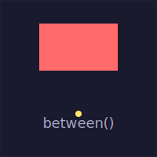
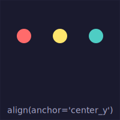
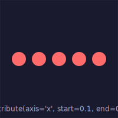
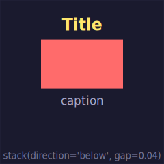

# Layout & Alignment

Position entities relative to each other without thinking about pixels. All layout functions work in **RelCoord space** — fractions of the containing surface — so they compose naturally with `at=`, `width=`, and everything else in the relative-first system.

```python
from pyfreeform import Scene, align, distribute, between, stack
```

---

## `between` — Placing Things in Gaps

`between(a, b)` returns a `RelCoord` — the midpoint between two objects. Use it directly with `at=`.

```python
scene = Scene.with_grid(cols=1, rows=1, cell_size=200)
cell = scene.grid[0][0]

shape = cell.add_rect(at=(0.5, 0.3), width=0.5, height=0.3, fill="coral")

# Place a label between the shape's bottom and the cell's bottom edge
mid = between(shape, cell, anchor="bottom")
cell.add_text("Label", at=mid, font_size=0.08, color="white")
```

<figure markdown>
{ width="200" }
<figcaption>A dot placed at the midpoint between the rect's bottom and the cell's bottom edge.</figcaption>
</figure>

Works with entities, surfaces, `RelCoord`s, and plain tuples:

```python
mid = between(dot_a, dot_b)                     # midpoint of two entities
mid = between(shape, cell, anchor="bottom")      # entity ↔ surface
mid = between((0.2, 0.3), (0.8, 0.7))           # tuple ↔ tuple
pt  = between(dot_a, dot_b, t=0.25)             # 25% from a toward b
```

---

## `align` — Lining Things Up

Align entities to a shared axis. The **first entity is the reference** — all others move to match it.

### Center alignment

```python
d1 = cell.add_dot(at=(0.2, 0.3), color="red")
d2 = cell.add_dot(at=(0.5, 0.6), color="blue")
d3 = cell.add_dot(at=(0.8, 0.15), color="green")

align(d1, d2, d3, anchor="center_y")  # all match d1's y-center
```

<figure markdown>
{ width="200" }
<figcaption>Three dots aligned to the same y-center. Faint lines show where d2 and d3 were before.</figcaption>
</figure>

### Edge alignment

```python
align(r1, r2, r3, anchor="left")    # left edges line up
align(r1, r2, r3, anchor="top")     # top edges line up
align(r1, r2, r3, anchor="right")   # right edges line up
align(r1, r2, r3, anchor="bottom")  # bottom edges line up
```

Edge alignment uses `relative_bounds()` — it works correctly with entities of different sizes, aligning their actual edges rather than their `at` positions.

**Valid anchors:** `"center_x"`, `"center_y"`, `"left"`, `"right"`, `"top"`, `"bottom"`

---

## `distribute` — Even Spacing

Space entities evenly between two positions along an axis.

```python
dots = [cell.add_dot(at=(0.5, 0.5), color="coral") for _ in range(5)]
distribute(*dots, axis="x", start=0.1, end=0.9)
align(*dots, anchor="center_y")
```

<figure markdown>
{ width="200" }
<figcaption>Five dots evenly distributed from x=0.1 to x=0.9, then aligned to the same y-center.</figcaption>
</figure>

```python
distribute(*items, axis="x")                      # full width (0.0 → 1.0)
distribute(*items, axis="x", start=0.1, end=0.9)  # with padding
distribute(*items, axis="y", start=0.2, end=0.8)  # vertical
```

Argument order is preserved — the first entity goes to `start`, the last to `end`. Cross-axis positions are untouched.

---

## `stack` — Size-Aware Stacking

Stack entities sequentially, accounting for their sizes so they don't overlap. The **first entity stays put**; each subsequent one is placed beside the previous.

```python
title   = cell.add_text("Title", at=(0.5, 0.15), font_size=0.1, bold=True, color="gold")
box     = cell.add_rect(at=(0.5, 0.5), width=0.5, height=0.3, fill="coral")
caption = cell.add_text("caption", at=(0.5, 0.8), font_size=0.07, italic=True, color="gray")

stack(title, box, caption, direction="below", gap=0.04)
```

<figure markdown>
{ width="240" }
<figcaption>Title, rect, and caption stacked vertically with consistent gaps.</figcaption>
</figure>

**Directions:** `"right"`, `"left"`, `"above"`, `"below"`

`gap` is a fraction of the surface — `gap=0.05` means 5% of the cell dimension between each pair.

---

## `place_beside` — Single-Entity Positioning

For placing one entity beside another, use the method directly:

```python
r2.place_beside(r1, side="right", gap=0.05)
```

This is the imperative version of what `stack` does in batch. Same relative semantics — `gap` is a fraction, both entities must share the same surface.

---

## Anchors vs Layout Functions

PyFreeform has two positioning vocabularies. Use the right one for the job:

| Need | Use | Returns |
|------|-----|---------|
| Connection endpoint | `entity.anchor("top")` | `Coord` (pixels) |
| SVG rendering query | `entity.bounds()` | `(min_x, min_y, max_x, max_y)` pixels |
| Position entities relative to each other | `between()`, `align()`, `distribute()`, `stack()` | `RelCoord` / mutates `entity.at` |
| Check relative position | `entity.relative_anchor("center")` | `RelCoord` |
| Check relative extent | `entity.relative_bounds()` | `(min_rx, min_ry, max_rx, max_ry)` fractions |

**Rule of thumb:** If you're _positioning_ entities, use layout functions (RelCoord). If you're _querying_ for rendering or connections, use anchors (Coord).

---

## What's Next?

Learn how connections link entities with live references and explore the anchor system:

[Connections & Anchors &rarr;](09-connections-and-anchors.md){ .md-button }
