# Gradients

Gradients let you fill or stroke any entity with smooth color transitions instead of flat colors. PyFreeform supports **linear** and **radial** gradients — the two types natively supported by SVG.

## Linear Gradients

A linear gradient transitions colors along a straight line. Pass colors and they auto-distribute evenly:

```python
from pyfreeform import LinearGradient

grad = LinearGradient("red", "blue")
cell.add_rect(fill=grad, width=0.9, height=0.6)
```

<figure markdown>
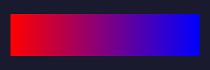{ width="360" }
<figcaption>Two-color linear gradient — left to right by default.</figcaption>
</figure>

### Angle

Control the gradient direction with `angle=` (degrees). 0° is left-to-right, 90° is top-to-bottom:

```python
LinearGradient("coral", "dodgerblue", angle=45)
```

<figure markdown>
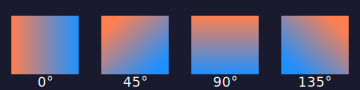{ width="380" }
<figcaption>The same gradient at 0°, 45°, 90°, and 135°.</figcaption>
</figure>

### Multiple Colors

Add as many colors as you like — offsets are distributed evenly:

```python
LinearGradient("red", "gold", "limegreen", "dodgerblue", "mediumpurple")
```

<figure markdown>
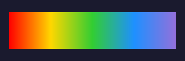{ width="360" }
<figcaption>Five colors, evenly spaced.</figcaption>
</figure>

### Custom Offsets

Use tuples to control *where* each color sits along the gradient. Offsets range from 0.0 (start) to 1.0 (end):

```python
# Even: colors at 0.0, 0.5, 1.0
LinearGradient("red", "blue", "white")

# Custom: blue pushed to 70%, white compressed into last 30%
LinearGradient(("red", 0.0), ("blue", 0.7), ("white", 1.0))
```

<figure markdown>
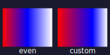{ width="200" }
<figcaption>Left: even spacing. Right: custom offsets shift where colors appear.</figcaption>
</figure>

### Hard Edges

Repeat a color at the same offset to create an instant transition — mixing solid regions with gradients:

```python
LinearGradient(
    ("black", 0.0), ("black", 0.4),   # solid black: 0% → 40%
    ("red", 0.4), ("yellow", 1.0),    # red→yellow gradient: 40% → 100%
)
```

<figure markdown>
{ width="360" }
<figcaption>Solid black for the first 40%, then a red-to-yellow gradient for the rest.</figcaption>
</figure>

### Stop Opacity

Each color stop can also have an `opacity` — a third value in the tuple. SVG smoothly interpolates opacity between stops, so a gradient from fully opaque to fully transparent creates a natural fade:

```python
LinearGradient(
    ("coral", 0.0, 1.0),   # fully opaque at the start
    ("coral", 1.0, 0.0),   # fully transparent at the end
)
```

<figure markdown>
{ width="360" }
<figcaption>Same color at both ends, but opacity fades from 1.0 to 0.0 — the dots behind gradually appear.</figcaption>
</figure>

Combine multiple stops for richer effects — opaque edges that fade to transparent in the middle:

```python
LinearGradient(
    ("coral", 0.0, 1.0),           # fully opaque
    ("#9b59b6", 0.35, 0.8),        # mostly opaque
    ("dodgerblue", 0.5, 0.0),      # fully transparent — content behind peeks through
    ("#9b59b6", 0.65, 0.8),        # fading back in
    ("coral", 1.0, 1.0),           # fully opaque again
)
```

<figure markdown>
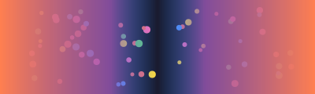{ width="400" }
<figcaption>The gradient fades to transparent in the middle, revealing colorful dots behind it.</figcaption>
</figure>

---

## Radial Gradients

A radial gradient radiates outward from a center point:

```python
from pyfreeform import RadialGradient

grad = RadialGradient("white", "dodgerblue", "midnightblue")
cell.add_ellipse(fill=grad, rx=0.35, ry=0.35)
```

<figure markdown>
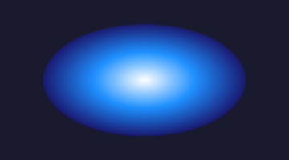{ width="360" }
<figcaption>Three-color radial gradient — white core fading to dark blue.</figcaption>
</figure>

### Focal Point

Shift the light source with `fx=` and `fy=` (0.0–1.0, relative to the shape):

```python
RadialGradient("white", "dodgerblue", "midnightblue", fx=0.3, fy=0.3)
```

<figure markdown>
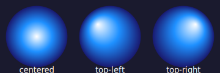{ width="380" }
<figcaption>Same gradient with different focal points — creates a 3D lighting effect.</figcaption>
</figure>

---

## Works Everywhere

Gradients work anywhere you'd use a color — `fill=`, `color=`, and `stroke=`:

<figure markdown>
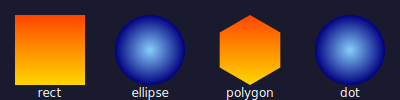{ width="420" }
<figcaption>Same gradients applied to rect, ellipse, polygon, and dot.</figcaption>
</figure>

```python
sunset = LinearGradient("orangered", "gold", angle=90)
ocean = RadialGradient("lightskyblue", "navy")

cell.add_rect(fill=sunset, width=0.7, height=0.7)
cell.add_ellipse(fill=ocean, rx=0.35, ry=0.35)
cell.add_polygon(Polygon.hexagon(size=0.7), fill=sunset)
cell.add_dot(radius=0.35, color=ocean)
```

### Gradient Strokes

Use gradients for strokes too:

```python
cell.add_rect(
    fill=None,
    stroke=LinearGradient("coral", "dodgerblue"),
    stroke_width=4,
    width=0.85, height=0.55,
)
```

<figure markdown>
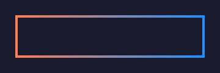{ width="360" }
<figcaption>A gradient applied to the stroke instead of the fill.</figcaption>
</figure>

---

## Gradient Reuse

One gradient object can fill multiple shapes — PyFreeform deduplicates automatically:

```python
fire = LinearGradient("yellow", "orangered", "darkred", angle=90)

for i, cell in enumerate(scene.grid):
    n = 3 + i  # triangle through octagon
    cell.add_polygon(Polygon.regular_polygon(n, size=0.7), fill=fire)
```

<figure markdown>
{ width="380" }
<figcaption>One gradient definition, six shapes — only one <code>&lt;linearGradient&gt;</code> in the SVG.</figcaption>
</figure>

---

## EntityGroups

Gradients work inside EntityGroups too:

```python
def make_badge(fill_grad, accent):
    g = EntityGroup()
    for k in range(12):
        angle = k * (2 * math.pi / 12)
        g.add(Dot(18 * math.cos(angle), 18 * math.sin(angle), radius=4, color=accent))
    g.add(Dot(0, 0, radius=12, color=fill_grad))
    return g

gold_grad = RadialGradient("lightyellow", "gold", "darkgoldenrod")
cell.add(make_badge(gold_grad, "gold"))
```

<figure markdown>
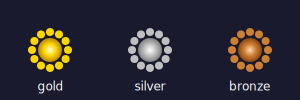{ width="320" }
<figcaption>Gradient-filled badges built with EntityGroups.</figcaption>
</figure>

---

## Creative Examples

### Sunset Scene

Layer gradients to build a scene:

```python
sky = LinearGradient(
    ("midnightblue", 0.0),
    ("darkorange", 0.6),
    ("gold", 0.85),
    ("lightyellow", 1.0),
    angle=90,
)
scene.add_rect(fill=sky, width=1.0, height=1.0)

sun = RadialGradient(
    ("white", 0.0), ("gold", 0.3),
    ("orangered", 0.7), ("transparent", 1.0),
)
scene.add_ellipse(fill=sun, rx=0.12, ry=0.19, at=(0.5, 0.75))
```

<figure markdown>
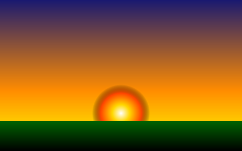{ width="400" }
<figcaption>Sky, sun, and ground — each a gradient.</figcaption>
</figure>

### Glowing Orbs

Radial gradients fading to transparent create glow effects:

```python
glow = RadialGradient(("#ff006e", 0.0), ("transparent", 1.0))
cell.add_ellipse(fill=glow, rx=0.08, ry=0.16, at=(x, 0.5))
cell.add_dot(radius=0.02, color="#ff006e", at=(x, 0.5))  # bright core
```

<figure markdown>
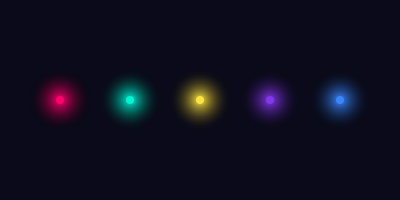{ width="400" }
<figcaption>Radial gradients with transparent edges simulate light emission.</figcaption>
</figure>

### Gem Stones

Combine a shifted focal point with per-stop opacity for a gem-like shine:

```python
gem = RadialGradient(
    ("white", 0.0, 0.9),     # (color, offset, opacity)
    ("#e0115f", 0.3),
    ("#8b0000", 1.0),
    fx=0.35, fy=0.35,        # off-center highlight
)
cell.add_polygon(Polygon.hexagon(size=0.75), fill=gem)
```

<figure markdown>
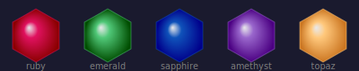{ width="420" }
<figcaption>Focal-shifted radial gradients with stop opacity — ruby, emerald, sapphire, amethyst, topaz.</figcaption>
</figure>

---

!!! info "See also"
    For the full gradient API, see [Styling & Caps — Gradients](../api-reference/styling.md#gradients).

## What's Next?

Add motion to your artwork with animations:

[Animation &rarr;](12-animation.md){ .md-button }

[&larr; Layout & Alignment](10-layout-alignment.md){ .md-button }
