# Animation

PyFreeform supports animations on any entity. Call a method like `.animate_fade()` or `.animate_spin()`, save as SVG, and open in a browser to see it play. Under the hood, animations use SVG SMIL — no JavaScript required.

!!! tip "Browser preview"
    Animated SVGs play automatically when opened in a web browser. They won't animate in image viewers or editors.

## Fade

Animate opacity with `.animate_fade()`. Pass the target opacity and a duration:

```python
dot = cell.add_dot(at="center", radius=0.2, color="coral")

dot.animate_fade(to=0.0, duration=3.0, easing="ease-in-out")
dot.loop(bounce=True)
```

The dot pulses — fading to invisible and back again. `.loop(bounce=True)` reverses each cycle and loops forever.

<figure markdown>
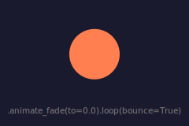{ width="240" }
<figcaption>A coral dot pulsing between visible and invisible.</figcaption>
</figure>

Fade to any value — `to=0.3` makes the entity ghostly, `to=1.0` animates it *in* (if it started transparent).

## Spin

Rotate an entity with `.animate_spin()`:

```python
rect = cell.add_rect(at="center", width=0.38, height=0.38,
                     fill="dodgerblue", stroke="white", stroke_width=2)

rect.animate_spin(360, duration=2.5, easing="linear")
rect.loop()
```

<figure markdown>
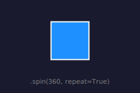{ width="240" }
<figcaption>A rectangle spinning continuously — `.loop()` makes it spin forever.</figcaption>
</figure>

The first argument is the total rotation angle in degrees. Call `.loop()` for continuous spinning.


## Scale

Animate an entity's scale with `.animate_scale()`:

```python
dot = cell.add_dot(at="center", radius=0.08, color="tomato")

dot.animate_scale(to=2.0, duration=2.0, easing="ease-in-out")
dot.loop(bounce=True)
```

<figure markdown>
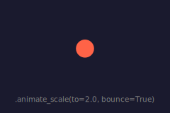{ width="240" }
<figcaption>A dot pulsing between normal size and 2&times; — `.loop(bounce=True)` reverses each cycle.</figcaption>
</figure>

`.animate_scale(to=)` animates the scale factor over time. This is the animated counterpart to `.scale()` — just as `.animate_spin()` is to `.rotate()`.

## Draw

Lines, curves, paths, and connections can draw themselves with `.animate_draw()` — the stroke reveals progressively like a pen tracing the shape:

```python
from pyfreeform.paths import Wave

w, h = cell.width, cell.height
wave_shape = Wave(start=(w * 0.08, h * 0.4), end=(w * 0.92, h * 0.4),
                  amplitude=h * 0.28, frequency=3)
path = cell.add_path(wave_shape, width=3, color="limegreen")

path.animate_draw(duration=2.5, easing="ease-in-out")
path.loop(bounce=True)
```

The wave draws itself left to right, then un-draws back — `.loop(bounce=True)` reverses the stroke reveal each cycle.

<figure markdown>
{ width="360" }
<figcaption>A wave drawing and undrawing itself in a loop.</figcaption>
</figure>

Connections support `.animate_draw()` too:

```python
d1 = cell.add_dot(at=(0.1, 0.42), radius=0.04, color="white")
d2 = cell.add_dot(at=(0.9, 0.42), radius=0.04, color="white")

conn = d1.connect(d2, curvature=0.4, color="skyblue", width=2)
conn.animate_draw(duration=2.0, easing="ease-in-out")
conn.loop(bounce=True)
```

<figure markdown>
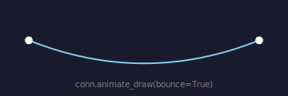{ width="360" }
<figcaption>A curved connection drawing and undrawing itself between two dots.</figcaption>
</figure>

!!! tip "Delayed draw"
    When using `.animate_draw()` with a `delay`, the stroke is fully hidden during the wait — then the draw begins on schedule. Pair it with a fade for a smooth entrance:

    ```python
    conn = d1.connect(d2, color="skyblue", width=2, opacity=0.0)
    conn.animate_fade(to=1.0, duration=0.15, delay=2.0, hold=True)
    conn.animate_draw(duration=1.0, delay=2.0)
    ```

---

## Easing

Easing controls the *speed curve* of an animation — whether it starts slow, ends slow, or moves at constant speed.

Pass a string name:

```python
dot.animate_fade(to=0.0, duration=2.0, easing="ease-in-out")
```

<figure markdown>
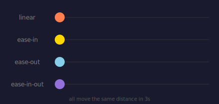{ width="440" }
<figcaption>Four dots racing across the same distance — watch how their speeds differ.</figcaption>
</figure>

Available named easings:

| Name | Behavior |
|---|---|
| `"linear"` | Constant speed (default for most animations) |
| `"ease-in"` | Starts slow, accelerates |
| `"ease-out"` | Starts fast, decelerates |
| `"ease-in-out"` | Slow start and end (default for `animate_draw` and `animate_move`) |

You can also pass a custom cubic-bezier as a tuple:

```python
dot.animate_fade(to=0.0, easing=(0.68, -0.55, 0.27, 1.55))  # overshoot
```

Or use the `Easing` class directly:

```python
from pyfreeform import Easing

dot.animate_fade(to=0.0, easing=Easing(0.68, -0.55, 0.27, 1.55))
dot.animate_fade(to=0.0, easing=Easing.EASE_IN_OUT)
```

---

## Common Parameters

Every animation method accepts these parameters:

| Parameter | Type | Default | Description |
|---|---|---|---|
| `duration` | `float` | `1.0` | Duration in seconds |
| `delay` | `float` | `0.0` | Wait this many seconds before starting |
| `easing` | `str \| tuple \| Easing` | `"linear"` | Speed curve (see above) |
| `hold` | `bool` | `True` | Hold final value after animation ends |

To loop or bounce, call `.loop()` after setting up animations — see [Looping](#looping) below.

---

## Method Chaining

All animation methods return `self`, so you can chain them:

```python
rect = cell.add_rect(at="center", width=0.35, height=0.35,
                     fill="mediumpurple", stroke="white", stroke_width=1)

rect.animate_fade(to=0.3, duration=2.0, easing="ease-in-out") \
    .animate_spin(360, duration=3.0) \
    .loop(bounce=True)
```

This applies both a fade and a spin to the same entity — they play simultaneously. The rect pulses between 30% and full opacity while spinning, bouncing forever.


<figure markdown>
{ width="240" }
<figcaption>A rect pulsing opacity while spinning — both animations play at once.</figcaption>
</figure>

## Sequential Chaining

Use `.then()` to start an animation *after* the previous ones finish — no manual delay math:

```python
rect.animate_fade(to=0.3, duration=1.5, easing="ease-in-out") \
    .then() \
    .animate_spin(360, duration=2.0, easing="ease-in-out")
```

The rect fades to 30% opacity over 1.5 seconds, then spins a full turn. The spin starts at exactly 1.5 seconds — when the fade ends.

<figure markdown>
{ width="300" }
<figcaption>Fade to ghostly, then spin — two steps playing one after the other.</figcaption>
</figure>

To bounce and repeat an entire sequential chain, add `.loop()` at the end — it applies to all steps:

```python
rect.animate_fade(to=0.3, duration=1.5, easing="ease-in-out") \
    .then() \
    .animate_spin(360, duration=2.0, easing="ease-in-out") \
    .loop(bounce=True)
```

Add a gap between animations:

```python
dot.animate_fade(to=0.0, duration=1.0).then(0.5).animate_spin(360, duration=1.0)
# spin starts at 1.5s (1.0 fade + 0.5 gap)
```

Chain as many times as you like:

```python
dot.animate_fade(to=0.5, duration=1.0).then().animate_spin(360, duration=2.0).then().animate_fade(to=1.0, duration=0.5)
```

`.then()` also works on connections:

```python
conn.animate_draw(duration=1.5).then().animate_fade(to=0.0, duration=0.5)
```

## Looping

There are two ways to loop animations in PyFreeform: **per-animation** (inline at creation time) and **chain-level** (via `.loop()`). They serve different use cases and work together.

### Per-Animation Looping

Pass `repeat=` and `bounce=` directly to any `animate_*` call. This controls only that one animation, leaving others unaffected:

```python
dot.animate_spin(360, duration=2.0)                                # plays once
dot.animate_color(to="blue", duration=1.0, repeat=True)            # loops forever
dot.animate_radius(to=35, duration=1.2, repeat=True, bounce=True)  # bounces forever
```

Here, spin plays once and stops, while `color` and `radius` loop independently. This is the standard pattern from GSAP, anime.js, Framer Motion, and CSS animations.

| Parameter | Type | Default | Description |
|---|---|---|---|
| `repeat` | `bool \| int` | `False` | `False` = play once, `True` = loop forever, `int ≥ 2` = N cycles |
| `bounce` | `bool` | `False` | Alternate direction each cycle |

### Chain-Level Looping with `.loop()`

Call `.loop()` after building your animation(s) to loop **all** animations on the entity at call time. It is a *terminal method* — it returns `None`.

```python
dot.animate_fade(to=0.0, duration=1.5, easing="ease-in-out")
dot.loop()                  # loop forever
dot.loop(bounce=True)       # loop, reversing direction each cycle
dot.loop(times=3)           # loop exactly 3 times, then stop
```

`.loop()` is especially useful for `.then()` chains — it applies the same loop settings to all steps at once:

```python
cell.add_dot(at="center", radius=0.15, color="coral") \
    .animate_fade(to=0.0, duration=1.5) \
    .loop(bounce=True)

rect.animate_fade(to=0.3, duration=1.5).then().animate_spin(360, duration=2.0).loop(bounce=True)
```

### `.loop()` parameters

| Parameter | Type | Default | Description |
|---|---|---|---|
| `bounce` | `bool` | `False` | Alternate direction each cycle (forward → backward → forward…) |
| `times` | `bool \| int` | `True` | `True` = infinite, `int ≥ 2` = loop N times |

!!! note "Parity note for `bounce=True, times=N`"
    When bouncing finitely, the final resting value depends on parity: odd N freezes at the *end* value, even N freezes at the *start* value (the last bounce cycle reverses back).

!!! warning "`.loop()` overrides inline `repeat=`"
    If you call `.loop()` after setting `repeat=True` on individual animations, `.loop()` wins — it stamps its own `bounce` and `times` onto **all** animations on the entity. Use one or the other, not both.

## Stagger

Animate a group of entities with offset timing using `stagger()`:

```python
from pyfreeform import stagger

dots = []
for i in range(6):
    dots.append(cell.add_dot(at=(0.1 + i * 0.15, 0.4), radius=0.08, color="coral"))

stagger(*dots, offset=0.3, each=lambda d: d.animate_fade(to=0.0, duration=1.5))
```

<figure markdown>
{ width="360" }
<figcaption>Six dots fading out one by one — each starts 0.3 seconds after the last.</figcaption>
</figure>

The `each` callback applies animation(s) to each entity, and `stagger` offsets the timing by `offset` seconds per entity. You can apply multiple animations and `.loop()` inside the callback:

```python
stagger(*dots, offset=0.15, each=lambda d: d.animate_fade(to=0.0).animate_spin(360))
stagger(*dots, offset=0.3,
        each=lambda d: d.animate_fade(to=0.0, duration=1.5).loop(bounce=True))
```

## Move

Animate position with `.animate_move()`. Use `to=` for an absolute target, or `by=` for a relative offset:

```python
dot.animate_move(to=(0.8, 0.5), duration=1.0)     # move to position
dot.animate_move(by=(0.1, 0), duration=1.0)        # shift right by 10%
```

Positions are relative coordinates — `(0.0, 0.0)` is the top-left and `(1.0, 1.0)` is the bottom-right of the containing surface.

---

## Reactive Animation

When a **Polygon** references entities as vertices, or a **Connection** references entities as endpoints, those shapes automatically animate when the referenced entities are animated with `.animate_move()`.

```python
# Four dots in a cell — polygon tracks their positions
p1 = cell.add_dot(at=(0.1, 0.12), radius=0.02, color="white")
p2 = cell.add_dot(at=(0.1, 0.72), radius=0.02, color="white")
p3 = cell.add_dot(at=(0.42, 0.72), radius=0.02, color="white")
p4 = cell.add_dot(at=(0.42, 0.12), radius=0.02, color="white")

poly = Polygon([p1, p2, p3, p4], fill="mediumpurple", stroke="white",
               stroke_width=1, opacity=0.7)
scene.place(poly)

# Move dots inward — polygon follows automatically
p1.animate_move(to=(0.2, 0.28), duration=2.0, easing="ease-in-out").loop(bounce=True)
p2.animate_move(to=(0.16, 0.58), duration=2.0, easing="ease-in-out").loop(bounce=True)
p3.animate_move(to=(0.48, 0.58), duration=2.0, easing="ease-in-out").loop(bounce=True)
p4.animate_move(to=(0.52, 0.28), duration=2.0, easing="ease-in-out").loop(bounce=True)
```

The polygon's shape animates to follow its vertices — no extra code needed.

Connections work the same way:

```python
d1 = cell.add_dot(at=(0.62, 0.2), radius=0.03, color="coral")
d2 = cell.add_dot(at=(0.92, 0.7), radius=0.03, color="gold")
conn = d1.connect(d2, color="skyblue", width=2)

d1.animate_move(to=(0.75, 0.7), duration=2.5, easing="ease-in-out").loop(bounce=True)
# conn follows d1 automatically — both straight lines and curves
```

<figure markdown>
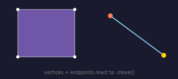{ width="360" }
<figcaption>Left: polygon vertices react to moving dots. Right: connection follows its endpoints.</figcaption>
</figure>

!!! tip "Mixed timing"
    Vertices and endpoints can have different durations, easings, delays, and even different `.loop()` settings — each vertex follows its own timing schedule. When timings differ, PyFreeform resamples all animations onto a unified timeline so the shape morphs smoothly.

---

## Typed Property Methods

Every animatable property has its own method on the relevant entity type — IDE autocomplete shows exactly what you can animate:

```python
dot = cell.add_dot(at="center", radius=0.06, color="coral")

dot.animate_radius(to=35, duration=1.2, easing="ease-in-out")
dot.loop(bounce=True)
```

<figure markdown>
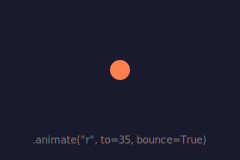{ width="240" }
<figcaption>A dot pulsing in size — `.loop(bounce=True)` reverses each cycle.</figcaption>
</figure>

More examples:

```python
rect.animate_fill(to="coral", duration=2.0)         # color transition
rect.animate_width(keyframes={0: 100, 1: 200, 2: 100})
rect.loop()                                          # loop the keyframe sequence
```

The `keyframes` dict maps times (seconds) to property values at those times.

You can also pass a list — values are distributed evenly over the duration:

```python
rect.animate_fill(keyframes=["coral", "dodgerblue", "coral"], duration=3.0)
rect.loop()
# equivalent to keyframes={0: "coral", 1.5: "dodgerblue", 3.0: "coral"}
```

### Generic `animate()`

For rare properties without a typed method, the generic `.animate()` is still available as an escape hatch:

```python
dot.animate("custom_attr", to=42, duration=1.0)
```

---

## Renderers

By default, `scene.save()` and `scene.to_svg()` auto-detect animations. If any entity has animations, the output includes SMIL `<animate>` elements. If none do, the SVG is identical to static output.

You can force a specific renderer:

```python
from pyfreeform.renderers import SVGRenderer, SMILRenderer

# Force static SVG (ignore all animations)
scene.render(SVGRenderer())

# Force animated SVG (default behavior)
scene.render(SMILRenderer())
```

---

## Showcase

Here's what happens when you combine multiple animation types in one scene — spinning, fading, pulsing, and self-drawing all playing together:

<figure markdown>
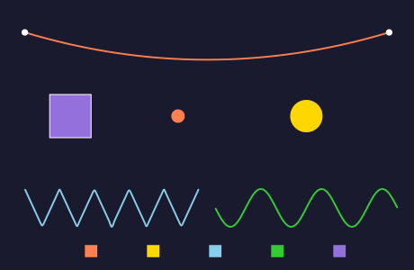{ width="460" }
<figcaption>A combined scene: self-drawing connection, spinning rect with fade, pulsing dot, fading dot, self-drawing paths, and a row of spinning squares.</figcaption>
</figure>

!!! info "See also"
    For the full animation and renderer API, see [Animation & Rendering](../api-reference/animation.md).

---

## What's Next?

You've completed the Guide! Put your skills to work with self-contained projects:

[Browse Recipes &rarr;](../recipes/index.md){ .md-button }

Or explore the complete API reference:

[API Reference &rarr;](../api-reference/index.md){ .md-button }

[&larr; Gradients](11-gradients.md){ .md-button }
