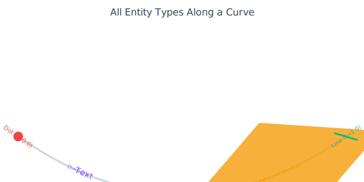
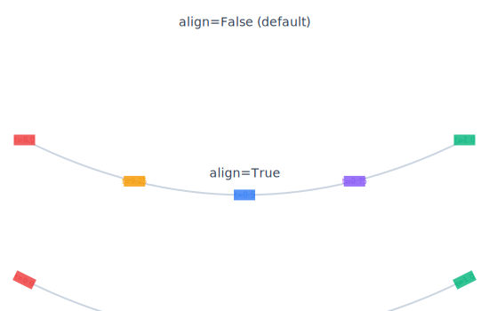
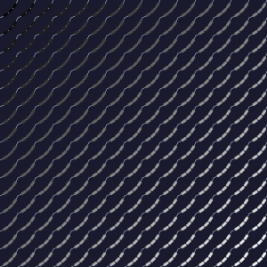
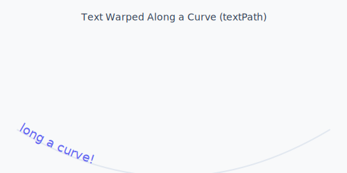
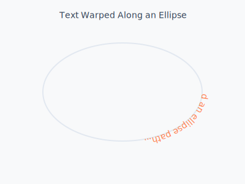
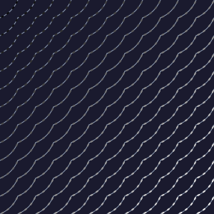
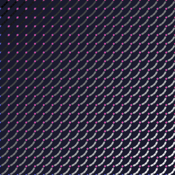

# Positioning Along Paths

The `along=` pattern positions entities parametrically along any path.

## The Pattern

```python
path = cell.add_line(start="left", end="right")  # Or curve, ellipse
cell.add_dot(along=path, t=0.5, radius=3)
```


## Works With All Pathables

```python
# Line - linear interpolation
line = cell.add_line(start="left", end="right")
cell.add_dot(along=line, t=cell.brightness)

# Curve - Bézier parametric
curve = cell.add_curve(curvature=0.5)
cell.add_dot(along=curve, t=cell.brightness)

# Ellipse - around perimeter
ellipse = cell.add_ellipse(rx=15, ry=10)
cell.add_dot(along=ellipse, t=cell.brightness)
```


## Data-Driven Positioning

Use cell data to drive t:

```python
for cell in scene.grid:
    line = cell.add_diagonal(start="bottom_left", end="top_right")

    # Dot position based on brightness (0-1)
    cell.add_dot(
        along=line,
        t=cell.brightness,  # Smooth distribution
        radius=4
    )
```

Creates smooth, organic distributions!


## Multiple Points

```python
curve = cell.add_curve(curvature=0.5)

# Position multiple dots along curve
for i in range(5):
    t = i / 4  # 0, 0.25, 0.5, 0.75, 1.0
    cell.add_dot(along=curve, t=t, radius=2)
```


## Along= for All Entities

The `along=` pattern works with **every entity type**, not just dots:

```python
curve = cell.add_curve(curvature=0.5, color="gray")

# Position ANY entity along a path
cell.add_dot(along=curve, t=0.3, radius=3, color="red")
cell.add_text("Hello", along=curve, t=0.5, font_size=10, color="white")
cell.add_rect(along=curve, t=0.7, width=8, height=6, fill="coral")
cell.add_ellipse(along=curve, t=0.9, rx=6, ry=4, fill="gold")
```



For **polygons**, the centroid is positioned at the path point:

```python
triangle = [(0, -5), (5, 5), (-5, 5)]
cell.add_polygon(triangle, along=curve, t=0.5, fill="purple")
```

For **lines and curves**, the midpoint is repositioned:

```python
# Small line centered at t=0.5 on the path
cell.add_line(start=(0, 0), end=(10, 0), along=curve, t=0.5, color="blue")
```

## Tangent Alignment (align=True)

By default, entities keep their original orientation. Pass `align=True` to rotate them to follow the path's tangent:

```python
curve = cell.add_curve(curvature=0.5, color="gray")

# Without align: rects stay axis-aligned
cell.add_rect(along=curve, t=0.5, width=8, height=4, fill="blue")

# With align: rects rotate to follow the curve
cell.add_rect(along=curve, t=0.5, width=8, height=4, fill="red", align=True)
```



This creates beautiful effects when distributing many aligned shapes:

```python
for cell in scene.grid:
    curve = cell.add_curve(curvature=0.4, color="#333", width=0.5)
    for i in range(5):
        t = (i + 0.5) / 5
        cell.add_rect(
            along=curve, t=t, align=True,
            width=6, height=3, fill=cell.color
        )
```



## Text Along Paths (TextPath)

Text has a special mode: call `add_text` with `along=` but **without `t=`** to warp text along the full path using SVG `<textPath>`:

```python
curve = cell.add_curve(start="left", end="right", curvature=0.5)

# Warp text along the curve (no t= parameter)
cell.add_text("Hello World", along=curve, font_size=10, color="white")
```



With `t=`, text is **positioned** at that point (and optionally aligned):

```python
# Position text at t=0.5 (not warped)
cell.add_text("Label", along=curve, t=0.5, align=True, font_size=10)
```

TextPath works with any path that has `to_svg_path_d()` — lines, curves, and ellipses:



## Lines and Curves Along Paths

Dual-position entities (lines, curves) are repositioned at their midpoint. With `align=True`, they also rotate to match the path tangent:

```python
path = cell.add_curve(curvature=0.5, color="gray")

# Distribute small lines along the curve
for i in range(8):
    t = (i + 0.5) / 8
    cell.add_line(
        start=(0, 0), end=(6, 0),
        along=path, t=t, align=True,
        color="coral", width=1.5
    )
```



This is especially powerful for creating tick marks, hatching, or decorative patterns that follow any path shape.



## See Also
- [Curves](../entities/03-curves.md) - Bezier paths
- [Ellipses](../entities/04-ellipses.md) - Circular paths
- [Text Along Paths](../entities/06-text.md#text-along-paths) - TextPath details
- [Pathable Protocol](../advanced-concepts/03-pathable-protocol.md)
