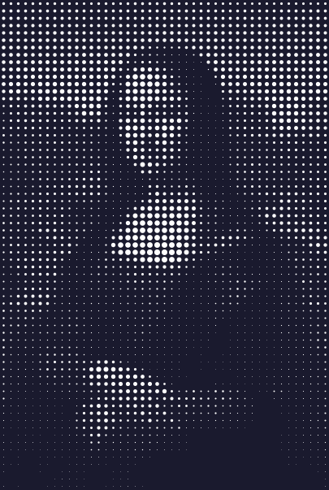
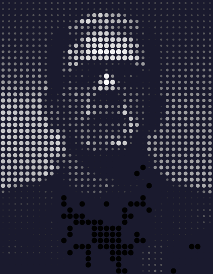
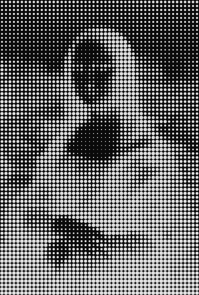
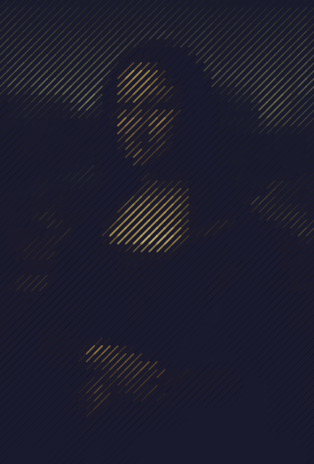
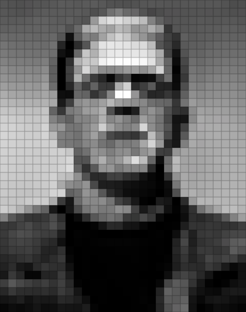
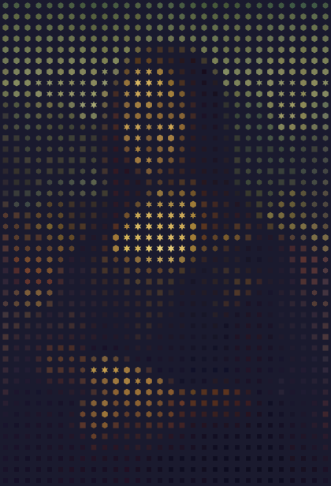
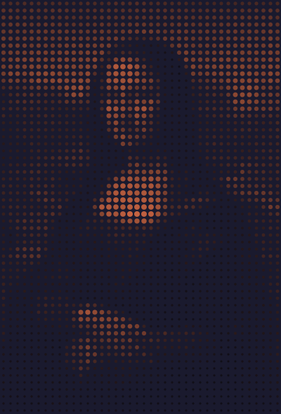

# Image-to-Art Portraits

Transform photographs into striking generative artwork. Each technique uses `Scene.from_image()` and a different approach to visualize the image data.

## Classic Dot Art

Map brightness to dot radius — the fundamental image-to-art technique:

```python
scene = Scene.from_image("MonaLisa.jpg", grid_size=45, cell_size=9)

for cell in scene.grid:
    r = cell.brightness * 0.48
    if r > 0.033:
        cell.add_dot(radius=r, color="#ffffff")
```

<figure markdown>
{ width="420" }
<figcaption>White dots on dark background — bright areas shine through larger dots.</figcaption>
</figure>

!!! tip "Even simpler with `color_brightness`"
    Instead of manually computing white/gray shades, use `color_brightness` to scale any color:
    ```python
    for cell in scene.grid:
        cell.add_dot(radius=0.4, color="white", color_brightness=cell.brightness)
    ```
    This works with any base color — `color="coral"`, `color="gold"`, etc.

## Color Dot Art

Preserve the original image colors for a vibrant result:

```python
for cell in scene.grid:
    r = cell.brightness * 0.45
    if r > 0.025:
        cell.add_dot(radius=r, color=cell.color, opacity=0.7 + cell.brightness * 0.3)
```

<figure markdown>
{ width="420" }
<figcaption>Full-color dots retain the character's vibrant palette.</figcaption>
</figure>

## Halftone Effect

Invert the mapping — dark areas get large dots, simulating print halftone:

```python
scene.background = "#0a0a0a"
for cell in scene.grid:
    r = (1 - cell.brightness) * 0.5  # Inverted!
    if r > 0.0375:
        cell.add_dot(radius=r, color="#e0e0e0")
```

<figure markdown>
{ width="420" }
<figcaption>Inverted brightness creates a newspaper halftone look.</figcaption>
</figure>

## Line Art

Replace dots with diagonal lines. Width maps to brightness:

```python
for cell in scene.grid:
    width = cell.brightness * 3
    if width > 0.2:
        cell.add_diagonal(
            width=width, color=cell.color,
            color_brightness=cell.brightness,  # Dim dark areas further
            opacity=0.5 + cell.brightness * 0.5,
        )
```

<figure markdown>
{ width="420" }
<figcaption>Diagonal lines of varying thickness trace the portrait's contours.</figcaption>
</figure>

## Color Mosaic

The most direct approach — fill each cell with its sampled color:

<figure markdown>
{ width="420" }
<figcaption>Color fills with thin borders create a stained-glass mosaic.</figcaption>
</figure>

## Shape Art

Choose different polygon shapes based on brightness bands:

```python
for cell in scene.grid:
    b = cell.brightness
    size = 0.4 + b * 0.4
    if b < 0.3:
        verts = Polygon.square(size=size)
    elif b < 0.6:
        verts = Polygon.hexagon(size=size)
    else:
        verts = Polygon.star(points=6, size=size, inner_ratio=0.5)
    cell.add_polygon(verts, fill=cell.color, opacity=0.6 + b * 0.4)
```

<figure markdown>
{ width="420" }
<figcaption>Squares for shadows, hexagons for midtones, stars for highlights.</figcaption>
</figure>

## Monochrome Portrait

One base color modulated entirely by `color_brightness` — no manual RGB math:

```python
scene = Scene.from_image("MonaLisa.jpg", grid_size=40, cell_size=10)
scene.background = "#1a1a2e"

for cell in scene.grid:
    cell.add_dot(
        radius=0.15 + cell.brightness * 0.30,
        color="coral",
        color_brightness=cell.brightness,
        opacity=0.5 + cell.brightness * 0.5,
    )
```

<figure markdown>
{ width="420" }
<figcaption>A single color — coral — dimmed by brightness. Dark areas go nearly black, bright areas glow.</figcaption>
</figure>

!!! tip "Works with any color"
    Swap `"coral"` for `"gold"`, `"cyan"`, `"mediumpurple"` — the brightness modifier handles the rest.
