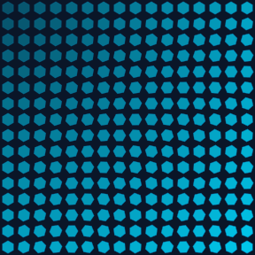
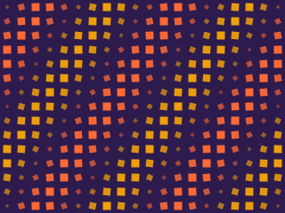
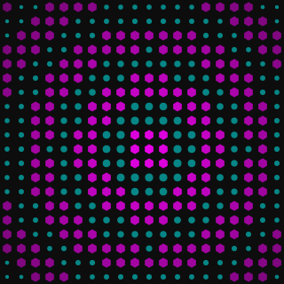
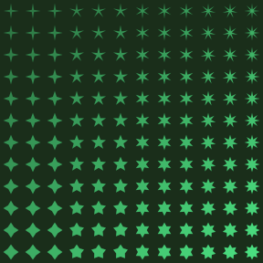

# Geometric Patterns

Create mesmerizing patterns using `Scene.with_grid()`, math, and polygon shapes. No images needed.

## Checkerboard with Shape Variations

Alternate between two shape types on a checkerboard:

```python
for cell in scene.grid.checkerboard("black"):
    cell.add_polygon(Polygon.diamond(size=0.75), fill=colors.primary, opacity=0.7)

for cell in scene.grid.checkerboard("white"):
    cell.add_polygon(Polygon.hexagon(size=0.6), fill=colors.accent, opacity=0.5)
```

<figure markdown>
{ width="320" }
<figcaption>Diamonds and hexagons on alternating cells.</figcaption>
</figure>

## Rotating Hexagonal Tiling

Position and product drive rotation for an organic feel:

```python
for cell in scene.grid:
    nx, ny = cell.normalized_position
    rotation = (nx * ny) * 120
    cell.add_polygon(
        Polygon.hexagon(size=0.8),
        fill=colors.primary, stroke=colors.secondary, stroke_width=0.5,
        opacity=0.3 + t * 0.6, rotation=rotation,
    )
```

<figure markdown>
{ width="320" }
<figcaption>Hexagons rotate by the product of their coordinates — organic turbulence.</figcaption>
</figure>

## Sine Wave Pattern

Sine functions create flowing, rhythmic patterns:

```python
wave = math.sin(nx * math.pi * 4 + ny * math.pi * 2)
size = 0.3 + abs(wave) * 0.5
fill = colors.primary if wave > 0 else colors.accent
cell.add_polygon(Polygon.diamond(size=size), fill=fill, rotation=wave * 45)
```

<figure markdown>
{ width="360" }
<figcaption>Diamonds sized and colored by a 2D sine function — peaks in one color, troughs in another.</figcaption>
</figure>

## Concentric Rings

Use `distance_to()` to create radial patterns:

```python
center = scene.grid[10][10]
for cell in scene.grid:
    d = cell.distance_to(center)
    ring = int((d / max_d) * 8) % 2
    if ring == 0:
        cell.add_polygon(Polygon.hexagon(size=0.7), fill=colors.primary)
    else:
        cell.add_dot(radius=0.20, color=colors.secondary)
```

<figure markdown>
{ width="360" }
<figcaption>Alternating ring zones with hexagons and dots.</figcaption>
</figure>

## Star Grid

Star point count and inner ratio driven by grid position:

<figure markdown>
{ width="320" }
<figcaption>Stars evolve from 4-pointed with narrow arms (top-left) to 8-pointed with wide arms (bottom-right).</figcaption>
</figure>
