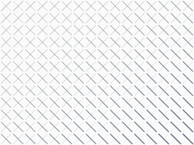

# Flowing Curves & Waves

Create organic, flowing compositions using curves, custom paths, and line art.

## Curve Field

Vary curvature by position for a rippling effect:

```python
for cell in scene.grid:
    nx, ny = cell.normalized_position
    curvature = math.sin(nx * math.pi * 2 + ny * math.pi) * 0.7
    cell.add_curve(
        start="left", end="right",
        curvature=curvature,
        width=0.5 + ny * 2,
        color=colors.primary,
        opacity=0.3 + nx * 0.6,
    )
```

<figure markdown>
{ width="380" }
<figcaption>Curvature varies sinusoidally — creating waves of flow across the grid.</figcaption>
</figure>

## Wave Visualization

Use a custom `Wave` pathable with `add_path()`:

```python
class Wave:
    def __init__(self, x1, y1, x2, y2, amplitude, frequency):
        self.x1, self.y1, self.x2, self.y2 = x1, y1, x2, y2
        self.amp, self.freq = amplitude, frequency

    def point_at(self, t):
        x = self.x1 + t * (self.x2 - self.x1)
        cy = self.y1 + t * (self.y2 - self.y1)
        y = cy + self.amp * math.sin(t * self.freq * 2 * math.pi)
        return Coord(x, y)
```

Stack multiple waves with different frequencies:

<figure markdown>
{ width="400" }
<figcaption>Eight overlapping waves with increasing frequency and amplitude.</figcaption>
</figure>

## Spiral Paths

A custom spiral rendered in each cell:

<figure markdown>
{ width="340" }
<figcaption>Spirals with increasing turns from left to right and thickening strokes downward.</figcaption>
</figure>

## Image Curves

Overlay curves on a photograph — curvature driven by brightness:

```python
scene = Scene.from_image("MCEscherBirds.jpg", grid_size=60, cell_size=10)
for cell in scene.grid:
    if cell.brightness > 0.15:
        curvature = (cell.brightness - 0.5) * 1.5
        cell.add_curve(
            start="bottom_left", end="top_right",
            curvature=curvature,
            width=0.5 + cell.brightness * 2,
            color=cell.color,
        )
```

<figure markdown>
{ width="380" }
<figcaption>Curves colored and shaped by the source image create an impressionistic effect.</figcaption>
</figure>

## Cross-Hatching

Layer perpendicular lines with position-driven weight:

<figure markdown>
{ width="360" }
<figcaption>Two sets of diagonal lines with weight shifting across the grid.</figcaption>
</figure>
