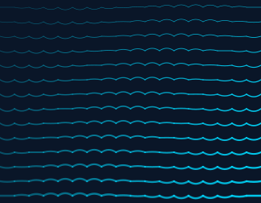
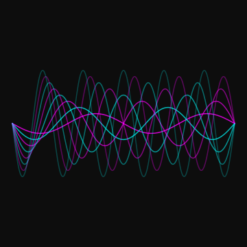
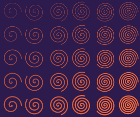
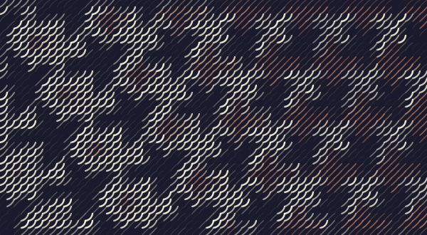
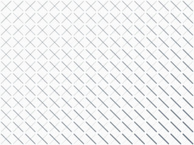

# Flowing Curves & Waves

Create organic, flowing compositions using curves, custom paths, and line art.

## Curve Field

Vary curvature by position for a rippling effect:

```python
for cell in scene.grid:
    nx, ny = cell.normalized_position
    curvature = math.sin(nx * math.pi * 2 + ny * math.pi) * 0.7
    cell.add_curve(
        start="left", end="right",
        curvature=curvature,
        width=0.5 + ny * 2,
        color=colors.primary,
        opacity=0.3 + nx * 0.6,
    )
```

<figure markdown>
{ width="380" }
<figcaption>Curvature varies sinusoidally — creating waves of flow across the grid.</figcaption>
</figure>

## Wave Visualization

Stack the built-in `Path.Wave` with growing amplitude and frequency — `relative=True` lets you place it in 0–1 cell coordinates:

```python
cell = scene.grid[0][0]
for i in range(8):
    wave = Path.Wave(start=(0.05, 0.5), end=(0.95, 0.5),
                     amplitude=0.04 + i * 0.025, frequency=2 + i * 0.5)
    color = colors.primary if i % 2 == 0 else colors.secondary
    cell.add_path(wave, relative=True, width=1.5, color=color, opacity=0.8 - i * 0.08)
```

<figure markdown>
{ width="400" }
<figcaption>Eight overlapping waves with increasing frequency and amplitude.</figcaption>
</figure>

## Spiral Paths

A custom spiral rendered in each cell:

<figure markdown>
{ width="340" }
<figcaption>Spirals with increasing turns from left to right and thickening strokes downward.</figcaption>
</figure>

## Image Curves

Overlay curves on a photograph — curvature driven by brightness:

```python
scene = Scene.from_image("MCEscherBirds.jpg", grid_size=60, cell_size=10)
for cell in scene.grid:
    if cell.brightness > 0.15:
        curvature = (cell.brightness - 0.5) * 1.5
        cell.add_curve(
            start="bottom_left", end="top_right",
            curvature=curvature,
            width=0.5 + cell.brightness * 2,
            color=cell.color,
            opacity=0.4 + cell.brightness * 0.5,
        )
```

<figure markdown>
{ width="380" }
<figcaption>Curves colored and shaped by the source image create an impressionistic effect.</figcaption>
</figure>

## Cross-Hatching

Layer perpendicular lines with position-driven weight:

<figure markdown>
{ width="360" }
<figcaption>Two sets of diagonal lines with weight shifting across the grid.</figcaption>
</figure>

[&larr; Geometric Patterns](02-geometric-patterns.md){ .md-button } [Connected Networks &rarr;](04-connected-networks.md){ .md-button }
