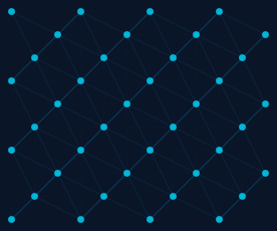
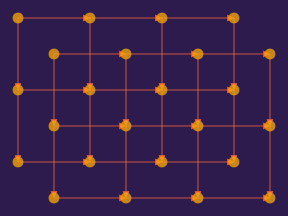

# Connected Networks

Link entities with connections to create network visualizations, directed graphs, and relationship diagrams.

## Brightness-Based Networks

Connect dots that appear in bright areas of an image:

```python
dots = {}
for cell in scene.grid:
    if cell.brightness > 0.35:
        dot = cell.add_dot(radius=0.15 + cell.brightness * 0.20, color=cell.color)
        dots[(cell.row, cell.col)] = dot

for (r, c), dot in dots.items():
    for dr, dc in [(0, 1), (1, 0)]:  # Right and down neighbors
        key = (r + dr, c + dc)
        if key in dots:
            scene.add_connection(dot.connect(dots[key], shape=Line(), style=conn_style))
```

<figure markdown>
{ width="420" }
<figcaption>The Mona Lisa's bright areas form a connected network — her face and hands emerge from the connections.</figcaption>
</figure>

## Distance-Based Connections

Only connect dots within a distance threshold, with opacity fading by distance:

```python
for i, key1 in enumerate(keys):
    for key2 in keys[i + 1:]:
        dist = cell1.distance_to(cell2)
        if dist < 80:
            opacity = 0.6 * (1 - dist / 80)
            scene.add_connection(dots[key1].connect(dots[key2], shape=Line(), style=ConnectionStyle(
                width=0.5 + (1 - dist / 80) * 1.5, color=colors.secondary, opacity=opacity,
            )))
```

<figure markdown>
{ width="340" }
<figcaption>Connections fade and thin with distance — nearby dots are strongly linked.</figcaption>
</figure>

## Directed Graphs with Arrows

Use `end_cap="arrow"` for directional connections:

```python
arrow_style = ConnectionStyle(width=1.5, color=colors.primary, opacity=0.5, end_cap="arrow")
conn = dot1.connect(dot2, shape=Line(), style=arrow_style)
scene.add_connection(conn)
```

<figure markdown>
{ width="340" }
<figcaption>Arrow caps turn connections into a directed graph.</figcaption>
</figure>

## Network Overlay on Image

Combine image fills with a network visualization:

<figure markdown>
{ width="420" }
<figcaption>Faded image background with a white connection network linking bright areas.</figcaption>
</figure>
