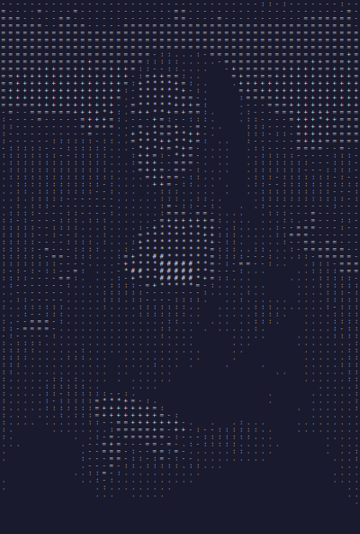
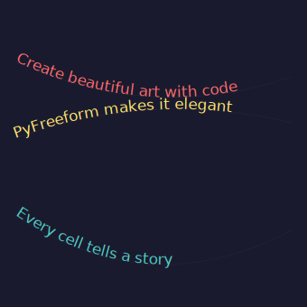
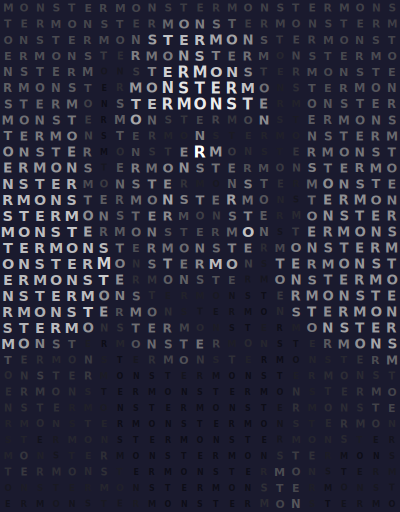
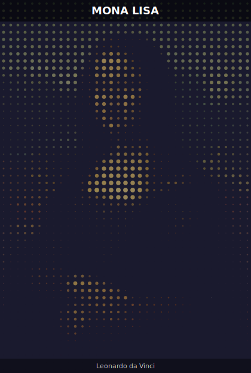

# Typographic Art

Create art using text characters, curved labels, and text-along-path effects.

## ASCII Art from Images

Map brightness to characters from a density string:

```python
chars = " .:-=+*#%@"

for cell in scene.grid:
    idx = int(cell.brightness * (len(chars) - 1))
    char = chars[idx]
    if char != " ":
        cell.add_text(char, at="center", font_size=7, color="#ffffff", font_family="monospace")
```

<figure markdown>
{ width="420" }
<figcaption>Dense characters for bright areas, sparse for dark — classic ASCII art.</figcaption>
</figure>

## Text Along Curves

Warp multiple text lines along curves with different curvatures:

```python
curve = cell.add_curve(start=(0.05, 0.2), end=(0.95, 0.25), curvature=0.4, ...)
cell.add_text("Create beautiful art with code", along=curve, font_size=14, color=colors.primary)
```

<figure markdown>
{ width="400" }
<figcaption>Three phrases flowing along curves with different curvatures and colors.</figcaption>
</figure>

## Letter Mosaic

Replace dots with repeated characters from a word:

```python
word = "MONSTER"
for i, cell in enumerate(scene.grid):
    char = word[i % len(word)]
    size = 8 + cell.brightness * 8
    cell.add_text(char, at="center", font_size=size, color=cell.color, bold=True)
```

<figure markdown>
{ width="420" }
<figcaption>The word "MONSTER" repeats across the grid, sized by brightness and colored by the image.</figcaption>
</figure>

## Combined: Dot Art with Title Overlay

Layer dot art with text overlays using merged CellGroups:

```python
# Dot art layer
for cell in scene.grid:
    cell.add_dot(radius=cell.brightness * 5, color=cell.color, opacity=0.6)

# Title overlay
title = scene.grid.merge((0, 0), (2, scene.grid.cols - 1))
title.add_fill(color="#000000", opacity=0.6)
title.add_text("MONA LISA", at="center", font_size=18, color="#ffffff", bold=True)
```

<figure markdown>
{ width="420" }
<figcaption>Dot art portrait with semi-transparent title and subtitle bars.</figcaption>
</figure>
