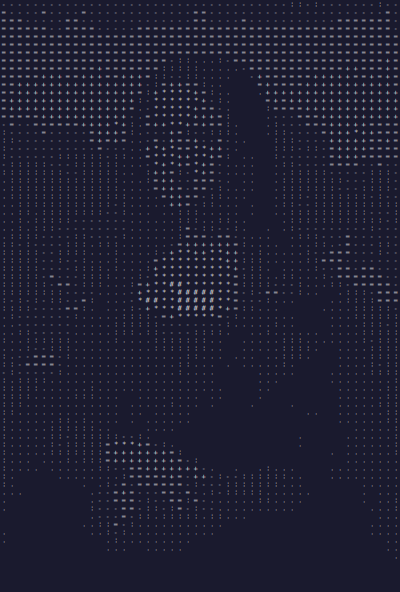
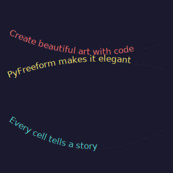
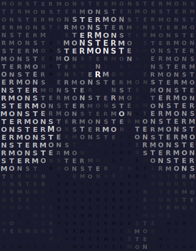
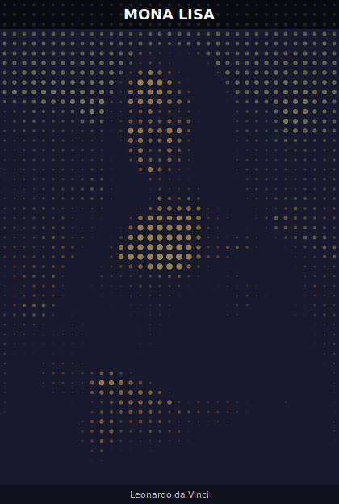

# Typographic Art

Create art using text characters, curved labels, and text-along-path effects.

## ASCII Art from Images

Map brightness to characters from a density string:

```python
chars = " .:-=+*#%@"

for cell in scene.grid:
    idx = int(cell.brightness * (len(chars) - 1))
    char = chars[idx]
    if char != " ":
        cell.add_text(char, at="center", font_size=0.90, color="#ffffff",
                      font_family="monospace", opacity=0.6 + cell.brightness * 0.4)
```

<figure markdown>
{ width="420" }
<figcaption>Dense characters for bright areas, sparse for dark — classic ASCII art.</figcaption>
</figure>

## Text Along Curves

Warp multiple text lines along curves with different curvatures:

```python
phrases = [
    ("Create beautiful art with code", 0.4),
    ("PyFreeform makes it elegant", -0.3),
    ("Every cell tells a story", 0.6),
]
for i, (text, curv) in enumerate(phrases):
    y_start = 0.2 + i * 0.25
    y_end = y_start + 0.05 * (1 if curv > 0 else -1)
    curve = cell.add_curve(start=(0.05, y_start), end=(0.95, y_end),
                           curvature=curv, width=0.5, color=colors.line, opacity=0.15)
    cell.add_text(text, along=curve, font_size=0.05,
                  color=[colors.primary, colors.accent, colors.secondary][i])
```

<figure markdown>
{ width="400" }
<figcaption>Three phrases flowing along curves with different curvatures and colors.</figcaption>
</figure>

## Letter Mosaic

Replace dots with repeated characters from a word:

```python
word = "MONSTER"
for i, cell in enumerate(scene.grid):
    char = word[i % len(word)]
    size = 0.50 + cell.brightness * 0.50
    cell.add_text(char, at="center", font_size=size, color=cell.color, bold=True,
                  opacity=0.5 + cell.brightness * 0.5)
```

<figure markdown>
{ width="420" }
<figcaption>The word "MONSTER" repeats across the grid, sized by brightness and colored by the image.</figcaption>
</figure>

## Combined: Dot Art with Title Overlay

Layer dot art with text overlays using merged CellGroups:

```python
# Dot art layer
for cell in scene.grid:
    r = cell.brightness * 0.4
    if r > 0.025:
        cell.add_dot(radius=r, color=cell.color, opacity=0.6)

# Title bar — merge the top rows into one surface
title = scene.grid.merge((0, 0), (2, scene.grid.num_columns - 1))
title.add_fill(color="#000000", opacity=0.6)
title.add_text("MONA LISA", at="center", font_size=0.5, color="#ffffff", bold=True, fit=True)

# Subtitle bar along the bottom
sub = scene.grid.merge((scene.grid.num_rows - 2, 0), (scene.grid.num_rows - 1, scene.grid.num_columns - 1))
sub.add_fill(color="#000000", opacity=0.4)
sub.add_text("Leonardo da Vinci", at="center", font_size=0.45, color="#cccccc", italic=True, fit=True)
```

<figure markdown>
{ width="420" }
<figcaption>Dot art portrait with semi-transparent title and subtitle bars.</figcaption>
</figure>

[&larr; Connected Networks](04-connected-networks.md){ .md-button } [Advanced Compositions &rarr;](06-advanced-compositions.md){ .md-button }
