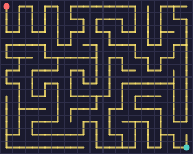
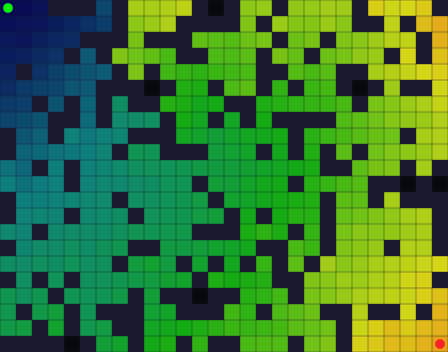
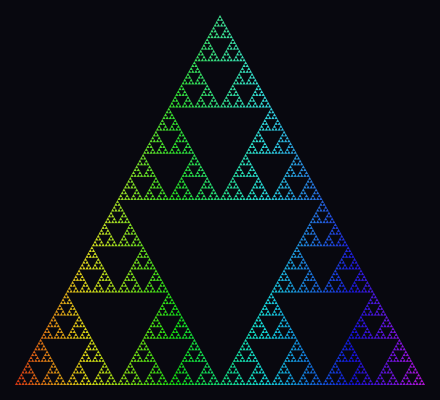
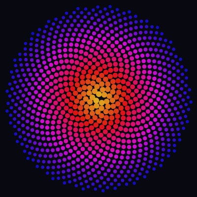
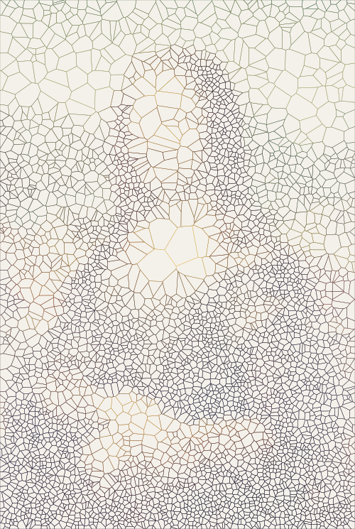
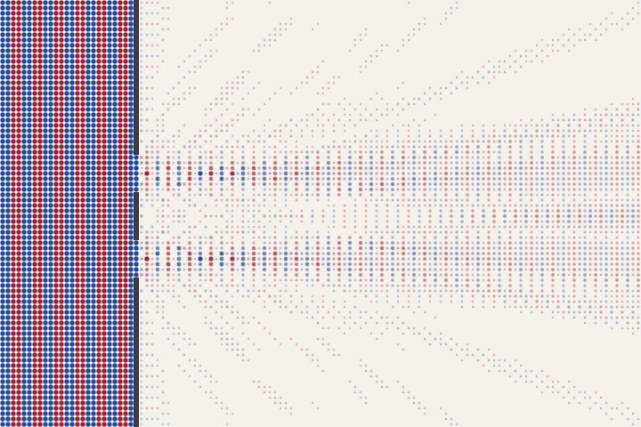

# Hidden Gems

Six examples that push beyond typical grid art: algorithm-driven mazes, Dijkstra's wavefront, fractal geometry, nature's golden ratio, Voronoi stippling, and double-slit diffraction.

## Random Maze

A DFS maze generator that uses `cell.data` to track visited cells and carved passages. Connections draw the corridors, borders form the walls:

```python
import random
from pyfreeform import Scene, Palette, PathStyle

random.seed(42)
colors = Palette.midnight()
scene = Scene.with_grid(cols=15, rows=12, cell_size=22, background=colors.background)
g = scene.grid

for cell in g:
    cell.data["visited"] = False
    cell.data["passages"] = []

# DFS maze carving
stack = [g[0][0]]
g[0][0].data["visited"] = True

while stack:
    current = stack[-1]
    unvisited = [
        n for n in current.neighbors.values()
        if n and not n.data["visited"]
    ]
    if unvisited:
        nxt = random.choice(unvisited)
        nxt.data["visited"] = True
        current.data["passages"].append((nxt.row, nxt.col))
        nxt.data["passages"].append((current.row, current.col))
        stack.append(nxt)
    else:
        stack.pop()

# Draw walls and passages
style = PathStyle(width=3, color=colors.accent, opacity=0.8)
for cell in g:
    cell.add_border(color=colors.grid, width=1, opacity=0.6, z_index=2)
    for r, c in cell.data["passages"]:
        if (r, c) > (cell.row, cell.col):  # each passage drawn once
            cell.connect(g[r][c], style=style, z_index=1)

g[0][0].add_dot(radius=0.25, color=colors.primary, z_index=3)
g[g.num_rows - 1][g.num_columns - 1].add_dot(
    radius=0.25, color=colors.secondary, z_index=3,
)
```

<figure markdown>
{ width="420" }
<figcaption>Every cell stores its own algorithm state via `.data` — no external data structures needed.</figcaption>
</figure>

---

## Dijkstra Wavefront

Dijkstra's algorithm finds the shortest path through a weighted grid with random walls. Every cell stores its own state in `.data` — distance, parent pointer, wall flag, and edge weight. The distance field creates a heat-map gradient that wraps around obstacles; the golden path traces back from end to start:

```python
import heapq, random
from pyfreeform import Scene, PathStyle
from pyfreeform.color import hsl

random.seed(7)
scene = Scene.with_grid(cols=28, rows=22, cell_size=16, background="#08080f")
g = scene.grid

# Scatter walls and assign random edge weights
for cell in g:
    cell.data["wall"] = random.random() < 0.25
    cell.data["dist"] = float("inf")
    cell.data["parent"] = None
    cell.data["weight"] = 1.0 + random.random() * 3.0

start, end = g[0][0], g[g.num_rows - 1][g.num_columns - 1]
for c in (start, end):
    c.data["wall"] = False
for c in (start.right, start.below, end.left, end.above):
    if c:
        c.data["wall"] = False
start.data["dist"] = 0.0

# Dijkstra
pq = [(0.0, start.row, start.col)]
while pq:
    d, r, c = heapq.heappop(pq)
    cell = g[r][c]
    if d > cell.data["dist"]:
        continue
    for nb in cell.neighbors.values():
        if nb is None or nb.data["wall"]:
            continue
        nd = d + nb.data["weight"]
        if nd < nb.data["dist"]:
            nb.data["dist"] = nd
            nb.data["parent"] = (r, c)
            heapq.heappush(pq, (nd, nb.row, nb.col))

# Color by distance, trace shortest path
max_dist = max(c.data["dist"] for c in g if c.data["dist"] < float("inf"))
for cell in g:
    if cell.data["wall"]:
        cell.add_fill(color="#1a1a2e")
    elif cell.data["dist"] < float("inf"):
        t = cell.data["dist"] / max_dist
        cell.add_fill(color=hsl(240 - t * 200, 0.8, 0.18 + t * 0.32))
    cell.add_border(color="#181828", width=0.5, opacity=0.4, z_index=1)

path_style = PathStyle(width=3, color=hsl(50, 0.95, 0.6), opacity=0.95)
cur = end
while cur and cur.data["parent"]:
    pr, pc = cur.data["parent"]
    g[pr][pc].connect(cur, style=path_style, z_index=3)
    cur = g[pr][pc]

start.add_dot(radius=0.3, color=hsl(120, 0.9, 0.5), z_index=4)
end.add_dot(radius=0.3, color=hsl(0, 0.9, 0.55), z_index=4)
```

<figure markdown>
{ width="460" }
<figcaption>The distance field radiates outward from the green source, wrapping around walls. The golden path traces the shortest route to the red target.</figcaption>
</figure>

!!! tip "The algorithm"
    **Dijkstra's algorithm** explores outward from the source in order of cumulative cost, guaranteeing the shortest path in a non-negative weighted graph. Each cell stores `dist`, `parent`, `wall`, and `weight` in `.data` — the entire algorithm runs on the grid's own metadata with no external data structures.

---

## Sierpinski Triangle

Seven levels of recursion produce 2,187 triangles. Each leaf triangle is colored by its x-position (rainbow gradient) with a subtle vertical brightness shift — no grid needed, just `Scene()` and `scene.place()`:

```python
from pyfreeform import Scene, Polygon
from pyfreeform.color import hsl

W, H = 440, 400
scene = Scene(W, H, background="#08080f")

def mid(a, b):
    return ((a[0] + b[0]) / 2, (a[1] + b[1]) / 2)

def draw(v1, v2, v3, depth):
    if depth == 7:
        cx = (v1[0] + v2[0] + v3[0]) / 3
        cy = (v1[1] + v2[1] + v3[1]) / 3
        color = hsl((cx / W) * 300, 0.85, 0.48 + 0.12 * (1 - cy / H))
        scene.place(Polygon([v1, v2, v3], fill=color, stroke=None, opacity=0.92))
        return
    m12, m23, m13 = mid(v1, v2), mid(v2, v3), mid(v1, v3)
    draw(v1, m12, m13, depth + 1)
    draw(m12, v2, m23, depth + 1)
    draw(m13, m23, v3, depth + 1)

margin = 15
draw((W / 2, margin), (margin, H - margin), (W - margin, H - margin), 0)
```

<figure markdown>
{ width="440" }
<figcaption>The Sierpinski gasket — 2,187 triangles at depth 7, rainbow-colored by horizontal position.</figcaption>
</figure>

!!! tip "The math"
    The **Sierpinski triangle** is formed by recursively subdividing each triangle into three smaller copies, leaving the center empty. At depth *n* it contains 3^n^ triangles. Its fractal dimension is log(3)/log(2) &asymp; 1.585 — more than a line, less than a plane.

---

## Phyllotaxis Spiral

Nine hundred dots arranged by the **golden angle** (137.508&deg;) — the same pattern sunflower seeds follow in nature. Warm gold at the center fades to deep blue at the edges:

```python
import math
from pyfreeform import Scene, Dot
from pyfreeform.color import hsl

SIZE = 400
scene = Scene(SIZE, SIZE, background="#080810")
cx, cy = SIZE / 2, SIZE / 2
golden_angle = 137.508
max_r = SIZE / 2 - 12
n = 900

for i in range(1, n + 1):
    angle = math.radians(i * golden_angle)
    r = max_r * math.sqrt(i / n)
    x = cx + r * math.cos(angle)
    y = cy + r * math.sin(angle)

    t = r / max_r
    radius = 5.0 * (1 - t * 0.55) + 1.0
    color = hsl((50 - t * 170) % 360, 0.88, 0.54 - t * 0.1)

    scene.place(Dot(x, y, radius=radius, color=color, opacity=0.92))
```

<figure markdown>
{ width="400" }
<figcaption>900 dots at the golden angle — warm gold center fading to deep blue at the edges.</figcaption>
</figure>

!!! tip "The math"
    The **golden angle** (360&deg; / &phi;&sup2; &asymp; 137.508&deg;) ensures no two elements align radially. Combined with Fermat's spiral spacing (r = &radic;n), this creates the **phyllotaxis pattern** found in sunflowers, pinecones, and pineapples — nature's most efficient packing.

---

## Voronoi Portrait

A portrait revealed purely through **edge density and color**. Seeds are placed by walking the image grid — each cell spawns seeds proportional to its darkness cubed, and each seed remembers the cell's color. The Voronoi tessellation is drawn stroke-only; dense clusters of tiny colored cells in dark regions create shading, while sparse large cells leave bright areas open:

```python
import random
from scipy.spatial import Voronoi
from pyfreeform import Scene, Polygon

random.seed(42)
bg = "#f4f1eb"
data_scene = Scene.from_image("portrait.jpg", grid_size=100, cell_size=5, background=bg)
g = data_scene.grid
W, H = data_scene.width, data_scene.height

# Grid-based seeding: each cell spawns seeds proportional to darkness
density = 0.7
seeds, seed_colors = [], []
for cell in g:
    darkness = 1.0 - cell.brightness
    expected = density * darkness ** 3
    n = int(expected) + (1 if random.random() < (expected % 1) else 0)
    cx, cy, cw, ch = cell.bounds
    for _ in range(n):
        seeds.append((cx + random.random() * cw, cy + random.random() * ch))
        seed_colors.append(cell.color)

# Mirror seeds so edge cells are bounded
pts = list(seeds)
for x, y in seeds:
    pts.extend([(-x, y), (2 * W - x, y), (x, -y), (x, 2 * H - y)])
vor = Voronoi(pts)

# Stroke-only polygons colored by the underlying image
n_seeds = len(seeds)
scene = Scene(W, H, background=bg)
for i in range(n_seeds):
    region = vor.regions[vor.point_region[i]]
    if not region or -1 in region:
        continue
    verts = [(vor.vertices[v][0], vor.vertices[v][1]) for v in region]
    # clip_polygon(): Sutherland-Hodgman clip to canvas bounds (omitted for brevity)
    verts = clip_polygon(verts, 0, 0, W, H)
    if len(verts) >= 3:
        scene.place(Polygon(verts, fill=None, stroke=seed_colors[i], stroke_width=0.4))
```

<figure markdown>
{ width="340" }
<figcaption>Voronoi cells colored by the underlying image — dark areas pack tightly, bright areas stay open.</figcaption>
</figure>

!!! tip "The math"
    Each image cell spawns Voronoi seeds proportional to **darkness&sup3;** — a cubic curve that concentrates almost all seeds in shadows while leaving highlights nearly empty. Each seed inherits its cell's color, so the stroke-only tessellation reproduces the image through both density and hue. This technique is related to **weighted centroidal Voronoi tessellation** (Lloyd relaxation), used in non-photorealistic rendering.

---

## Double-Slit Experiment

A plane wave hits a barrier with two narrow slits — the classic experiment that reveals **wave/particle duality**. Behind the barrier, each slit acts as a Huygens point source; their interference creates the famous fringe pattern. Dots sized by |&psi;|&sup2; show particles accumulating at probability maxima:

```python
import math
from pyfreeform import Scene
from pyfreeform.color import hsl

COLS, ROWS, SIZE = 120, 80, 6
bg = "#f4f1eb"
scene = Scene.with_grid(cols=COLS, rows=ROWS, cell_size=SIZE, background=bg)
g = scene.grid
barrier_col = 25
slit1, slit2, slit_width = ROWS // 2 - 8, ROWS // 2 + 8, 3
k = 2 * math.pi / 8  # wavelength = 8

for cell in g:
    cell.data["wall"] = False
    cell.data["amplitude"] = 0.0

# Build barrier with two slits
for row in range(ROWS):
    if abs(row - slit1) > slit_width and abs(row - slit2) > slit_width:
        g[row][barrier_col].data["wall"] = True

# Compute wave field: plane wave left of barrier, Huygens sources right
for cell in g:
    if cell.data["wall"]:
        continue
    px = (cell.col + 0.5) * SIZE
    py = (cell.row + 0.5) * SIZE
    if cell.col <= barrier_col:
        cell.data["amplitude"] = math.sin(k * px)
    else:
        amp = 0.0
        for sc in (slit1, slit2):
            for dr in range(-slit_width, slit_width + 1):
                sx = (barrier_col + 0.5) * SIZE
                sy = (sc + dr + 0.5) * SIZE
                d = math.hypot(px - sx, py - sy)
                if d > 0.1:
                    amp += math.sin(k * (sx + d)) / math.sqrt(d)
        cell.data["amplitude"] = amp

# Normalize, then draw dots sized by |psi|^2
max_amp = max(abs(c.data["amplitude"]) for c in g if not c.data["wall"])
for cell in g:
    if cell.data["wall"]:
        cell.add_fill(color="#3a3a4a")
    else:
        a = cell.data["amplitude"] / max_amp
        intensity = a ** 2
        if intensity > 0.01:
            hue = 220 if a >= 0 else 350
            radius = 0.1 + 0.35 * intensity ** 0.3
            cell.add_dot(radius=radius, color=hsl(hue, 0.75, 0.35),
                         opacity=0.3 + intensity * 0.65)
```

<figure markdown>
{ width="480" }
<figcaption>A plane wave passes through two slits — dots accumulate at interference maxima, showing the probability distribution. Blue = positive amplitude, red = negative.</figcaption>
</figure>

!!! tip "The physics"
    The **double-slit experiment** is the cornerstone of quantum mechanics. Each slit acts as a Huygens point source; behind the barrier the two wavefronts interfere, creating bright fringes (constructive) and dark bands (destructive). Sizing dots by |&psi;|&sup2; shows the **probability distribution** — exactly the pattern observed when single particles build up one at a time.
