# Animated Art

Five animations that showcase what's possible when you combine PyFreeform's animation system with parametric curves, fractals, and algorithmic geometry. Every SVG below is pure SMIL — open in a browser to watch it play.

!!! tip "Browser preview"
    Animated SVGs play in web browsers. They won't animate in image viewers or editors like Inkscape.

## Mandelbrot Set

The Mandelbrot set revealed iteration by iteration on a 100&times;100 grid. Each cell maps to a point on the complex plane, colored by escape iteration. The set assembles band-by-band, holds, then dissolves in reverse — looping forever:

```python
from pyfreeform import Scene, Rect
from pyfreeform.color import hsl

cols, rows = 100, 100
scene = Scene(cols * 4, rows * 4, background="#0a0a1a")
max_iter = 50

# Map grid to complex plane: x ∈ [-2, 0.5], y ∈ [-1.25, 1.25]
x_min, x_max = -2.0, 0.5
y_min, y_max = -1.25, 1.25

by_iter = {}

for row in range(rows):
    for col in range(cols):
        cx = x_min + (col + 0.5) / cols * (x_max - x_min)
        cy = y_min + (row + 0.5) / rows * (y_max - y_min)
        c = complex(cx, cy)

        z = 0 + 0j
        escape = max_iter
        for i in range(max_iter):
            z = z * z + c
            if z.real * z.real + z.imag * z.imag > 4:
                escape = i
                break

        x_px, y_px = col * 4, row * 4
        if escape == max_iter:
            scene.place(Rect(x_px, y_px, 4, 4, fill="#0c0c2a"))
            continue

        t = escape / max_iter
        hue = (240 + t * 300) % 360
        color = hsl(hue, 0.85, 0.35 + 0.3 * t)
        r = Rect(x_px, y_px, 4, 4, fill=color, opacity=0.0)
        scene.place(r)
        by_iter.setdefault(escape, []).append(r)

# Compute per-band delays, then animate with bounce
delay = 0.0
band_delays = []
for i in sorted(by_iter):
    band_delays.append((delay, by_iter[i]))
    delay += 0.06

forward_time = delay + 0.5

for appear, fills in band_delays:
    for fill in fills:
        fill.animate_fade(
            keyframes={0: 0, appear: 0, appear + 0.4: 1.0,
                       forward_time: 1.0},
        )
        fill.loop(bounce=True)
```

<figure markdown>
{ width="400" }
<figcaption>The Mandelbrot set assembling itself, then dissolving in reverse — the fractal boundary is the last to appear and first to vanish.</figcaption>
</figure>

!!! tip "The Mandelbrot set"
    For each point *c* in the complex plane, iterate *z* &rarr; *z*&sup2; + *c* starting from *z* = 0. If *z* stays bounded, *c* is in the set. The boundary between "escapes" and "stays" is infinitely detailed — zoom in anywhere on the edge and you'll find miniature copies of the whole set.

---

## Lissajous Harmonograph

A dot traces a Lissajous curve in real time while the path draws itself behind it. The frequency ratio `a=5, b=4` creates an intricate closed knot:

```python
import math
from pyfreeform import Scene, Dot, Path
from pyfreeform.paths import Lissajous

scene = Scene(400, 400, background="#0a0a1a")
cx, cy = 200, 200

liss = Lissajous(center=(cx, cy), a=5, b=4, delta=math.pi / 2, size=150)

# The curve draws itself
path = Path(liss, width=2, color="mediumpurple", opacity=0.7)
scene.place(path)
path.animate_draw(duration=6.0, easing="linear")

# A dot follows the same curve
start = liss.point_at(0.0)
tracer = Dot(start.x, start.y, radius=6, color="coral")
scene.place(tracer)
tracer.animate_follow(liss, duration=6.0, easing="linear")
tracer.loop()

# Glowing center on the tracer — pulse radius, not scale
glow = Dot(start.x, start.y, radius=3, color="white")
scene.place(glow)
glow.animate_follow(liss, duration=6.0, easing="linear")
glow.animate_radius(to=8, duration=0.8, easing="ease-in-out")
glow.loop(bounce=True)
```

<figure markdown>
{ width="400" }
<figcaption>A 5:4 Lissajous curve drawing itself while a dot traces the path — like a mathematical Spirograph.</figcaption>
</figure>

!!! tip "Lissajous curves"
    A Lissajous figure is defined by `x = sin(a·t + δ)`, `y = sin(b·t)`. When the frequency ratio `a/b` is rational, the curve closes. Different ratios produce wildly different patterns — try `a=3, b=2` for a figure-eight, or `a=7, b=5` for a complex star-knot.

---

## Spiral Galaxy

Stars bloom outward in golden-angle phyllotaxis order. Each star fades in with staggered timing, recreating the way a spiral galaxy's arms emerge:

```python
import math
from pyfreeform import Scene, Dot, stagger
from pyfreeform.color import hsl

scene = Scene(440, 440, background="#050510")
cx, cy = 220, 220
golden_angle = 137.508
max_r = 440 * 0.44

stars = []
for i in range(1, 201):
    angle = math.radians(i * golden_angle)
    t = i / 200
    r = max_r * math.sqrt(t)
    x = cx + r * math.cos(angle)
    y = cy + r * math.sin(angle)

    hue = (40 - t * 220) % 360
    radius = 2.0 + 4.0 * (1 - t)
    dot = Dot(x, y, radius=radius, color=hsl(hue, 0.85, 0.55), opacity=0.0)
    scene.place(dot)
    stars.append(dot)

# Stagger: each star fades in with offset timing
stagger(*stars, offset=0.02,
        each=lambda d: d.animate_fade(to=0.9, duration=0.5, easing="ease-out"))

# Some stars spin for a twinkling effect
for i, dot in enumerate(stars):
    if i % 5 == 0:
        dot.animate_spin(360, duration=8.0 + (i % 3) * 2, easing="linear")
        dot.loop()
```

<figure markdown>
{ width="440" }
<figcaption>200 stars blooming in golden-angle order — the same pattern that arranges sunflower seeds and galaxy arms.</figcaption>
</figure>

!!! tip "The golden angle"
    The golden angle (137.508&deg;) is 360&deg; / &phi;&sup2; where &phi; is the golden ratio. Placing points at successive golden angles produces the most uniform distribution possible — no two arms ever align, creating the natural spiral patterns found throughout nature.

---

## Breathing Mandala

Concentric rings of dots pulse in and out with phase offsets, creating a hypnotic breathing pattern. Each ring starts its cycle slightly after the previous one:

```python
import math
from pyfreeform import Scene, Dot

scene = Scene(420, 420, background="#0a0a1a")
cx, cy = 210, 210

n_rings = 6
dots_per_ring = [8, 12, 16, 20, 24, 28]
ring_colors = ["coral", "gold", "#ff6b9d", "skyblue", "mediumpurple", "limegreen"]

for ring_idx in range(n_rings):
    n = dots_per_ring[ring_idx]
    r = 30 + ring_idx * 30
    color = ring_colors[ring_idx]
    phase_delay = ring_idx * 0.3

    for j in range(n):
        angle = 2 * math.pi * j / n + ring_idx * 0.15
        x = cx + r * math.cos(angle)
        y = cy + r * math.sin(angle)
        dot = Dot(x, y, radius=4, color=color)
        scene.place(dot)

        dot.animate_radius(to=10, duration=2.0, delay=phase_delay + j * 0.05,
                           easing="ease-in-out")
        dot.loop(bounce=True)

# Center jewel
center = Dot(cx, cy, radius=8, color="white")
scene.place(center)
center.animate_radius(to=16, duration=1.5, easing="ease-in-out")
center.animate_spin(360, duration=6.0, easing="linear")
center.loop(bounce=True)
```

<figure markdown>
{ width="420" }
<figcaption>Six concentric rings of dots pulsing with phase-offset timing — a digital mandala that breathes.</figcaption>
</figure>

---

## Sierpinski Triangle

A Sierpinski triangle that cuts itself out depth by depth. A solid triangle appears first, then progressively smaller center holes are punched out to reveal the fractal:

```python
from pyfreeform import Scene, Polygon

scene = Scene(420, 420, background="#0a0a1a")
bg = "#0a0a1a"

margin = 420 * 0.08
top = (210, margin)
bl = (margin, 420 - margin)
br = (420 - margin, 420 - margin)

def midpoint(a, b):
    return ((a[0] + b[0]) / 2, (a[1] + b[1]) / 2)

# Solid outer triangle
outer = Polygon([top, bl, br], fill="#ff6b6b", stroke="#ff6b6b",
                stroke_width=0.5, opacity=0.0)
scene.place(outer)
outer.animate_fade(to=0.85, duration=0.6, easing="ease-out", hold=True)

# Collect holes by depth: each depth removes center sub-triangles
corners = [(top, bl, br)]
total_delay = 0.8
max_depth = 5

for d in range(1, max_depth + 1):
    holes, next_corners = [], []
    for v0, v1, v2 in corners:
        m01, m12, m02 = midpoint(v0, v1), midpoint(v1, v2), midpoint(v0, v2)
        holes.append((m01, m12, m02))
        next_corners.extend([(v0, m01, m02), (m01, v1, m12), (m02, m12, v2)])
    corners = next_corners

    per_hole = min(0.04, 1.2 / max(len(holes), 1))
    for k, (h0, h1, h2) in enumerate(holes):
        hole = Polygon([h0, h1, h2], fill=bg, stroke=bg,
                       stroke_width=0.3, opacity=0.0)
        scene.place(hole)
        hole.animate_fade(to=1.0, duration=0.3,
                          delay=total_delay + k * per_hole,
                          easing="ease-out", hold=True)

    total_delay += 1.2 + 0.3
```

<figure markdown>
{ width="420" }
<figcaption>A solid triangle with progressively smaller holes punched out — the Sierpinski pattern emerging depth by depth.</figcaption>
</figure>

!!! tip "Sierpinski's triangle"
    The Sierpinski triangle is one of the simplest fractals: start with a triangle, remove the center, and repeat on each remaining sub-triangle. After *n* iterations you have 3<sup>n</sup> triangles, each at 1/2 the scale. The total area shrinks to zero while the structure retains infinite detail — a hallmark of fractal geometry.

---

## What's Next?

These recipes barely scratch the surface. Try combining techniques:

- **Lissajous + color keyframes**: Animate fill color as a dot traces the curve
- **Galaxy + connections**: Connect nearby stars with self-drawing connections
- **Mandala + .then()**: Sequentially build each ring, then start the breathing animation
- **Mandelbrot + zoom**: Animate into the boundary by narrowing the complex-plane window each frame

[&larr; Hidden Gems](07-hidden-gems.md){ .md-button }
